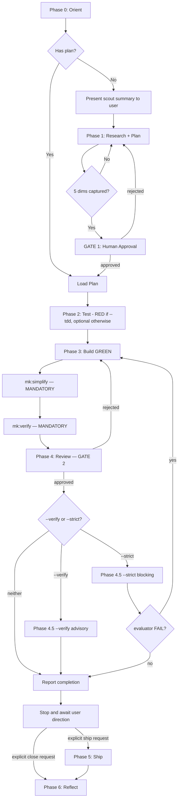

# Cook — Full Implementation Pipeline

End-to-end implementation following the 7-phase workflow. TDD is opt-in via `--tdd`.

## Usage

```
/cook <natural language task OR plan path>
/cook "Add user auth" --fast
/cook "Build payment processor" --tdd       # Strict TDD enforced
/cook tasks/plans/260329-feature/plan.md --auto
```

Flags: `--interactive` (default) | `--fast` | `--parallel` | `--auto` | `--no-test` | `--tdd` | `--verify` | `--strict` | `--no-strict`

**Modifier flags** (layer on any mode): `--verify` [LIGHT] (light browser/artifact check) | `--strict` [HEAVY] (full evaluator pass) | `--no-strict` (suppress auto-strict)

Concrete cost depends on the inner harness, model tier, and target surface; treat `[LIGHT]` vs `[HEAVY]` as relative ordering only.

**`--verify` is advisory** (does not block ship). **`--strict` is a hard gate** (FAIL blocks ship and routes back to Phase 3).

## TDD mode (`--tdd` flag)

When `--tdd` is detected in the invocation, the cook skill MUST write `on` to `.claude/session-state/tdd-mode` via a Bash tool call BEFORE any other workflow step:

```bash
mkdir -p .claude/session-state && echo on > .claude/session-state/tdd-mode
```

This sentinel file is read by `pre-implement.sh`, `tdd-detect.sh`, and downstream agents to detect TDD mode. Without `--tdd`, the sentinel is absent and the workflow runs in default mode (Phase 2 optional, no RED-phase gate).

`MEOWKIT_TDD=1` env var (set in CI / shell rc) is the highest-precedence opt-in and overrides the sentinel.

When loading an existing plan, scan `plan.md` and phase files for `tdd: true`, `## Tests Before`, or `## Regression Gate`. If any are present but this invocation lacks `--tdd` and `MEOWKIT_TDD` is not enabled, warn:

```
Plan contains TDD sections but cook is not in TDD mode. Re-run with --tdd to enforce RED-first execution, or continue in default mode with TDD guidance only.
```

**HARD GATE**

Do NOT write implementation code until a plan exists and Gate 1 is approved.
In TDD mode (`--tdd` / `MEOWKIT_TDD=1`): do NOT skip Test RED phase — write failing tests BEFORE implementation.
In default mode: Phase 2 is optional; the developer may implement directly per the approved plan.
Exception: `--fast` mode skips research but still requires plan + (in TDD mode) TDD-flavored tests.
User override: Planning may be skipped only when the user explicitly says "just code it" or "skip planning" **and** Phase 0 found zero matched risk flags. Record the human override and rationale per `.claude/rules/intervention-recording-rules.md`; otherwise explain why Gate 1 still applies.

## Anti-Rationalization

Generic implementation-phase rationalizations live in `.claude/rules/anti-rationalization.md` — read before any non-trivial implementation step. Cook-specific addition (TDD mode):

| Thought                | Reality                                                                                                                                  |
| ---------------------- | ---------------------------------------------------------------------------------------------------------------------------------------- |
| "Tests can come after" | In TDD mode (`--tdd`), no — failing tests define the spec. In default mode, yes — tests after is permitted. Choose your mode explicitly. |

Before starting work, read `references/failure-catalog.md` for common implementation failure modes (cross-linked to `## Gotchas` below).

## Smart Intent Detection

See `references/intent-detection.md` for full detection logic.

> **Green-field product build** (new kanban app, full SaaS from scratch, multi-sprint autonomous build)? Use `mk:autobuild` instead. Cook handles single features, fixes, and refactors; harness owns the generator↔evaluator loop and adaptive scaffolding density.

| Input Pattern                    | Mode        | Behavior                                      |
| -------------------------------- | ----------- | --------------------------------------------- |
| Path to `plan.md` / `phase-*.md` | code        | Execute existing plan                         |
| "fast", "quick"                  | fast        | Skip research, plan→test→code                 |
| "trust me", "auto"               | auto        | Auto-fix issues, human gates still enforced   |
| 3+ features OR "parallel"        | parallel    | Multi-agent execution                         |
| "no test", "skip test"           | no-test     | Skip Test phase only when TDD is not enabled; `--no-test` + `--tdd` is invalid and requires user resolution |
| Default                          | interactive | Full workflow with user approval at each gate |
| `--verify`                       | (modifier)  | Light browser check after review (Phase 4.5)  |
| `--strict`                       | (modifier)  | Full evaluator after review (Phase 4.5)        |
| `--no-strict`                    | (modifier)  | Suppress auto-strict from scale-routing        |

## Process Flow (Authoritative)

<!-- Canonical source: .claude/workflow.yaml — this diagram renders the same lifecycle; -->
<!-- the YAML is the machine-readable authority; this Mermaid diagram is the human-facing render. -->



**This diagram is authoritative.** If prose conflicts, follow the diagram.

### Scout-First Contract (Phase 0)

Before any clarifying question or plan generation, present a 3–6 bullet codebase-context summary to the user:

1. Project type / language / framework
2. Existing modules/files relevant to the task
3. Current patterns/conventions for similar features
4. In-flight plans (`tasks/plans/`) or docs (`docs/`) covering this area
5. Public APIs / schemas / contracts the task could affect

**Skip when input is a `plan.md` / `phase-*.md` path** — the plan already encodes scout output.

In `--fast` mode the summary is **abbreviated** (1–3 bullets) but still presented; "skip research" reduces external research depth, not codebase-context handoff to the user.

### Exact-Requirements Contract (Phase 1)

`mk:plan-creator` MUST be able to answer all 5 dimensions in concrete sentences before returning a plan:

1. **Expected output** — concrete artifact(s) the user will see (paths, behavior, endpoint, CLI flags)
2. **Acceptance criteria** — specific inputs → outputs / edge cases
3. **Scope boundary** — what is explicitly OUT of scope this round
4. **Non-negotiable constraints** — stack, file locations, naming, compat, deadlines, performance
5. **Touchpoints** — which existing files (from scout) will be modified / which contracts must stay stable

Every clarifying-question option MUST cite scout findings (e.g., file paths). Vague abstract options are a failure mode — see `references/failure-catalog.md`.

**Skip when input is a `plan.md` / `phase-*.md` path** (plan encodes the 5 dimensions).

## Workflow Modes

| Mode        | Research | TDD          |
| ----------- | -------- | ------------ |
| interactive | Yes      | RED-strict   |
| auto        | Yes      | RED-strict   |
| fast        | Skip     | Plan-level   |
| parallel    | Optional | RED-strict   |
| no-test     | Yes      | Skip         |
| code        | Skip     | RED-strict   |

Gate 1 routing, parallelism, and full per-phase progression live in `references/intent-detection.md` (canonical Mode Behaviors table).

**Gate 2: human approval mandatory in all modes — see `.claude/rules/gate-rules.md` for the full contract.** If the reviewer surfaces a regression / side effect / broken workflow, follow the Regression Recovery Options pattern in `references/review-cycle.md` rather than silently patching.

## Required Subagents

| Phase         | Subagent                          | When                                     |
| ------------- | --------------------------------- | ---------------------------------------- |
| 0 Orient      | `mk:scout`                      | Codebase mapping                         |
| 1 Plan        | `mk:plan-creator`, `researcher` | Research + planning                      |
| 2 Test        | `tester` via `mk:testing`       | TDD mode (`--tdd`): **MUST** spawn — write failing tests. Default mode: optional (skip unless requested) |
| 3 Build GREEN | `developer`                       | Implementation                           |
| 3 Build GREEN | `developer` via `mk:investigate` | Root-cause analysis when tests fail after 3 self-heal attempts |
| 3.5 Simplify  | `developer` via `mk:simplify`   | **MANDATORY** after Phase 3 GREEN — run before verify  |
| 3.6 Verify    | `mk:verify`                     | **MANDATORY** after simplify — unified build+lint+test+coverage check before Phase 4 |
| 4 Review      | `reviewer` via `mk:review`      | **MUST** spawn — Gate 2                  |
| 4.5 Verify    | `browser-automation subagent` or `HTTP verification tool` | Only if `--verify` flag (light browser check) |
| 4.5 Verify    | `evaluator` via `mk:evaluate`   | Only if `--strict` flag or auto-triggered     |

Concrete subagent name and HTTP tool depend on installed skill set; cook treats both as interfaces, not specific implementations.
| 5 Ship        | `shipper` via `mk:ship`         | Only after an explicit ship request — runs full pre-ship pipeline (`git-manager` invoked inside shipper for commit + PR) |
| 6 Reflect     | `analyst`                       | **MUST** spawn — cost + pattern analysis |
| 6 Reflect     | `documenter`                      | **MUST** spawn — sync-back + docs        |
| 6 Reflect     | `mk:memory` session-capture     | **MUST** spawn — 3-category learning extraction |

During iterative build-test-fix cycles, follow `references/loop-safety-protocol.md` for checkpoint tracking, stall detection, and escalation triggers.

See `references/subagent-patterns.md` for Task() invocation patterns.
See `references/workflow-steps.md` for detailed per-phase instructions.
See `references/review-cycle.md` for review gate logic.

## Simplify Step (Mandatory)

After Phase 3 (Build GREEN) completes, run `mk:simplify` to reduce complexity before Phase 4 (Review). This is mandatory — do not skip.

Rationale: Review quality improves when code is already simplified. Reviewers catch logic errors better when complexity is low. Running simplify after tests are green (but before review) ensures the reviewed code is the final, clean version.

## Verify Step (Mandatory)

After `mk:simplify` completes, run `mk:verify` for a unified build→lint→type-check→test→coverage check. This confirms simplification didn't break anything and gives the reviewer a clean signal. By default `mk:verify` scopes lint and tests to the changed files (build and type-check stay whole-program); the complete whole-project run happens at ship time. Pass `--full` only when a full sweep is needed here.

If `mk:verify` FAILS after simplify: send back to developer to fix, then re-run verify before proceeding to Phase 4. Do not skip verify or proceed to review with a failing verify result.

## Status Report (Post-Gate 2)

After a Gate 2 verdict PASS, delegate to `project-manager` per `.claude/rules/post-phase-delegation.md` Rule 1 (background — include "Run in the background" in the prompt). Status report is co-located at `{plan-dir}/status-reports/{YYMMDD}-status.md`. Stop after reporting completion; invoke `mk:ship` only when the user explicitly requests shipping. Skipped automatically when `MEOWKIT_PM_AUTO=off`.

## Durable Task State (when an active task record exists)

When this run drives an **active durable task** (a `tasks/active/<id>.json` exists), emit status/step at phase transitions and record each acted-on `mewkit capabilities resolve` outcome (`selected|skipped|unavailable|unsupported`) via `mewkit task-state update` — per `.claude/rules/task-state-emission.md`. Advisory + best-effort: a failed or unavailable command is surfaced but never blocks the pipeline, and one-off work with no record emits nothing.

## Related Rules

- `.claude/rules/gate-rules.md` — Gate 1 (Plan) and Gate 2 (Review) hard-stop conditions this skill enforces across all modes
- `.claude/rules/post-phase-delegation.md` — PM delegation fire points and skip conditions
- `.claude/rules/task-state-emission.md` — when/what/how to emit durable task-state events (advisory; active durable tasks only)
- `.claude/rules-conditional/workflow-evidence-rules.md` — workflow evidence index (traceability over existing Phase 0-6 outputs; mirrors the gate scripts, never approves). See `references/workflow-steps.md` → Workflow Evidence Index

## Gotchas

Operational gotchas live here; pre-build failure modes and rationalizations live in `references/failure-catalog.md`.

- **Skipping mk:simplify before review**: Tests pass but code is still complex → run `/mk:simplify` between Phase 3 and Phase 4 every time, no exceptions
- **Skipping Gate 1 on "simple" features**: Features that seem simple grow during implementation. Always create a plan file; cancel it if truly trivial
<!-- lint-allow-gate-authority -->
- **Auto-approve sneaking bugs past Gate 2**: "auto" means automatic execution *between* gates, NOT automatic approval. Auto mode auto-fixes but NEVER auto-approves Gate 2 — gate-rules.md says NO exceptions. The workflow evidence index must be complete before Gate 2 is presented
- **Context loss between phases**: Long multi-phase workflows exceed the context window — the external-memory write after each completed plan phase is the load-bearing action that lets a fresh session resume the correct phase. This is a mandatory step, not a habit: see the **Per-Phase Checkpoint** in `references/workflow-steps.md` (Phase 6) — flip the phase-file checkboxes and update plan.md Agent State before any next-phase transition
- **Parallel mode deadlocks**: Phase dependencies cause deadlock when phase-03 waits for phase-02 results. Map dependency graph before spawning parallel agents
- **Code mode on stale plans**: Running old plan against changed codebase. Warn if plan.md is >14 days old
- **Fast mode shallow test coverage**: Skipping research means tests capture plan-level intent, not edge cases. Document: "fast mode = TDD-flavored, coverage may be lower"
- **Missing model tier declaration**: Expensive models on trivial tasks, cheap models on security-critical work. Always declare tier in Phase 0
- **Forgetting memory read/write**: Prior session learnings lost. Phase 0 reads canonical `.claude/memory/*.json` stores only for fix memory; Phase 6 writes canonical JSON stores and regenerates generated views when needed
- **Subagent patterns using Agent() not Task()**: Task() enables tracking, blocking, and progress. Always use Task() for phases 2-6
- **--strict cost surprise**: `--strict` spawns the full evaluator (`mk:evaluate`) — a [HEAVY] pass. Auto-triggered by scale-routing `level=high`. Use `--no-strict` to suppress, or `--verify` for the [LIGHT] check
- **--strict vs --verify confusion**: `--verify` = light browser check (advisory). `--strict` = full evaluator with rubrics (FAIL blocks ship). `--strict` supersedes `--verify`
