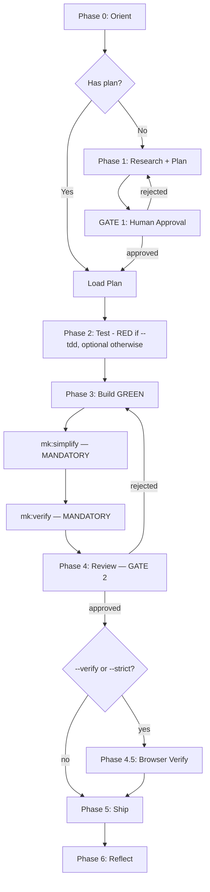

# Cook — Full Implementation Pipeline

End-to-end implementation following the 7-phase workflow. TDD is opt-in via `--tdd`.

## Usage

```
/cook <natural language task OR plan path>
/cook "Add user auth" --fast
/cook "Build payment processor" --tdd       # Strict TDD enforced
/cook tasks/plans/260329-feature/plan.md --auto
```

Flags: `--interactive` (default) | `--fast` | `--parallel` | `--auto` | `--no-test` | `--tdd` | `--verify` | `--strict` | `--no-strict`

**Modifier flags** (layer on any mode): `--verify` (light browser check ~$1) | `--strict` (full evaluator ~$2-5) | `--no-strict` (suppress auto-strict)

## TDD mode (`--tdd` flag)

When `--tdd` is detected in the invocation, the cook skill MUST write `on` to `.claude/session-state/tdd-mode` via a Bash tool call BEFORE any other workflow step:

```bash
mkdir -p .claude/session-state && echo on > .claude/session-state/tdd-mode
```

This sentinel file is read by `pre-implement.sh`, `tdd-detect.sh`, and downstream agents to detect TDD mode. Without `--tdd`, the sentinel is absent and the workflow runs in default mode (Phase 2 optional, no RED-phase gate).

`MEOWKIT_TDD=1` env var (set in CI / shell rc) is the highest-precedence opt-in and overrides the sentinel.

**HARD GATE**

Do NOT write implementation code until a plan exists and Gate 1 is approved.
In TDD mode (`--tdd` / `MEOWKIT_TDD=1`): do NOT skip Test RED phase — write failing tests BEFORE implementation.
In default mode: Phase 2 is optional; the developer may implement directly per the approved plan.
Exception: `--fast` mode skips research but still requires plan + (in TDD mode) TDD-flavored tests.
User override: If user explicitly says "just code it" or "skip planning", respect their instruction.

## Anti-Rationalization

| Thought                         | Reality                                                            |
| ------------------------------- | ------------------------------------------------------------------ |
| "This is too simple to plan"    | Simple tasks have hidden complexity. Plan takes 30 seconds.        |
| "I already know how to do this" | Knowing ≠ planning. Write it down.                                 |
| "Let me just start coding"      | Undisciplined action wastes tokens. Plan first.                    |
| "Tests can come after"          | In TDD mode (`--tdd`), no — failing tests define the spec. In default mode, yes — tests after is permitted. Choose your mode explicitly. |
| "I'll plan as I go"             | That's not planning, that's hoping.                                |
| "Just this once"                | Every skip is "just this once." No exceptions.                     |

Before starting work, read `references/failure-catalog.md` for common implementation failure modes to avoid.

## Smart Intent Detection

See `references/intent-detection.md` for full detection logic.

> **Green-field product build** (new kanban app, full SaaS from scratch, multi-sprint autonomous build)? Use `mk:harness` instead. Cook handles single features, fixes, and refactors; harness owns the generator↔evaluator loop and adaptive scaffolding density.

| Input Pattern                    | Mode        | Behavior                                      |
| -------------------------------- | ----------- | --------------------------------------------- |
| Path to `plan.md` / `phase-*.md` | code        | Execute existing plan                         |
| "fast", "quick"                  | fast        | Skip research, plan→test→code                 |
| "trust me", "auto"               | auto        | Auto-fix issues, human gates still enforced   |
| 3+ features OR "parallel"        | parallel    | Multi-agent execution                         |
| "no test", "skip test"           | no-test     | Skip Test phase entirely (force off, even if `--tdd`) |
| Default                          | interactive | Full workflow with user approval at each gate |
| `--verify`                       | (modifier)  | Light browser check after review (Phase 4.5)  |
| `--strict`                       | (modifier)  | Full evaluator after review (Phase 4.5)        |
| `--no-strict`                    | (modifier)  | Suppress auto-strict from scale-routing        |

## Process Flow (Authoritative)



**This diagram is authoritative.** If prose conflicts, follow the diagram.

## Workflow Modes

| Mode        | Research | TDD        | Review Gate 2      | Progression                             |
| ----------- | -------- | ---------- | ------------------ | --------------------------------------- |
| interactive | Yes      | Yes        | **Human approval** | One at a time                           |
| auto        | Yes      | Yes        | **Human approval** | Continuous (auto-fix, not auto-approve) |
| fast        | Skip     | Plan-level | **Human approval** | One at a time                           |
| parallel    | Optional | Yes        | **Human approval** | Parallel groups                         |
| no-test     | Yes      | Skip       | **Human approval** | One at a time                           |
| code        | Skip     | Yes        | **Human approval** | Per plan                                |

**Gate 2 requires human approval in ALL modes. No exceptions.** Auto mode auto-fixes issues but never auto-approves shipping.

## Required Subagents

| Phase         | Subagent                          | When                                     |
| ------------- | --------------------------------- | ---------------------------------------- |
| 0 Orient      | `mk:scout`                      | Codebase mapping                         |
| 1 Plan        | `mk:plan-creator`, `researcher` | Research + planning                      |
| 2 Test        | `tester` via `mk:testing`       | TDD mode (`--tdd`): **MUST** spawn — write failing tests. Default mode: optional (skip unless requested) |
| 3 Build GREEN | `developer`                       | Implementation                           |
| 3 Build GREEN | `developer` via `mk:investigate` | Root-cause analysis when tests fail after 3 self-heal attempts |
| 3.5 Simplify  | `developer` via `mk:simplify`   | **MANDATORY** after Phase 3 GREEN — run before verify  |
| 3.6 Verify    | `mk:verify`                     | **MANDATORY** after simplify — unified build+lint+test+coverage check before Phase 4 |
| 4 Review      | `reviewer` via `mk:review`      | **MUST** spawn — Gate 2                  |
| 4.5 Verify    | `agent-browser` or `curl`         | Only if `--verify` flag (light browser check) |
| 4.5 Verify    | `evaluator` via `mk:evaluate`   | Only if `--strict` flag or auto-triggered     |
| 5 Ship        | `git-manager` via `mk:ship`     | **MUST** spawn — commit + PR             |
| 6 Reflect     | `documenter`                      | **MUST** spawn — sync-back + docs        |
| 6 Reflect     | `mk:memory` session-capture     | **MUST** spawn — 3-category learning extraction |

During iterative build-test-fix cycles, follow `references/loop-safety-protocol.md` for checkpoint tracking, stall detection, and escalation triggers.

See `references/subagent-patterns.md` for Task() invocation patterns.
See `references/workflow-steps.md` for detailed per-phase instructions.
See `references/review-cycle.md` for review gate logic.

## Simplify Step (Mandatory)

After Phase 3 (Build GREEN) completes, run `mk:simplify` to reduce complexity before Phase 4 (Review). This is mandatory — do not skip.

Rationale: Review quality improves when code is already simplified. Reviewers catch logic errors better when complexity is low. Running simplify after tests are green (but before review) ensures the reviewed code is the final, clean version.

## Verify Step (Mandatory)

After `mk:simplify` completes, run `mk:verify` for a unified build→lint→type-check→test→coverage check. This confirms simplification didn't break anything and gives the reviewer a clean signal.

If `mk:verify` FAILS after simplify: send back to developer to fix, then re-run verify before proceeding to Phase 4. Do not skip verify or proceed to review with a failing verify result.

## Status Report (Post-Gate 2)

After Gate 2 verdict PASS and before Phase 5 ship, delegate to `project-manager` per `.claude/rules/post-phase-delegation.md` Rule 1 (background — include "Run in the background" in the prompt). Status report is co-located at `{plan-dir}/status-reports/{YYMMDD}-status.md`. Do not block on PM — continue to ship. Skipped automatically when `MEOWKIT_PM_AUTO=off`.

## Related Rules

- `.claude/rules/gate-rules.md` — Gate 1 (Plan) and Gate 2 (Review) hard-stop conditions this skill enforces across all modes
- `.claude/rules/post-phase-delegation.md` — PM delegation fire points and skip conditions

## Gotchas

- **Skipping mk:simplify before review**: Tests pass but code is still complex → run `/mk:simplify` between Phase 3 and Phase 4 every time, no exceptions
- **Skipping Gate 1 on "simple" features**: Features that seem simple grow during implementation. Always create a plan file; cancel it if truly trivial
- **Auto-approve sneaking bugs past Gate 2**: Auto mode can auto-fix but NEVER auto-approve. gate-rules.md says NO exceptions
- **Context loss between phases**: Long multi-phase workflows exceed context window. Update plan.md Agent State after each phase; next agent reads it first
- **Parallel mode deadlocks**: Phase dependencies cause deadlock when phase-03 waits for phase-02 results. Map dependency graph before spawning parallel agents
- **Code mode on stale plans**: Running old plan against changed codebase. Warn if plan.md is >14 days old
- **Fast mode shallow test coverage**: Skipping research means tests capture plan-level intent, not edge cases. Document: "fast mode = TDD-flavored, coverage may be lower"
- **Missing model tier declaration**: Expensive models on trivial tasks, cheap models on security-critical work. Always declare tier in Phase 0
- **Forgetting memory read/write**: Prior session learnings lost. Phase 0 reads .claude/memory/fixes.md + .claude/memory/architecture-decisions.md; Phase 6 appends to the relevant topic file by category
- **Subagent patterns using Agent() not Task()**: Task() enables tracking, blocking, and progress. Always use Task() for phases 2-6
- **--strict cost surprise**: `--strict` spawns full mk:evaluate (~$2-5). Auto-triggered by scale-routing `level=high`. Use `--no-strict` to suppress, or `--verify` for light check (~$1)
- **--strict vs --verify confusion**: `--verify` = light browser check (advisory). `--strict` = full evaluator with rubrics (FAIL blocks ship). `--strict` supersedes `--verify`
