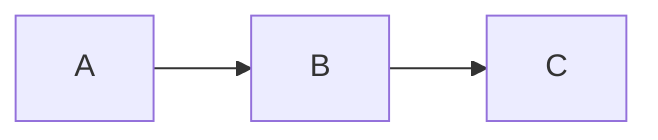

# mk:markdown-reader

Local HTTP server rendering markdown files with a calm, book-like reading experience.

**Note:** `mk:brainstorming --html` and `mk:plan-creator --html` produce self-contained
HTML files that open directly in the browser — they do not use or need this server.

## Installation (Required Before First Use)

This skill requires npm dependencies. Install once from the project root:

```bash
cd .claude/skills/markdown-reader
npm install
```

**Dependencies:** `marked`, `highlight.js`, `gray-matter`

Without installation you will get **Error 500: Error rendering markdown**.

## Usage

```bash
# View a markdown file (opens browser automatically)
node .claude/skills/markdown-reader/scripts/server.cjs \
  --file ./tasks/plans/my-plan/plan.md

# Browse a directory
node .claude/skills/markdown-reader/scripts/server.cjs \
  --dir ./tasks/plans

# Background mode (foreground process for Claude Code task runners)
node .claude/skills/markdown-reader/scripts/server.cjs \
  --file ./README.md \
  --foreground

# Stop all running instances
node .claude/skills/markdown-reader/scripts/server.cjs --stop
```

The server binds to `127.0.0.1` (localhost) only. Served files are not reachable from
other devices on the network — this is intentional.

## CLI Options

| Option | Description | Default |
|---|---|---|
| `--file <path>` | Markdown file to view | — |
| `--dir <path>` | Directory to browse | — |
| `--port <number>` | Server port; auto-increments if busy | 3456 |
| `--open` | Auto-open browser | true |
| `--no-open` | Suppress auto-open | — |
| `--stop` | Stop all running instances | — |
| `--background` | Spawn detached child and exit (legacy) | false |
| `--foreground` | Run in-process (for host-runtime background tasks) | false |

## Features

### Reading Experience
- Warm cream background (light mode) / dark mode with warm gold accents
- Libre Baskerville serif headings · Inter body text · JetBrains Mono code
- Maximum 720px content width for comfortable line length
- Auto-hide header on scroll-down; always-visible reading progress bar

### Mermaid.js Diagrams
- Auto-renders `mermaid` fenced code blocks as diagrams
- Theme-aware (light/dark mode)
- Click to expand/collapse full-width
- Error display with source preview for debugging

### Directory Browser
- Clean file listing with type icons
- Markdown files link to viewer; folders link to sub-directories
- Parent directory navigation

### Plan Navigation
- Auto-detects plan directory structure (`plan.md` + `phase-*.md`)
- Accordion sidebar with status badges (complete, in-progress, pending)
- Previous/Next navigation buttons
- Mobile FAB + bottom-sheet sidebar

### Keyboard Shortcuts
- `?` — keyboard shortcut cheatsheet overlay
- `T` — toggle theme (light/dark)
- `S` — toggle sidebar (desktop)
- `←` / `→` — previous/next phase (plan mode)
- `Esc` — close modal/sidebar

## HTTP Routes

| Route | Description |
|---|---|
| `/view?file=<path>` | Markdown file viewer |
| `/browse?dir=<path>` | Directory browser |
| `/assets/*` | Static assets (CSS, JS) |
| `/file/*` | Local file serving (images referenced by markdown) |

All file paths are validated against an allowed-directories list; traversal attempts
return HTTP 403.

## Architecture

```
scripts/
├── server.cjs               # CLI entry point; binds 127.0.0.1 only
└── lib/
    ├── port-finder.cjs      # Dynamic port allocation (3456–3500)
    ├── process-mgr.cjs      # PID state in CLAUDE_PLUGIN_DATA/markdown-reader/
    ├── http-server.cjs      # HTTP routing + directory-traversal guards
    ├── markdown-renderer.cjs # MD→HTML with syntax highlighting (marked + hljs)
    └── plan-navigator.cjs   # Plan detection + sidebar/footer generation

assets/
├── template.html            # Viewer HTML template
├── reader.js                # Client-side interactivity
├── novel-theme.css          # Main theme file (imports modular CSS)
├── directory-browser.css    # Directory browser styles
└── styles/                  # Modular CSS: base, typography, code, tables,
                             #   links, layout, header, sidebar, overlays
```

## Persistent State

Server PID files are written to `${CLAUDE_PLUGIN_DATA}/markdown-reader/` (falls back
to `~/.cache/mewkit/markdown-reader/` when `CLAUDE_PLUGIN_DATA` is unset). This ensures
state persists across plugin upgrades rather than being wiped with the skill directory.

## Mermaid Diagrams

Use fenced code blocks with the `mermaid` language tag:

~~~markdown

~~~

Supported types: flowchart, sequence, pie, gantt, xychart-beta, mindmap, quadrant, ER,
state, timeline.

**Debug:** when a diagram fails, the viewer shows the error message and source. Fix
the syntax and refresh.

## Gotchas

- **Port in use**: server auto-increments from 3456 to 3500; check Gotcha below if all
  ports are stuck.
- **Stale PID files**: if `--stop` does not clear a server, check
  `${CLAUDE_PLUGIN_DATA}/markdown-reader/` (or `~/.cache/mewkit/markdown-reader/`) for
  leftover `.pid` files and delete them manually.
- **Missing npm deps**: ensure `npm install` was run from `.claude/skills/markdown-reader/`
  — the server exits with Error 500 otherwise.
- **Images not loading**: image paths in markdown must be relative to the markdown file;
  they are served via the `/file/*` route with path-safety validation.
- **First visit toast**: "Press ? for keyboard shortcuts" appears on first load and
  auto-dismisses after 5 seconds.
- **Localhost binding**: the server never binds to 0.0.0.0; all traffic stays on
  127.0.0.1. There is no `--host` option in this skill.
- **Not a dependency**: `mk:brainstorming --html` and `mk:plan-creator --html` produce
  self-contained HTML that opens inline — they do NOT start or depend on this server.
