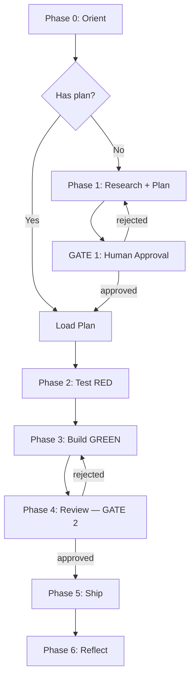

# Cook — Full Implementation Pipeline

End-to-end implementation following MeowKit's 7-phase workflow with TDD enforcement.

## Usage

```
/cook <natural language task OR plan path>
/cook "Add user auth" --fast
/cook tasks/plans/260329-feature/plan.md --auto
```

Flags: `--interactive` (default) | `--fast` | `--parallel` | `--auto` | `--no-test`

<HARD-GATE>
Do NOT write implementation code until a plan exists and Gate 1 is approved.
Do NOT skip Test RED phase — write failing tests BEFORE implementation.
Exception: `--fast` mode skips research but still requires plan + TDD-flavored tests.
User override: If user explicitly says "just code it" or "skip planning", respect their instruction.
</HARD-GATE>

## Anti-Rationalization

| Thought                         | Reality                                                            |
| ------------------------------- | ------------------------------------------------------------------ |
| "This is too simple to plan"    | Simple tasks have hidden complexity. Plan takes 30 seconds.        |
| "I already know how to do this" | Knowing ≠ planning. Write it down.                                 |
| "Let me just start coding"      | Undisciplined action wastes tokens. Plan first.                    |
| "Tests can come after"          | MeowKit is TDD. Failing tests define the spec. Code fills them in. |
| "I'll plan as I go"             | That's not planning, that's hoping.                                |
| "Just this once"                | Every skip is "just this once." No exceptions.                     |

## Smart Intent Detection

See `references/intent-detection.md` for full detection logic.

| Input Pattern                    | Mode        | Behavior                                      |
| -------------------------------- | ----------- | --------------------------------------------- |
| Path to `plan.md` / `phase-*.md` | code        | Execute existing plan                         |
| "fast", "quick"                  | fast        | Skip research, plan→test→code                 |
| "trust me", "auto"               | auto        | Auto-fix issues, human gates still enforced   |
| 3+ features OR "parallel"        | parallel    | Multi-agent execution                         |
| "no test", "skip test"           | no-test     | Skip Test RED phase                           |
| Default                          | interactive | Full workflow with user approval at each gate |

## Process Flow (Authoritative)



**This diagram is authoritative.** If prose conflicts, follow the diagram.

## Workflow Modes

| Mode        | Research | TDD        | Review Gate 2      | Progression                             |
| ----------- | -------- | ---------- | ------------------ | --------------------------------------- |
| interactive | Yes      | Yes        | **Human approval** | One at a time                           |
| auto        | Yes      | Yes        | **Human approval** | Continuous (auto-fix, not auto-approve) |
| fast        | Skip     | Plan-level | **Human approval** | One at a time                           |
| parallel    | Optional | Yes        | **Human approval** | Parallel groups                         |
| no-test     | Yes      | Skip       | **Human approval** | One at a time                           |
| code        | Skip     | Yes        | **Human approval** | Per plan                                |

**Gate 2 requires human approval in ALL modes. No exceptions.** Auto mode auto-fixes issues but never auto-approves shipping.

## Required Subagents

| Phase         | Subagent                          | When                                     |
| ------------- | --------------------------------- | ---------------------------------------- |
| 0 Orient      | `meow:scout`                      | Codebase mapping                         |
| 1 Plan        | `meow:plan-creator`, `researcher` | Research + planning                      |
| 2 Test RED    | `tester` via `meow:testing`       | **MUST** spawn — write failing tests     |
| 3 Build GREEN | `fullstack-developer`             | Implementation                           |
| 3 Build GREEN | `debugger` via `meow:investigate` | If tests fail after 3 self-heal attempts |
| 4 Review      | `code-reviewer` via `meow:review` | **MUST** spawn — Gate 2                  |
| 5 Ship        | `git-manager` via `meow:ship`     | **MUST** spawn — commit + PR             |
| 6 Reflect     | `project-manager`, `docs-manager` | **MUST** spawn — sync-back + docs        |
| 6 Reflect     | `meow:memory` session-capture     | **MUST** spawn — 3-category learning extraction |

See `references/subagent-patterns.md` for Task() invocation patterns.
See `references/workflow-steps.md` for detailed per-phase instructions.
See `references/review-cycle.md` for review gate logic.

## Gotchas

- **Skipping Gate 1 on "simple" features**: Features that seem simple grow during implementation. Always create a plan file; cancel it if truly trivial
- **Auto-approve sneaking bugs past Gate 2**: Auto mode can auto-fix but NEVER auto-approve. gate-rules.md says NO exceptions
- **Context loss between phases**: Long multi-phase workflows exceed context window. Update plan.md Agent State after each phase; next agent reads it first
- **Parallel mode deadlocks**: Phase dependencies cause deadlock when phase-03 waits for phase-02 results. Map dependency graph before spawning parallel agents
- **Code mode on stale plans**: Running old plan against changed codebase. Warn if plan.md is >14 days old
- **Fast mode shallow test coverage**: Skipping research means tests capture plan-level intent, not edge cases. Document: "fast mode = TDD-flavored, coverage may be lower"
- **Missing model tier declaration**: Expensive models on trivial tasks, cheap models on security-critical work. Always declare tier in Phase 0
- **Forgetting memory read/write**: Prior session learnings lost. Phase 0 reads memory/lessons.md; Phase 6 writes back
- **Subagent patterns using Agent() not Task()**: Task() enables tracking, blocking, and progress. Always use Task() for phases 2-6
