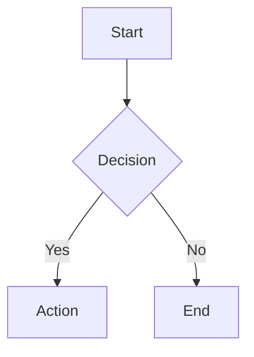

# Mermaid.js v11

## Quick Start

**Basic Diagram Structure:**
```
{diagram-type}
  {diagram-content}
```

Common types: `flowchart`, `sequenceDiagram`, `classDiagram`, `stateDiagram`, `erDiagram`,
`gantt`, and `journey`. Load [references/diagram-types.md](references/diagram-types.md) for
the complete v11 syntax catalog.

## Creating Diagrams

**Inline Markdown Code Blocks:**
````markdown

````

**Configuration via Frontmatter:**
````markdown

````

**Comments:** Use `%% ` prefix for single-line comments.

## CLI Usage

Convert `.mmd` files to images:
```bash
# Installation
npm install -g @mermaid-js/mermaid-cli

# Basic conversion
mmdc -i diagram.mmd -o diagram.svg

# With theme and background
mmdc -i input.mmd -o output.png -t dark -b transparent

# Custom styling
mmdc -i diagram.mmd --cssFile style.css -o output.svg
```

See `references/cli-usage.md` for Docker, batch processing, and advanced workflows.

## JavaScript Integration

**HTML Embedding:**
```html
<pre class="mermaid">
  flowchart TD
    A[Client] --> B[Server]
</pre>
<script src="https://cdn.jsdelivr.net/npm/mermaid@latest/dist/mermaid.min.js"></script>
<script>mermaid.initialize({ startOnLoad: true });</script>
```

See `references/integration.md` for Node.js API and advanced integration patterns.

## Configuration & Theming

**Common Options:**
- `theme`: "default", "dark", "forest", "neutral", "base"
- `look`: "classic", "handDrawn"
- `fontFamily`: Custom font specification
- `securityLevel`: "strict", "loose", "antiscript"

See `references/configuration.md` for complete config options, theming, and customization.

## Practical Patterns

Load `references/examples.md` for:
- Architecture diagrams
- API documentation flows
- Database schemas
- Project timelines
- State machines
- User journey maps

## References

| Need | Load |
|---|---|
| Diagram syntax | [references/diagram-types.md](references/diagram-types.md) |
| Config, theming, accessibility | [references/configuration.md](references/configuration.md) |
| CLI, Docker, batch export | [references/cli-usage.md](references/cli-usage.md) |
| JavaScript integration | [references/integration.md](references/integration.md) |
| Common patterns | [references/examples.md](references/examples.md) |

For rendered SVG layout review, load `mk:tech-graph` and follow its SVG-layout route.

## Gotchas

- Mermaid v11 removed some v10 aliases; always use canonical type names (e.g., `flowchart` not `graph`).
- The `securityLevel: "strict"` setting strips HTML from labels — use plain text in node labels when security mode is on.
- `mmdc` requires Node 18+; skip the CLI section if the project's Node version is older.
- Inline frontmatter config (the `---` block inside a code fence) is a v10.7+ feature; older renderers silently drop it and render the `---` as content.
- External `@import` in `<style>` breaks `rsvg-convert` — embed fonts inline if you later export via `mk:tech-graph`.
