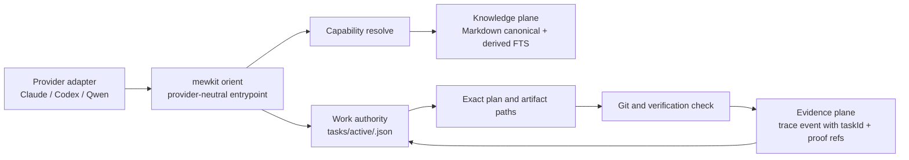

# MeowKit outer-harness improvement proposal

**Status:** design proposal; no runtime change in this document  
**Audited:** 2026-07-19  
**Scope:** MeowKit source at `bf9924e` and the installed MeowKit footprint in `/Users/sangnguyen/Documents/Aspire/`  
**Decision:** connect existing MeowKit state, knowledge, evidence, and provider surfaces. Do not merge in the durable stores of `repository-harness` or `pro-workflow`.

## Executive decision

MeowKit has most of the primitives needed for a long-running, multi-provider outer harness, but the live Aspire installation does not join them into a recovery path. It is currently strongest as a Claude Code toolkit. The appropriate next change is a thin, vendor-neutral **orientation and transition spine**, not another database, wiki, or generic orchestration layer.

The spine must make a new or resumed agent session able to answer, from durable project state:

1. What task is active?
2. What was just completed?
3. What is the next action and what is blocked?
4. Which plan, repositories, revisions, and evidence are relevant?
5. Which bounded project knowledge is relevant to the selected capability?

It must then re-check the live repository before acting. Durable state narrows the read set; it never substitutes for verification.

## Verified current state

### Live Aspire footprint

The inspected installation has a large, active Claude-oriented surface:

| Surface | Observation |
| --- | --- |
| `.claude/` | 128 skills, 40 agents, 53 hook files, 27 rules |
| Work artifacts | 55 `tasks/plans/*` directories plus reviews, contracts, reports, and other artifacts |
| Durable task records | **0** `tasks/active/*.json` records; **0** active-plan pointer files |
| Wiki | 29 canonical pages; derived index present |
| Wiki provenance | SQLite index reports 0 sources, 0 claims, and 0 seeds |
| Trace | 6,770 JSONL events; none has `taskId`, `task_id`, `planPath`, or `plan_path` |
| Latest checkpoint | plan path `null`; git branch/hash `unknown`; clean state `null` |

The installed metadata also drifts: `.claude/metadata.json` reports MeowKit `2.14.3`, while `.claude/meowkit.config.json` remains at `2.3.9`.

### Source capabilities already present

| Existing primitive | What source code provides | Current connection problem |
| --- | --- | --- |
| Task record | Atomic JSON records with status, step, next action, blockers, repos, evidence refs, and capability decisions | `task new` creates Markdown only; workflow rules emit updates only if a JSON record already exists |
| Resume reconstruction | `reconstructResumeState()` joins task records with active-plan pointer | Session orientation reads only checkpoint data; it does not invoke this reconstruction |
| Wiki | Human-gated canonical Markdown pages, candidate queue, scanner, FTS index, bounded recall | Live data has no source/claim/seed provenance and index/files have observed drift |
| Capability resolver | Host-aware selection plus an optional bounded knowledge-recall envelope | Recall is attached only after a `selected` outcome; ambiguous results do no recall |
| Trace / checkpoint | JSONL trace and checkpoint writer | Events lack task/plan join fields; checkpoint is not work authority |
| Provider projection | Claude Code supported; Codex partial/advisory | Qwen has no tested projection or named adapter in the source tree |

### Why recovery fails today

For a fresh session, Aspire's orientation handler deliberately returns nothing. For resume/clear/compact, it loads `checkpoint-latest.json`, which in the inspected state does not identify an active plan, repository revision, or actionable next step. `mewkit task-state show --json` returns an empty record list and null active-plan pointer.

Therefore, the agent must infer the current task from the human prompt or scan the project again. This is not a durable long-running workflow.

## Relevant lessons from the two reference repositories

### repository-harness

The useful concepts are explicit work authority, durable lifecycle state, evidence attached to work, and recovery from a bounded set of authoritative records. These should be adopted as principles, not by introducing its separate Rust/SQLite harness core into MeowKit.

### pro-workflow

The useful concepts are persistent searchable knowledge and bounded context recovery. MeowKit already has a better-aligned starting point: Markdown canonical pages, derived FTS, scanner, candidate gate, and human approval.

Do not copy pro-workflow's auto-research loop as a critical workflow dependency. Its research/cost mechanics must be independently evaluated before use. In Aspire, MeowKit's own research path has no live seeds or source records yet, so enabling automation before provenance works would create untrustworthy knowledge.

### Explicit non-adoption: compact-guard for now

`pro-workflow`'s compact guard writes a session summary and counters to `/tmp/pro-workflow`, then restores the newest temporary file after compaction. It does not provide durable task authority, revision tracking, blockers, or proof references. MeowKit should not port it as a parallel state store.

Compaction safety is deferred. If later required, it should update the same active task record and then re-enter through `mewkit orient`; it must not introduce a second “resume summary” authority.

## Target architecture

### One spine, three planes, provider adapters

| Plane | Canonical data | Derived/cache data | Rule |
| --- | --- | --- | --- |
| Work / authority | `tasks/active/<id>.json`, plans, reviews, contracts, evidence artifacts | display summaries only | The active record owns current step, next action, blockers, and task status |
| Knowledge / context | approved `tasks/wikis/*/pages/*.md` | `wiki-index.db` FTS | Wiki is bounded context, never completion proof |
| Evidence / observation | append-only trace log plus referenced proof artifacts | query/index views and checkpoint | Every transition refers to a task id and relevant proof paths |

There must be one authoritative store per responsibility. In particular, do **not** add a `harness.db` beside task JSON and do **not** add another wiki database beside MeowKit's canonical files and derived FTS index.

## Proposed lifecycle

### Start or resume

1. The provider adapter invokes `mewkit orient` when its lifecycle supports it.
2. `orient` reconstructs durable task state and identifies the active record, or explicitly reports that none exists.
3. It verifies current git state against recorded repository revisions.
4. It returns a bounded resume envelope: task id, status, current step, next action, blockers, plan path, evidence references, and stale-state warnings.
5. Capability resolution runs for a specific intent. A selected capability receives at most the existing bounded wiki recall; the agent opens the named page only when needed.
6. The agent reads exact files/revisions and executes work. It must not treat the envelope, checkpoint, or wiki as proof that the source is unchanged.

### Work transitions

The following events must update the same durable task record, idempotently and atomically:

- task/plan activation;
- phase completion;
- blocker creation or resolution;
- capability decision acted upon;
- verification result;
- stop/handoff;
- task completion.

Each trace event emitted for these transitions must include `taskId`; when applicable it also includes `planPath`, repository revision, and evidence reference. The checkpoint writer consumes a summary of the record; it does not become an independent work-state writer.

### No active record

The system must not invent one. It should report “no active durable task” and let normal one-off work proceed, or require an explicit task/plan activation for work intended to survive sessions. This avoids accidentally turning every small edit into workflow overhead.

## Provider contract

MeowKit should keep its honest support vocabulary: `supported`, `advisory`, `unsupported`, and `unknown`.

| Provider | Current evidence | Target behavior |
| --- | --- | --- |
| Claude Code | Session and compaction lifecycle hooks exist; real enforcement is available at selected events | Automatic orientation and transition updates where hooks are available |
| Codex | Projection is partial; lifecycle/enforcement claims are version-gated or advisory | Run orientation through instruction/bootstrap or supported hooks, but report advisory status honestly |
| Qwen / other | No tested projection in current source | Add an adapter only after defining bootstrap placement, lifecycle mapping, tool mapping, and actual enforcement level |

“Outer harness” means shared durable data and a shared recovery contract; it does not mean every provider has equal hook enforcement.

## Implementation order

1. **Repair state creation.** Make planned/long-running task activation create the JSON task record. Do not rely on a pre-existing record as the condition for creating one.
2. **Add `mewkit orient`.** Reuse `reconstructResumeState()`; do not parse a new resume format. Wire Claude's orientation handler to it.
3. **Join proof to work.** Add task context to trace transitions and make checkpoint output a cache of the active record summary.
4. **Make wiki recall reliable.** Add index freshness/rebuild checks, reconcile JSONL/index drift, and require source/claim provenance before any auto-research rollout.
5. **Make provider boundaries explicit.** Keep Claude behavior working; add/validate Codex lifecycle handling; define a Qwen adapter contract before claiming support.
6. **Measure before broadening.** Record recovery outcomes, stale-record warnings, missing task context, recall hit quality, and verification re-runs. Use this evidence to decide whether any further orchestration is justified.

## Acceptance criteria

The first implementation is successful only when all of the following are demonstrable in an installed project:

1. Starting a planned task creates exactly one active JSON record and active-plan pointer by an explicit, tested path.
2. A new Claude session can identify the active task and next action without a human instructing it to search the wiki or scan all plans.
3. A stale git revision produces a visible warning and targeted re-verification request.
4. A trace event for each tested transition can be queried by task id and leads to its plan/evidence artifact.
5. A selected capability receives no more than the configured recall bound; an ambiguous resolver result states that no automatic recall occurred.
6. Wiki source/claim data and the derived index are internally consistent before research automation is enabled.
7. Codex/Qwen documentation claims only the lifecycle behavior demonstrated by tests or runtime probes.

## Trade-offs and guardrails

### Gains

- A future agent can resume long-running work with actionable context rather than reverse-engineering the last session.
- Repository scans become targeted, not eliminated: state directs the agent to exact artifacts and revisions.
- Persistent knowledge remains useful without being allowed to override work authority or proof.
- Cross-provider portability improves because task state and knowledge are not provider-owned.

### Costs

- Workflow entrypoints and adapters need real code and integration tests; documentation alone cannot create recovery.
- Providers without equivalent hooks remain best-effort.
- Existing state drift must be migrated or declared stale before it is trusted.
- Transition writes add small operational complexity and need idempotency/concurrency handling.

### Deliberate exclusions

- No second task database.
- No second knowledge database.
- No unconditional auto-save of brainstorms, plans, or fixes.
- No auto-research on the critical path.
- No claim that context recovery removes the need to verify live source, git state, or tests.

## Evidence index

- Task scaffold: `packages/mewkit/src/commands/task.ts`
- Durable state and resume: `packages/mewkit/src/core/task-record.ts`, `packages/mewkit/src/commands/task-state.ts`
- Installed task-state emission rule: `/Users/sangnguyen/Documents/Aspire/.claude/rules/task-state-emission.md`
- Installed orientation/checkpoint/budget handlers: `/Users/sangnguyen/Documents/Aspire/.claude/hooks/handlers/{orientation-ritual,checkpoint-writer,budget-tracker}.cjs`
- Wiki write/research/recall: `packages/mewkit/src/wiki/application/{service,research}.ts`, `packages/mewkit/src/wiki/recall/*`
- Provider lifecycle/projections: `packages/mewkit/src/core/{provider-lifecycle,provider-projection}.ts`
- MeowKit's own substrate limitation: `packages/mewkit/src/core/consolidation-ledger.ts`
- pro-workflow compact guard reviewed but intentionally deferred: `external-repo/pro-workflow/{scripts/pre-compact.js,scripts/post-compact.js,skills/compact-guard/SKILL.md}`
