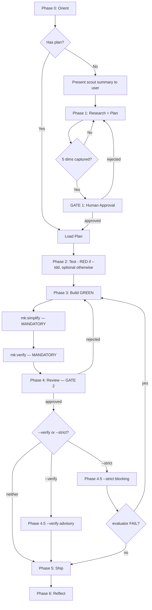

# Development Roadmap

Phase status and milestones for MeowKit. Updated as work lands.

## 2026-05-23 — Plan-creator deep/TDD redesign (COMPLETE)

6-phase redesign implementing `plans/260523-2324-plan-creator-deep-tdd-redesign/plan.md`.

### Updated Plan-Creator Contracts

1. **`--deep` is bounded planning depth** — compact scope map plus per-phase Deep Phase Map. It maps selected implementation scope; it does not perform uncontrolled repo-wide scouting or choose architecture.
2. **`--tdd` is a composable regression flag** — optional phase metadata, RED-first `## Tests Before`, protected-change guidance, exact regression gate command, and explicit `/mk:cook ... --tdd` handoff.
3. **Scout / brainstorm / plan boundaries are explicit** — unknown files route to `mk:scout`; unresolved architecture routes to `mk:brainstorming`; `--deep` may replace explicit scouting only when approach and feature area are already concrete.
4. **Cook warns on dropped TDD state** — TDD markers in plan files trigger a warning when cook is run without `--tdd` / `MEOWKIT_TDD`.

### Rollout State

- Skill reference contracts: complete.
- Step workflow edits: complete.
- Fixture coverage: deep-only, TDD-only, and deep+TDD fixtures added.
- Validation: targeted fixtures, plan validator, cook scripts, typecheck, and lint pass. Full `npm test` still has unrelated orchviz React hook failures and a worktree `.cjs` no-suite failure.

## 2026-05-23 — Cook skill workflow upgrade (COMPLETE)

7-phase upgrade landed. See `docs/project-changelog.md` for the per-phase summary and `plans/260523-1428-meowkit-cook-workflow-context-engineering-upgrade/plan.md` for the full plan.

### Updated Cook Gate Flow

The authoritative diagram in `cook/SKILL.md` now reflects two structural additions:

1. **Scout-first node** on the No branch of `Has plan?` — presents a 3–6 bullet codebase-context summary to the user before any clarifying question.
2. **Requirements-captured loop** on Phase 1 — `RQ{5 dims captured?}` keeps revisiting plan-creator until expected output / acceptance criteria / scope boundary / non-negotiable constraints / touchpoints are all answered concretely.

> **Mirror of `.claude/skills/cook/SKILL.md` — do not edit here.** Update the SKILL.md diagram (authoritative) and copy back. Drift between the two surfaces is a documentation bug.

### Phase 4.5 split

- `--verify` is advisory (no back-edge to Phase 3); FAIL is reported but does not block ship.
- `--strict` is a hard gate; evaluator FAIL routes back to Phase 3 with feedback. Max 2 evaluator iterations.

### Gate 2 regression-recovery pattern

When the reviewer flags a regression / side effect / broken workflow on EXISTING behavior (verdict includes `Side Effects Detected: Yes`), cook STOPs the iteration loop and presents 2–4 concrete recovery options to the user via the inner harness's clarifying-question surface. User selection is recorded as a `## User Decision Addendum` block on the verdict file. `validate-gate-2.sh` blocks Gate 2 until the addendum is present (positive-presence-only signal — absence is never a block).

## Open Follow-Ups

| Item | Source | Status |
|------|--------|--------|
| `${CLAUDE_PLUGIN_DATA}` runtime-coupling audit | plan.md Open Questions §1 | Deferred — flag for future audit |
| Approval-ledger pattern (1-line plan.md entry on Gate 1/2 approval) | plan.md Open Questions §2; analysis-report.md §8 | Deferred — adopt when compliance demands surface |
| Dead-weight audit on next model-tier upgrade | Phase 7 plan step 7; `.claude/rules/dead-weight-audit-rules.md` Rule 1 | Scheduled 2026-08-23 quarterly OR sooner on model release |
| Trace-analyze for new recurring failure modes attributable to the new gates | Phase 7 plan §Next Steps | Post-rollout, after enough field data |

## Roadmap Maintenance

This file is updated as significant phases or milestones complete. See `docs/project-changelog.md` for the detailed per-feature log.
