# MeowKit Architecture

> Grounded architecture model derived from the full-system audit (v2.4.0).
> Every claim cites source files or the consolidated audit report.
> Last verified: 2026-04-18

---

## 1. System Overview

MeowKit is a prompt-engineering framework that extends Claude Code with structured
workflows, quality gates, memory persistence, and 78 domain skills. It operates
through three mechanisms:

1. **Rules** (`.claude/rules/*.md`) — behavioral instructions loaded every session;
   17 rule files, priority-ordered; 2 are NEVER-override (`security-rules.md`,
   `injection-rules.md`). Source: `RULES_INDEX.md` loading-priority table.
2. **Hooks** (`.claude/hooks/*.sh`, `.cjs`) — shell/Node scripts triggered by
   Claude Code events before or after tool calls. Source: `settings.json` (7 hook
   events registered).
3. **Skills** (`.claude/skills/meow:*/SKILL.md`) — context-loaded domain expertise
   activated by user intent or `autoInvoke: true`. Source: `skill-inventory.json`
   (78 entries, verified 2026-04-18).

There is no executable runtime. MeowKit shapes LLM behavior through prompt
engineering, preventive hooks, and structured file conventions.
Source: `CLAUDE.md` Role section; `settings.json` hook registrations.

---

## 2. Component Inventory (Verified 2026-04-18)

| Component | Count | Source of Truth | Drift / Notes |
|---|---|---|---|
| Skills on disk | 75 | `ls .claude/skills/ \| grep meow:` | 3 deprecated skills removed in v2.4.4 |
| Registered skills (SKILLS_INDEX) | 71 | `SKILLS_INDEX.md` pipe-table rows | |
| Orphaned skills (unregistered) | 4 | `inventory-summary.md:15` | meow:chom, meow:pack, meow:confluence, meow:planning-engine |
| Active (non-deprecated) skills | 75 | `inventory-summary.md:17` | |
| Deprecated skills | 0 | — | `meow:debug`, `meow:documentation`, `meow:shipping` removed in v2.4.4 |
| Step-file skills | 5 | `step-file-rules.md` Applicability section | plan-creator, review, evaluate, harness, trace-analyze |
| Skills with internal agents | 3 | `AGENTS_INDEX.md` Skill-Scoped section | jira (3), confluence (2), planning-engine (2) = 7 agents |
| Core agents | 16 | `ls .claude/agents/*.md` excl. index | Matches `CLAUDE.md` Agents table |
| AGENTS_INDEX rows | 16 | `AGENTS_INDEX.md` active table | Footer "13 agents" phrasing is stale (CF-M34) |
| Hook events (settings.json) | 7 | `settings.json` hooks keys | SessionStart, PreToolUse, PostToolUse, Stop, UserPromptSubmit, SubagentStart, SubagentStop |
| Node handlers on disk | 12 | `ls .claude/hooks/handlers/*.cjs` | **DRIFT**: HOOKS_INDEX footer says 8; disk has 12 (CF-M2) |
| Node handlers documented (HOOKS_INDEX) | 5 active | `HOOKS_INDEX.md:39` footer | memory-filter, memory-parser, memory-injector, memory-loader deleted (v2.4.0); immediate-capture-handler retained (CF-M1 closed) |
| Slash commands | 20 | `ls .claude/commands/meow/*.md` | `inventory-summary.md:24` |
| Rules files | 17 | `ls .claude/rules/*.md` excl. RULES_INDEX | RULES_INDEX table lists 17 rows — matches disk |
| Memory files | 8 | `CLAUDE.md` Memory section | 6 named + conversation-summary.md + quick-notes.md |

**Skill type breakdown** (source: `inventory-summary.md`): workflow 33, verification 17,
reference 11, business-process 7, scaffolding 5, cicd 3, library-api-reference 2 = **78**.

---

## 3. Skill Graph (Summary)

Generated 2026-04-18 from consolidated audit findings. Nodes annotated with
finding severity (orange = gap node, red = critical, yellow = high).

```mermaid
---
title: MeowKit Skill Graph — Summary (Phase Clusters)
---
flowchart TD
    subgraph HOOKS["Hook Events (7)"]
        H_SS(SessionStart)
        H_PTU(PreToolUse)
        H_POTU(PostToolUse)
        H_STOP(Stop)
        H_UPS(UserPromptSubmit)
        H_SubS(SubagentStart)
        H_SubSt(SubagentStop)
    end

    subgraph P0["Phase 0 — Orient (12 skills)"]
        AD[meow:agent-detector\nautoInvoke:true]
        SC[meow:scout]
        SR[meow:scale-routing]
        WO[meow:workflow-orchestrator\nautoInvoke:true]
        H[meow:harness]
        LAL[meow:lazy-agent-loader]
        PC[meow:project-context]
        SK[meow:skill-creator]
        SECON[meow:session-continuation]
        BENCH[meow:benchmark]
        PARTY[meow:party]
        TQ[meow:task-queue]
    end

    subgraph P1["Phase 1 — Plan (7 skills)"]
        PLANC[meow:plan-creator]
        PE[meow:planning-engine]
        BRN[meow:brainstorming]
        OH[meow:office-hours]
        VP[meow:validate-plan]
        CEO[meow:plan-ceo-review]
        DF[meow:decision-framework]
    end

    subgraph P2["Phase 2 — Test (6 skills)"]
        TEST[meow:testing]
        CSO[meow:cso]
        STS[meow:skill-template-secure]
        LAV[meow:lint-and-validate]
        NYQ[meow:nyquist]
        BRW[meow:browse]
    end

    subgraph P3["Phase 3 — Build (20 skills)"]
        COOK[meow:cook]
        DEV[meow:development]
        FIX[meow:fix]
        INV[meow:investigate]
        SIM[meow:simplify]
        SC_P[meow:sprint-contract]
        BOOT[meow:bootstrap]
        ANG[meow:angular]
        VUE[meow:vue]
        TS[meow:typescript]
        DB[meow:database]
        FE[meow:frontend-design]
        CHOM[meow:chom]
        PACK[meow:pack]
        JIRA[meow:jira]
        BF[meow:build-fix]
        PRJO[meow:project-organization]
        VER[meow:verify]
        SEQT[meow:sequential-thinking]
        CONF[meow:confluence]
    end

    subgraph P4["Phase 4 — Review (5 skills)"]
        REV[meow:review]
        EVAL[meow:evaluate]
        RUB[meow:rubric]
        ELICIT[meow:elicit]
        TA[meow:trace-analyze]
    end

    subgraph P5["Phase 5 — Ship (2 skills)"]
        SHIP[meow:ship]
        WT[meow:worktree]
    end

    subgraph P6["Phase 6 — Reflect (5 skills)"]
        MEM[meow:memory]
        RETRO[meow:retro]
        LLMS[meow:llms]
        DOCINIT[meow:docs-init]
        DOCREL[meow:document-release]
    end

    subgraph CROSS["Cross-Phase Skills (8)"]
        MM[meow:multimodal]
        W2M[meow:web-to-markdown]
        DF2[meow:docs-finder]
        CAREFUL[meow:careful]
        FREEZE[meow:freeze]
        INTAKE[meow:intake]
        AB[meow:agent-browser]
        QA[meow:qa]
    end

    subgraph AGENTS["Key Agents (16)"]
        AGT_ORC(orchestrator)
        AGT_PLN(planner)
        AGT_DEV(developer)
        AGT_REV(reviewer)
        AGT_EVAL(evaluator)
        AGT_SHIP(shipper)
    end

    %% Hook → Handler edges
    H_SS -->|hooks| AD
    H_SS -->|hooks| WO
    H_UPS -->|hooks| AD
    H_PTU -->|hooks| COOK
    H_STOP -->|hooks| MEM
    H_STOP -->|hooks| RETRO

    %% Phase flow — critical calls
    AD -->|calls| SR
    AD -->|calls| LAL
    SR -->|calls| PLANC
    PLANC -->|calls| COOK
    COOK -->|calls| REV
    REV -->|calls| SHIP
    H -->|calls| SC_P
    H -->|calls| EVAL
    EVAL -->|calls| RUB
    FIX -->|calls| INV

    %% Agent ownership (key)
    AGT_ORC -->|owns| AD
    AGT_ORC -->|owns| H
    AGT_PLN -->|owns| PLANC
    AGT_DEV -->|owns| COOK
    AGT_DEV -->|owns| FIX
    AGT_REV -->|owns| REV
    AGT_EVAL -->|owns| EVAL
    AGT_SHIP -->|owns| SHIP

    %% Deprecated aliases
    DEBUG -.->|deprecated-alias| INV
    SHIPP2 -.->|deprecated-alias| SHIP
    DOCD -.->|deprecated-alias| DOCREL

    %% Findings annotations
    PLANC:::gapNode
    WO:::gapNode
    MM:::critNode
    LAL:::highNode

    classDef gapNode fill:#ff9900,color:#000
    classDef critNode fill:#ff0000,color:#fff
    classDef highNode fill:#ffcc00,color:#000
```

---

## 4. Execution Flow

Hook chain verified against `settings.json` (2026-04-18). All 7 events listed.

| Event | Hooks (in order) | Source line |
|---|---|---|
| `SessionStart` | project-context-loader.sh → dispatch.cjs (model-detector.cjs, orientation-ritual.cjs) | `settings.json:18-33` |
| `PreToolUse Edit\|Write` | gate-enforcement.sh → privacy-block.sh | `settings.json:36-52` |
| `PreToolUse Read` | privacy-block.sh | `settings.json:53-63` |
| `PreToolUse Bash` | pre-task-check.sh → pre-ship.sh → privacy-block.sh | `settings.json:64-85` |
| `PostToolUse Edit\|Write` | post-write.sh → learning-observer.sh → dispatch.cjs (build-verify, loop-detection, budget-tracker, auto-checkpoint) | `settings.json:87-108` |
| `PostToolUse Bash` | cost-meter.sh → dispatch.cjs (budget-tracker) | `settings.json:109-123` |
| `UserPromptSubmit` | tdd-flag-detector.sh → conversation-summary-cache.sh → dispatch.cjs (immediate-capture-handler, orientation-ritual) | `settings.json:152-173` |
| `Stop` | pre-completion-check.sh → post-session.sh → conversation-summary-cache.sh → dispatch.cjs (auto-checkpoint, checkpoint-writer) | `settings.json:125-151` |

**Phase routing** (source: `CLAUDE.md` Phase Composition Contracts table):
`Phase 0 Orient → Phase 1 Plan [GATE 1] → Phase 2 Test → Phase 3 Build → Phase 4 Review [GATE 2] → Phase 5 Ship → Phase 6 Reflect`

SubagentStart/SubagentStop: intentionally empty — hooks in these events would
infinite-loop inside subagents (`HOOKS_INDEX.md:39` footer).

---

## 5. Gate Enforcement

Source: `.claude/rules/gate-rules.md`, `settings.json:41` (gate-enforcement.sh
registration), `RULES_INDEX.md` Enforcement Mechanism Matrix.

| Gate | Trigger | Mechanism | Bypass |
|---|---|---|---|
| Gate 1 | After Phase 1, before any code write | **Hook-preventive**: `gate-enforcement.sh` on PreToolUse Edit\|Write; timeout 10s | `/meow:fix` simple; scale-routing one-shot (`scale-adaptive-rules.md` Rule 4) |
| Gate 2 | After Phase 4, before Phase 5 | **Behavioral**: reviewer verdict at `tasks/reviews/` required | None — zero exceptions (`gate-rules.md` Gate 2 section) |
| Active Verification | Phase 4 evaluator PASS | **Script**: `validate-verdict.sh` rejects PASS with empty `evidence/` dir | None — hard gate (`harness-rules.md` Rule 8) |
| Sprint Contract | FULL density harness Phase 3 | **Hook**: `gate-enforcement.sh` contract gate | `MEOWKIT_HARNESS_MODE=LEAN` or `MINIMAL` |

**Known issue — gate-owning agents don't reference gate-rules.md:**
planner (`planner.md` Required Context, CF-M3), reviewer (`reviewer.md:132`, CF-M5),
evaluator (`evaluator.md` Required Context, CF-M4), plan-creator (`plan-creator/SKILL.md`,
CF-H5), workflow-orchestrator (`workflow-orchestrator/SKILL.md`, CF-H6), sprint-contract
(`sprint-contract/SKILL.md`, CF-M10), ship (`ship/SKILL.md`, CF-M25), review
(`review/SKILL.md`, CF-M26). Gate behavior depends on agent compliance, not textual
anchor. See `consolidated.md` Cross-Cutting Pattern 2.

---

## 6. Agent Roster (16)

Source: `AGENTS_INDEX.md` active table (16 rows verified against `ls .claude/agents/*.md`),
`CLAUDE.md` Agents table. AGENTS_INDEX footer contains stale "13 agents" phrasing
(CF-M34) — canonical count is 16.

| Agent | Type | Phase | Role |
|---|---|---|---|
| orchestrator | Core | 0 | Route tasks, assign model tier |
| planner | Core | 1 | Scope-adaptive planning, Gate 1 |
| architect | Core | 1 | ADRs, system design (opus tier) |
| researcher | Support | 0, 1, 4 | Technology research (CLAUDE.md table omits Phase 4 — CF-M31) |
| brainstormer | Support | 1 | Trade-off analysis |
| tester | Core | 2 | Test writing (TDD opt-in via --tdd / MEOWKIT_TDD=1) |
| developer | Core | 3 | Implementation |
| ui-ux-designer | Support | 3 | Design systems, accessibility |
| security | Core | 2, 4 | Audit, BLOCK verdicts (complex tier) |
| reviewer | Core | 4 | Structural audit, Gate 2 |
| evaluator | Core | 4 | Behavioral verification, rubric grading |
| shipper | Core | 5 | Deploy pipeline (haiku tier) |
| git-manager | Support | 5 | Git operations, conventional commits |
| documenter | Core | 6 | Living docs (haiku tier) |
| analyst | Core | 0, 6 | Cost tracking, patterns (haiku tier) |
| journal-writer | Support | 6 | Failure docs, root cause analysis |

### Skill-Scoped Agents (7)

Agents that exist only within a specific skill's `agents/` directory.
Source: `AGENTS_INDEX.md` table footnote; `harness-rules.md` Rule 2.

| Skill | Agents | Role |
|---|---|---|
| meow:jira | jira-evaluator, jira-estimator, jira-analyst | Ticket intelligence |
| meow:confluence | confluence-reader, spec-analyzer | Spec analysis |
| meow:planning-engine | tech-analyzer, planning-reporter | Sprint planning |

---

## 7. Context & Memory System

Source: `CLAUDE.md` Memory section; `HOOKS_INDEX.md` State Files table.

Memory path: `.claude/memory/` (NOT bare `memory/` — see CF-C6).
Source: `CLAUDE.md` Memory section; `HOOKS_INDEX.md` State Files table.

| File | When read | Writer |
|---|---|---|
| `fixes.md` + `fixes.json` | On-demand (meow:fix) | immediate-capture-handler.cjs, session-capture |
| `review-patterns.md` + `review-patterns.json` | On-demand (meow:review, meow:plan-creator) | immediate-capture-handler.cjs, session-capture |
| `architecture-decisions.md` + `architecture-decisions.json` | On-demand (meow:plan-creator, meow:cook) | immediate-capture-handler.cjs, session-capture |
| `security-notes.md` | On-demand (meow:cso) | Manual / session-capture |
| `conversation-summary.md` | Yes — every UserPromptSubmit (conversation-summary-cache.sh) | conversation-summary-cache.sh Stop bg worker |
| `cost-log.json` | Phase 0/6 | post-session.sh (atomic temp-rename) |
| `decisions.md` | On-demand (architect) | Manual |
| `security-log.md` | On-demand (security agent) | Manual / injection-audit.py |
| `quick-notes.md` | Phase 6 Reflect | immediate-capture-handler.cjs |
| `trace-log.jsonl` | On-demand | append-trace.sh |

**Per-turn context budget** (~4KB, source: `HOOKS_INDEX.md` handler rows):
conversation-summary-cache ≤4KB only. memory-loader.cjs deleted in v2.4.0 — no per-turn memory injection. SessionStart also loads
`docs/project-context.md` via project-context-loader.sh — **CF-C5 OPEN**: file
does not exist; loads nothing.

---

## 8. Harness (Autonomous Build Pipeline)

Source: `harness-rules.md` (11 rules), `CLAUDE.md` Adaptive Density table,
`.claude/skills/meow:harness/references/adaptive-density-matrix.md` (density
matrix single source of truth).

7-step step-file pipeline for green-field product builds. Generator/evaluator
architecture: separate agents, separate contexts; self-evaluation forbidden
(`harness-rules.md` Rule 2).

| Step | Action | Rule |
|---|---|---|
| 0 | Tier Detection — model-detector.cjs → session-state/detected-model.json → MINIMAL\|FULL\|LEAN | Rule 5 |
| 1 | Plan — meow:plan-creator --product-level; user stories NOT file paths → Gate 1 | Rule 1, 3 |
| 2 | Contract — meow:sprint-contract (FULL: required; LEAN: optional; MINIMAL: skip) | Rule 3 |
| 3 | Generate — developer agent (isolated context) | Rule 2 |
| 4 | Evaluate — evaluator (fresh context, skeptic-persona per criterion); MUST drive running build; validate-verdict.sh rejects empty evidence/ → FAIL | Rule 8, 9 |
| 5 | Ship or Iterate — PASS→ship; FAIL→loop; max 3 rounds → AskUserQuestion | Rule 4 |
| 6 | Run Report — audit trail written | — |

### Density Matrix

Source: `CLAUDE.md` Adaptive Density table; `.claude/skills/meow:harness/references/adaptive-density-matrix.md`.

| Density | Model | Contract | Iterations | Override |
|---|---|---|---|---|
| MINIMAL (Haiku) | Cheapest | Skip — short-circuits to meow:cook | Skip | `MEOWKIT_HARNESS_MODE=MINIMAL` |
| FULL (Sonnet, Opus 4.5) | Default/Best | Required (gate-enforced) | 1–3 rounds | `MEOWKIT_HARNESS_MODE=FULL` |
| LEAN (Opus 4.6+) | Best | Optional (skip if ACs < 5) | 0–1 rounds | `MEOWKIT_HARNESS_MODE=LEAN` |

Density override adjusts scaffolding only — **never bypasses gates**
(`harness-rules.md` Rule 10).

---

## 9. Design Principles

Derived from `audit-rubric-final.md` Section A. Each principle maps to a rubric
criterion. Source for all: `meow:skill-creator/SKILL.md` + `audit-rubric-final.md`.

Source for all: `audit-rubric-final.md` Section A; `meow:skill-creator/SKILL.md`.

| # | Principle | Rubric | Current Violations |
|---|---|---|---|
| 1 | Skills as folders — sibling files must be disclosed in SKILL.md; undisclosed = FAIL | A4, RF-5 | CF-H4, CF-H8, CF-H9, CF-M13, CF-M18, CF-M19 + others |
| 2 | Gotchas over obvious prose — `## Gotchas` with ≥1 specific failure; missing = FAIL | A3, A2, RF-2 | 10 skills (`consolidated.md` Cross-Cutting Pattern 1) |
| 3 | Scripts over repeated prose — same fetch/transform in prose with no script = FAIL | A9, RF-7 | — |
| 4 | Outcome + constraint over railroaded steps — >5 sequential "Step N: run X" = FAIL | A5, RF-4 | — |
| 5 | Named cross-skill dependencies — implicit dependency without naming it = FAIL | A10, RF-8 | 10 phantom command refs (CF-H11–CF-H15, CF-M29) |
| 6 | Description = trigger, not summary — no trigger language = FAIL | A7, RF-3 | CF-M14, CF-M16, CF-L5 |
| 7 | Behavioral rules upgraded to preventive hooks — Gate 1 hook-enforced (`settings.json:41`) because behavioral-only rules fail under context pressure | — | Gate-owning agents lack gate-rules.md refs (Section 5) |

---

## 10. Known Issues (v2.4.0 Audit)

### Critical Findings (6 active)

| ID | File:Line | Issue | Status |
|---|---|---|---|
| CF-C1 | `meow:debug/SKILL.md:1-4` | Deprecated skill missing `deprecated: true` + `superseded_by:` YAML — parsers miss it | CLOSED (skill removed v2.4.4) |
| CF-C2 | `meow:shipping/SKILL.md:1-4` | Same YAML deprecation key absence | CLOSED (skill removed v2.4.4) |
| CF-C3 | `meow:documentation/SKILL.md:1-4` | Same YAML deprecation key absence | CLOSED (skill removed v2.4.4) |
| CF-C4 | `meow:multimodal/SKILL.md:45` | `.claude/skills/.venv/bin/python3` ABSENT — all Python scripts fail; blocks meow:llms, meow:web-to-markdown, meow:plan-creator | OPEN |
| CF-C5 | `plan-creator/step-02-codebase-analysis.md:21` | `docs/project-context.md` missing; project-context-loader.sh loads nothing at SessionStart | OPEN |
| CF-C6 | `meow:cook/SKILL.md:159` | Bare `memory/lessons.md` path (missing `.claude/` prefix); cook Phase 0 memory read silently fails in non-root-cwd | OPEN |

### High-Impact High Findings (selected — 18 total active)

| ID | File:Line | Issue |
|---|---|---|
| CF-H7 | `meow:lazy-agent-loader/SKILL.md:13` | Agent index hardcodes 15; evaluator unreachable via lazy-loader |
| CF-H11 | `commands/meow/meow.md:20` | `/meow:command` routed but `meow:command` not in inventory (phantom) |
| CF-H12 | `commands/meow/meow.md:20,40` | `meow:plan`, `meow:arch`, `meow:design`, `meow:test` phantom routing targets |
| CF-H13 | `commands/meow/plan.md` | `meow:plan` phantom — correct name is `meow:plan-creator` |
| CF-H14 | `commands/meow/validate.md` | `meow:audit`, `meow:validate` — neither in inventory |
| CF-H15 | `commands/meow/summary.md` | `meow:summary` phantom target |

**Total active:** 6 CRITICAL, 18 HIGH, 34 MEDIUM, 6 LOW = **64 findings**.

### Simulation Verdicts (6 scenarios, 2026-04-18)

| Scenario | Verdict | Key Break Point |
|---|---|---|
| S1 — Feature request routing | PARTIAL | `commands/meow/meow.md:40` phantom routing (CF-H12) |
| S2 — `/meow:cook <plan>` | PARTIAL | `meow:cook/SKILL.md:159` bare memory path (CF-C6) |
| S3 — `/meow:harness "build X"` | PARTIAL | `evaluator.md` Required Context missing rubric-rules.md (CF-M4) |
| S4 — Python skill runtime | BROKEN | `.claude/skills/.venv/bin/python3` absent (CF-C4) |
| S5 — Session reset mid-phase | PARTIAL | `plan-creator/step-02:21` loads missing project-context.md (CF-C5) |
| S6 — `/meow fix` dispatcher | PARTIAL | `commands/meow/fix.md:58` phantom `/meow:plan` ref (CF-M29) |

Source: `audit-findings/simulation-traces.md` Scenario Verdict Summary table.

---

## 11. Audit Lineage

| Audit | Date | Focus |
|---|---|---|
| Baseline | 2026-04-11 | Wiring red-team (CF2–CF7, H2–H12, M1–M16) |
| Current (v2.4.0) | 2026-04-18 | Full-system 5-team audit (78 skills, 16 agents, 6 simulation scenarios) |

**Delta vs baseline** (source: consolidated audit Delta table):
- Resolved: 16 prior findings closed
- Still open: 6 carried forward (CF3→CF-C5, CF4→CF-C6, H2→CF-M1, M2→CF-M33, M6→CF-M6, H7→partial)
- New: 59 new findings (dominated by Gotchas gaps, phantom command refs, deprecated YAML key absence, Python venv)
- Regressed: 0

**Next audit trigger:** mandatory on next model upgrade per `harness-rules.md` Rule 7
(dead-weight audit playbook: `docs/dead-weight-audit.md`).
