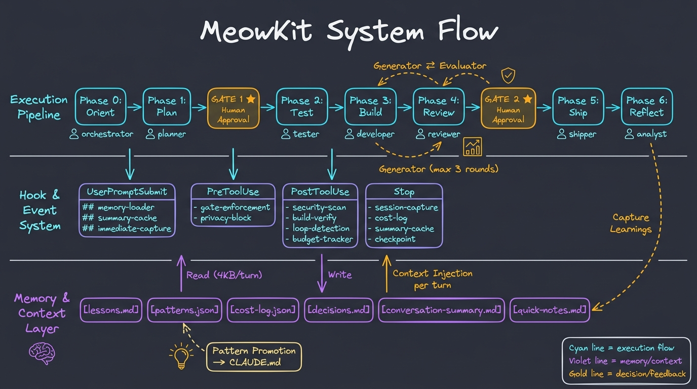

# MeowKit System Flow — Synthesis & Flow Model

> Generated from `memory-system.md` + `meowkit-architecture.md` cross-analysis.
> Diagram: `meowkit-system-flow-diagram-v2.png`

## 1. System Summary

MeowKit is a **prompt-engineering framework** — no executable runtime. It shapes LLM behavior through three mechanisms operating in concert:

| Mechanism | What | How |
|-----------|------|-----|
| **Rules** (16 files) | Behavioral instructions loaded every session | Priority-ordered: security > injection > gates > everything else |
| **Hooks** (14 scripts + 9 handlers) | Shell/Node scripts triggered by Claude Code events | Preventive enforcement — intercept BEFORE execution |
| **Skills** (74 active) | Context-loaded domain expertise | Matched by user intent, injected into prompt on activation |

**Orchestration unit:** 16 core agents + 7 skill-scoped agents route through a 7-phase pipeline with 2 human gates.

---

## 2. Execution Flow (End-to-End Lifecycle)

### Stage 1: Context Injection (every user message)

```
UserPromptSubmit event fires
  ├─ memory-loader.cjs → inject filtered memories (≤4KB)
  │   ├─ 60% budget: critical entries (always)
  │   ├─ 40% budget: domain-keyword-matched entries
  │   └─ skip: stale entries (>6mo standard), expired patterns (>12mo)
  ├─ conversation-summary-cache.sh → inject cached summary (≤4KB)
  ├─ immediate-capture-handler.cjs → capture ##prefix messages
  └─ tdd-flag-detector.sh → check --tdd flag
```

### Stage 2: Intent Classification & Routing

```
Claude Code skill matching
  ├─ meow:agent-detector (autoInvoke) → classify message, detect model tier
  ├─ meow:workflow-orchestrator (autoInvoke) → route complex features
  └─ Other skills → matched by SKILL.md description keywords
```

### Stage 3: 7-Phase Pipeline

| Phase | Agent(s) | Action | Gate |
|-------|----------|--------|------|
| 0 Orient | orchestrator | Load context, detect tier, process NEEDS_CAPTURE markers | — |
| 1 Plan | planner, architect, researcher | Scope-adaptive planning (--fast/--hard/--deep) | **GATE 1** (hook-enforced) |
| 2 Test | tester | Write tests targeting acceptance criteria | Optional (unless --tdd) |
| 3 Build | developer | Implement per approved plan + sprint contract (harness) | — |
| 4 Review | reviewer + evaluator | Structural audit + behavioral verification (active) | **GATE 2** (behavioral) |
| 5 Ship | shipper, git-manager | PR + deploy pipeline | — |
| 6 Reflect | documenter, analyst, journal-writer | Capture learnings, update patterns, cost tracking | — |

### Stage 4: Hook Enforcement (continuous)

| Event | Hooks | Purpose |
|-------|-------|---------|
| **PreToolUse** (Edit/Write) | gate-enforcement.sh, privacy-block.sh | Block unauthorized writes/reads |
| **PostToolUse** (Edit/Write) | post-write.sh, build-verify.cjs, loop-detection.cjs, budget-tracker.cjs | Verify + guard |
| **Stop** | pre-completion-check.sh, post-session.sh, summary-cache.sh, checkpoint-writer.cjs | Persist state |

---

## 3. Memory & Context Flow

### Per-Turn Injection (~8KB budget)

- **Memory** (≤4KB): 60% critical entries + 40% domain-matched. Filtered by staleness (6mo), keyword match, per-entry cap (3000 critical / 800 standard).
- **Summary** (≤4KB): Haiku-summarized conversation cache from previous Stop event.
- **SessionStart** (once): project-context.md, directory tree, readiness score.

### Memory Write Points

| Trigger | What's Written | Target |
|---------|---------------|--------|
| `##decision:` / `##pattern:` / `##note:` | Immediate capture (crash-resilient) | lessons.md / patterns.json / quick-notes.md |
| Stop hook | NEEDS_CAPTURE marker + cost entry | lessons.md + cost-log.json |
| Stop hook | Conversation summary (Haiku) | conversation-summary.md |
| Phase 6 Reflect | Categorized learnings | patterns.json + lessons.md |
| Pre-Ship (live) | Non-obvious decisions | lessons.md |

### Memory Files (8 active)

| File | Auto-loaded? | Purpose |
|------|-------------|---------|
| lessons.md | Yes (every turn) | Session learnings, YAML frontmatter |
| patterns.json | Yes (every turn) | Recurring patterns, frequency-tracked |
| conversation-summary.md | Yes (every turn) | Haiku-summarized conversation cache |
| cost-log.json | No | Token usage per task |
| decisions.md | No | Architecture decisions |
| security-log.md | No | Security audit findings |
| quick-notes.md | No | Staging for ##note: captures |
| trace-log.jsonl | No | Trace events for harness analysis |

---

## 4. Feedback Loops

### Loop A — Generator ⇄ Evaluator (within session)
Phase 3 Build → Phase 4 Review → PASS? → Ship. FAIL? → Back to Build (max 3 rounds → human escalation). Hard separation: generator ≠ evaluator, no self-evaluation.

### Loop B — Session Memory (cross-session)
Session learnings → lessons.md / patterns.json → memory-loader injects next session → agents use context → produce new learnings.

### Loop C — Pattern Promotion (long-term evolution)
After ~10 sessions: patterns with frequency ≥3 + severity=critical (or frequency ≥5) → proposed for CLAUDE.md → human approval → permanent behavioral rules.

### Loop D — Dead-Weight Audit (model upgrade cycle)
New model ships → audit playbook → measure each scaffold component's delta → prune dead weight → update adaptive density matrix. Scaffolding scales inversely with model capability.

---

## 5. Adaptive Density (Harness)

| Model | Density | Scaffolding | Rationale |
|-------|---------|-------------|-----------|
| Haiku (TRIVIAL) | MINIMAL | Short-circuits to `/meow:cook` | Cheapest, skip ceremony |
| Sonnet (STANDARD) | FULL | Contract + 1-3 iterations + context resets | Needs explicit scope |
| Opus 4.5 (COMPLEX) | FULL | Same as Sonnet | Same capability bracket |
| Opus 4.6+ (COMPLEX) | LEAN | Single-session, contract optional, 0-1 iterations | Capable models degrade under heavy scaffolding |

---

## 6. Diagram



**Color Legend:**
- **Cyan** → execution flow / orchestration
- **Violet** → memory & context
- **Gold** → decision points / gates / feedback loops
