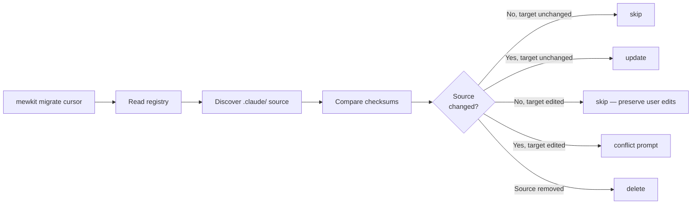

The `mewkit migrate` command exports your `.claude/` kit to 2 external coding-agent tools: Cursor and Codex. This page covers when to use it, what each tool accepts, and how to recover when conflicts surface.

## When to migrate

| Scenario | Command |
|----------|---------|
| Just ran `mewkit init`, want Cursor to see the kit too | `mewkit migrate cursor` |
| Create a Codex-only toolkit (from the authored bundle, no `.claude/`) | `mewkit init --target codex` |
| Have both coding agents installed and want them in sync | `mewkit migrate --all` |
| Just ran `mewkit upgrade`, need to propagate changes to external tools | `mewkit migrate TOOL` (re-runs are idempotent) |
| Want to check what would happen before writing | `mewkit migrate TOOL --dry-run` |

## Capability matrix

What each tool can receive from your `.claude/` kit:

| Tool | Agents | Commands | Skills | Config | Rules | Hooks |
|------|:------:|:--------:|:------:|:------:|:-----:|:-----:|
| Claude Code (source) | ✓ | ✓ | ✓ | ✓ | ✓ | ✓ |
| Cursor | — | — | — | ✓ | ✓ | — |
| Codex | ✓ | — | ✓ | ✓ | ✓ | ✓ |

✓ supported · — not supported by tool

**Special cases:**
- **Codex commands** migrate as Agent Skills (`.agents/skills/source-command-<name>/SKILL.md`) — Codex custom prompts gave way to skills. Dynamic template syntax (`$ARGUMENTS`, `$1`, <code v-pre>{`{...}`}</code>, `` !`cmd` ``, `@file`) has no skill equivalent; the template migrates verbatim with a manual-adaptation warning.
- **Capability resolution** adds one generated, bounded instruction block to `AGENTS.md` and writes `.codex/capabilities.json`. The block tells the agent to use `npx mewkit capabilities resolve --intent "..." --provider codex`; the JSON is data-only resolver input, never always-on model context. Re-running migration replaces the managed block without touching user-authored `AGENTS.md` content.
- **Codex rules** merge into `AGENTS.md` as `## Rule:` sections (native `.rules` files only accept `prefix_rule()` command policies). Orchestration/runtime-only rules are skipped by default; pass `--all-rules` to merge everything. The merged file is checked against Codex's 32 KiB `project_doc_max_bytes` budget — over-budget merges warn with the exact config line to add to `~/.codex/config.toml`, but mewkit never truncates the file or writes to your home config.
- **`.mcp.json`** converts to `config.toml [mcp_servers]` entries with the opt-in `--include-mcp` flag (Codex only; project-scoped MCP config loads only in trusted projects). When `.mcp.json` exists and the flag is off, the preflight tells you the exact re-run command.
- **`.claude/.env`** converts to a Codex `[shell_environment_policy]` scaffold from key names only. Values are never copied; secret-like key names are omitted and counted only as an aggregate warning.
- **Hooks** only migrate to Codex. Cursor has no documented hooks surface, so mewkit skips hooks for it with a warning. Codex events are version-gated: recent Codex (0.142+) supports 10 events with hooks enabled by default; older versions fall back to the conservative 6-event table.
- **Codex shell hooks** (`.sh`) migrate through generated `.cjs` wrappers that execute the copied script inside `.codex/hooks/`. Unsupported shell-family handlers such as `.ps1`, `.bat`, `.cmd`, and `.py` are reported as skipped with a reason.
- **Codex agent bundle** — `mewkit migrate codex` copies a hand-authored, Codex-native bundle: agents as `.codex/agents/*.toml` (name/description/developer_instructions), skills/commands/rules/modes as `.agents/skills/*/SKILL.md`, and hooks as `.codex/hooks.json`.

## Reference rewriting

Markdown content is rewritten with a fence-aware classifier instead of blanket string replacement:

| Reference | Inline prose / frontmatter | Fenced code (runnable) | Citation |
|-----------|---------------------------|------------------------|----------|
| Mapped asset (`.claude/skills/x/...`) | rewritten to the provider path | rewritten **only if** the asset migrates in the same run, else preserved + warned | preserved |
| Unmapped runtime (`.claude/scripts/`, `.claude/memory/`) | neutralized to provider-agnostic phrasing | preserved + warned | preserved |
| `CLAUDE.md` token | rewritten to the provider config name | preserved (command examples stay runnable) | preserved |

Every preserved reference appears in the preflight/dry-run report with `file:line` and a reason — nothing is silently dropped, and no path is ever fabricated. A post-conversion scanner verifies the invariant: any surviving source reference must be explained by a classifier decision, otherwise the run aborts before writing. Codex runs also persist the outcome to `.codex/migration-report.json` and `.codex/migration-report.md`, with one row per migrated, skipped, failed, or narrowed artifact.

## Quick start

### One-shot scaffold + export

```bash
# Codex-only toolkit — copies the authored Codex bundle, no .claude/
npx mewkit init --target codex

# Cursor toolkit — unpack .claude/, then export to Cursor
npx mewkit init --target cursor
```

### Standalone after init

```bash
# Already have a .claude/ — export to one tool
npx mewkit migrate cursor

# Export to all installed tools (auto-detected)
npx mewkit migrate --yes

# Interactive picker
npx mewkit migrate
```

## Idempotent re-runs

mewkit tracks every install in `~/.mewkit/portable-registry.json` with SHA-256 checksums for both source and target. Re-running migrate reconciles changes per file using an 8-case decision matrix:



**Practical impact:** running `mewkit upgrade` followed by `mewkit migrate cursor` automatically propagates new agents/skills to Cursor without overwriting your local edits.

### Portable evolution manifest

`mewkit migrate` also reads `packages/mewkit/portable-manifest.json` from the installed package. This file has one narrow job: clean up old registry-owned paths after MeowKit moves a source item or changes a provider install path.

The portable evolution manifest is not the release checksum manifest and it is not a provider capability manifest. Release manifests verify packaged files. Provider manifests describe supported surfaces. The portable evolution manifest only records real path evolution that must be reconciled once per registry.

Dry runs show manifest cleanup actions without updating `~/.mewkit/portable-registry.json`. A successful non-dry-run migration records the applied manifest version so the cleanup does not repeat.

## Resolving conflicts

When source AND target both changed since last install, mewkit prompts:

```
[!] Conflict: cursor/agent/scout
  mewkit updated source since last install
  Target file was also modified (user edits detected)

? How to resolve?
  > Overwrite with mewkit version (lose your edits)
    Keep your version (skip mewkit update)
    Show diff
```

Options:

| Choice | Behavior |
|--------|----------|
| **Overwrite** | Take mewkit's version. Your edits are lost. |
| **Keep** | Take your version. mewkit's update is deferred until next conflict. |
| **Show diff** | Display unified diff (then re-prompt). Limit: 5 views per item. |
| **Smart merge** | (merge-target files only) Update mewkit's sections, keep your additions outside the sentinels. |

**Bypass the prompt:**
- `--force` — overwrite all conflicts without asking
- `--yes` — non-interactive default is "keep your version"

## Scope flags

Restrict what gets migrated:

```bash
# Only skills
mewkit migrate cursor --only=skills

# Only skills and rules
mewkit migrate cursor --only=skills,rules

# Everything except hooks
mewkit migrate cursor --skip-hooks

# Everything except config and rules
mewkit migrate codex --skip-config --skip-rules

# Merge every rule into AGENTS.md, bypassing the portability filter
mewkit migrate codex --all-rules

# Also convert .mcp.json servers into config.toml [mcp_servers]
mewkit migrate codex --include-mcp
```

## Codex migration report

Codex migrations write two managed report files at the end of every run:

| File | Purpose |
|------|---------|
| `.codex/migration-report.json` | Machine-readable artifact ledger with counts, budget lines, preserved-reference details, and the minimum supported Codex hook version. |
| `.codex/migration-report.md` | Human-readable summary with the same data plus next actions for anything skipped, failed, or narrowed. |

The final summary prints a single verdict line:

```text
Migration: 125 migrated, 67 skipped, 39 need attention -> .codex/migration-report.json
```

`need attention` does not necessarily mean the run failed. It means at least one artifact migrated with reduced coverage, preserved an out-of-scope runtime reference, or was intentionally skipped by portability policy.

## Project vs. global scope

By default, mewkit writes to **project-local** paths (`./.cursor/rules/`, `./.codex/agents/`, etc.). Pass `--global` to write to your home directory (`~/.cursor/rules/`, `~/.codex/agents/`).

```bash
# Project scope (default)
mewkit migrate cursor

# Global scope
mewkit migrate cursor --global

# Init + migrate to global
mewkit init --target cursor --migrate-global
```

**Rule of thumb:** project scope keeps the kit confined to one repo. Global scope is for users who want every project on their machine to share the same Cursor/Codex config.

## Path collisions

mewkit detects when two selected providers would write the same install path and emits a banner during the preflight before reconciling per-provider install actions. With only Cursor and Codex as targets, and Cursor not migrating a skills surface, there is currently no cross-provider path collision — `.agents/skills/` is written only by Codex. The detection and reconciliation logic stay in place for when a future provider shares an install path.

## Uninstalling / starting over

The registry tracks every installation. To clean a partial state:

```bash
# Remove the registry — next migrate becomes a fresh install
rm ~/.mewkit/portable-registry.json

# Per-tool: delete the tool's directory then re-run
rm -rf .cursor
mewkit migrate cursor
```

## Concurrency

A PID-based file lock at `SCOPE/.mewkit/.lock` (`./.mewkit/.lock` for project, `~/.mewkit/.lock` for global) prevents two `mewkit migrate` runs from racing. Stale locks with dead PIDs auto-clear after 60 seconds.

If you see `Another mewkit migrate is in progress (PID X)`, check whether that PID is actually alive:

```bash
ps -p <PID>      # Unix
tasklist | grep <PID>   # Windows
```

If dead, delete the lock manually: `rm .mewkit/.lock`.

## Troubleshooting

### "Provider detection failed" in `--yes` mode

A `which` probe threw an unexpected error. mewkit refuses to default to "all supported targets" silently. Pass `--all` or specify a tool explicitly:

```bash
mewkit migrate cursor --yes      # explicit single tool
mewkit migrate --all --yes       # explicit both supported tools
```

### Codex hooks require recent Codex version

mewkit probes `codex --version` and picks a version-gated capability table: Codex 0.142+ gets the full 10-event surface (hooks enabled by default), while older or undetectable versions fall back to the conservative 0.124.0-alpha.3 table (6 events, feature flag written). Unsupported events are skipped with a structured warning. Set `MEWKIT_CODEX_COMPAT=optimistic` to assume the newest capabilities, or `MEWKIT_CODEX_COMPAT=strict` to force the conservative table.

## Upgrading mewkit itself

Independent of `mewkit migrate`, the CLI tool itself updates via:

```bash
npx mewkit upgrade           # latest stable
npx mewkit upgrade --beta    # latest beta
npx mewkit upgrade --check   # show available without installing
```

`mewkit upgrade` refreshes the `.claude/` kit **and** automatically re-exports to any installed provider toolkit it detects (`.cursor/`, `.codex/`), so a single `upgrade` moves the whole install together. In a codex-only project (`init --target codex`, no `.claude/`), `upgrade` refreshes the authored Codex bundle instead. To scaffold a provider toolkit fresh, use `mewkit init --target <provider>`.

## See also

- [CLI Commands Reference](/cli/commands#migrate) — every flag with examples
- [Memory System](/guide/memory-system#legacy-migration-from-claudememory) — every `mewkit migrate` run also migrates legacy `.claude/memory/` into `.meowkit/`
- [TDD Optional Migration](/migration/tdd-optional) — older migration guide for the v2.x TDD-optional change
