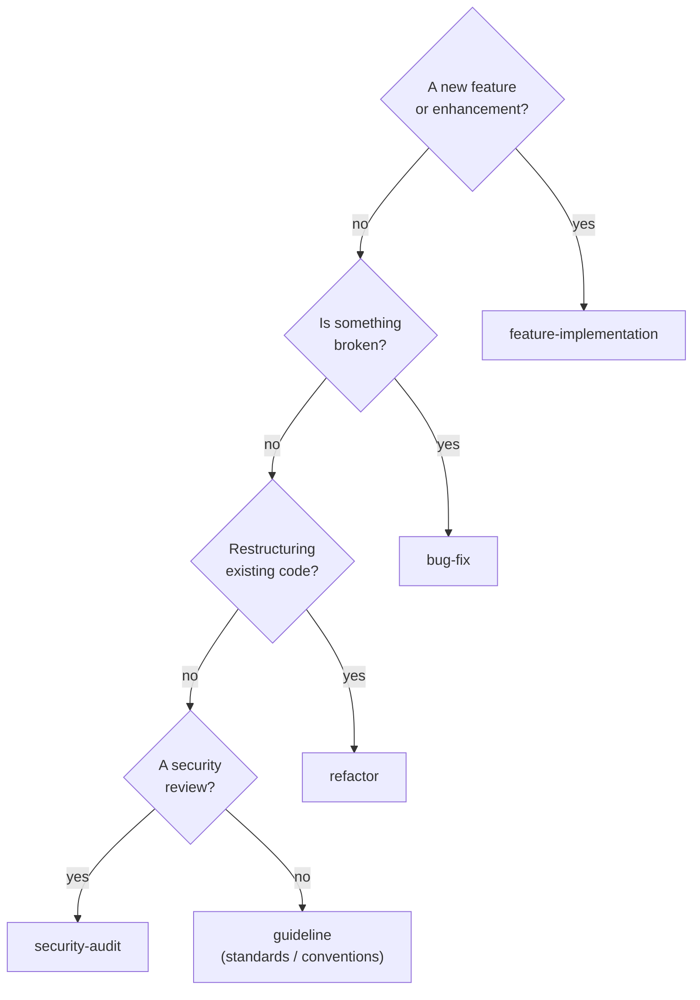

MeowKit ships 5 task templates covering the most common development workflows. Each template is a filled example with `[PLACEHOLDERS]` — not a blank form.

## Template overview

| Template | File | Use when |
|----------|------|----------|
| Feature Implementation | `feature-implementation.md` | Adding new functionality |
| Bug Fix | `bug-fix.md` | Fixing broken behavior |
| Refactor | `refactor.md` | Code restructuring |
| Security Audit | `security-audit.md` | Security review |
| Guideline | `guideline.md` | Team standards |

## Choosing a template



## Creating a task

```bash
# Using CLI
npx mewkit task new --type feature "Add user authentication"
npx mewkit task new --type bug-fix "Fix login timeout"

# Manually
cp .claude/../tasks/templates/feature-implementation.md tasks/active/260327-add-auth.feature.md
```

## Universal sections

Every template includes these sections:

| Section | Purpose | Required? |
|---------|---------|-----------|
| **Goal** | One sentence — what done looks like | Yes |
| **Context** | Current state + problem (max 5 bullets) | Yes |
| **Scope** | In scope / Out of scope | Yes |
| **Constraints** | What must NOT change | Yes |
| **Acceptance Criteria** | Binary pass/fail checkboxes | Yes |
| **Related** | File paths, plan links | Yes |
| **Agent State** | Resumability checkpoint | Yes |

## Writing good acceptance criteria

**Good** (binary, verifiable):
- `[ ] All existing tests pass after changes`
- `[ ] Login endpoint returns 401 for invalid credentials`
- `[ ] Response time < 200ms for P95`

**Bad** (subjective, ambiguous):
- `[ ] Code is clean` — what does "clean" mean?
- `[ ] Performance is good` — how good?
- `[ ] Handles edge cases` — which ones?

## File naming

```
YYMMDD-kebab-description.type.md

Examples:
260327-add-user-authentication.feature.md
260327-fix-login-timeout.bug-fix.md
260327-extract-auth-middleware.refactor.md
```

## Plan Creator Reference System

The `mk:plan-creator` skill uses progressive disclosure — details live in reference files loaded on-demand:

| Reference | Purpose | When loaded |
|-----------|---------|-------------|
| `scope-challenge.md` | Scope modes (HOLD/EXPANSION/REDUCTION), complexity thresholds | Before research begins |
| `research-phase.md` | Scout + researcher subagent protocol | When research is needed |
| `plan-organization.md` | Directory structure, naming, size rules | When creating plan directory |
| `output-standards.md` | YAML frontmatter, required sections, quality rules | When drafting plan |
| `solution-evaluation.md` | Trade-off scoring for multiple options | When comparing approaches |
| `task-management.md` | Hydration, cross-session resume, sync-back | After plan approval |
| `gotchas.md` | Known planning failure modes | Always (inline top 3 in SKILL.md) |
| `workflow-models/*.md` | Phase flow per task type | After model selection |

Plans validate via `scripts/validate-plan.py` — deterministic checks for required sections, binary acceptance criteria, and non-empty constraints.
