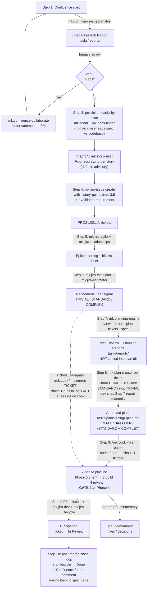

> A guided tour through the full developer loop. Each step shows the **prompt you type**, **which skills fire**, **which agent forks**, **what artifact gets written**, and **which gate decides whether you proceed**.

**Best for:** Developers who want to understand _why_ the workflow is shaped this way — not just the commands.
**Time estimate:** First read 20 min · Real run 1-4 hours depending on ticket size
**Skills used:** [mk:confluence-spec-analyst](/reference/skills/confluence-spec-analyst), [mk:confluence-collaborate](/reference/skills/confluence-collaborate), [mk:jira-issue](/reference/skills/jira-issue), [mk:jira-agile](/reference/skills/jira-agile), [mk:jira-relationships](/reference/skills/jira-relationships), [mk:jira-evaluator](/reference/skills/jira-evaluator), [mk:jira-estimator](/reference/skills/jira-estimator), [mk:planning-engine](/reference/skills/planning-engine), [mk:agent-detector](/reference/skills/agent-detector), [mk:scale-routing](/reference/skills/scale-routing), [mk:plan-creator](/reference/skills/plan-creator), [mk:cook](/reference/skills/cook), [mk:review](/reference/skills/review), [mk:ship](/reference/skills/ship), [mk:jira-dev](/reference/skills/jira-dev), [mk:jira-lifecycle](/reference/skills/jira-lifecycle), [mk:memory](/reference/skills/memory)

## Prerequisites

{/*
  Shared partial — included by workflow docs that require Jira access.
  Host page provides the surrounding H2 (e.g. "## Prerequisites").
  Source of truth: meowkit/.claude/skills/jira/references/install-and-auth.md
*/}

Install the `jira-as` CLI (used by every `mk:jira-*` leaf):

```bash
npx mewkit setup
```

This installs `jira-as` into `.claude/skills/.venv/bin/jira-as`. No global install needed.

Then populate `.claude/.env` (gitignored) with three vars:

| Var | Purpose |
|---|---|
| `MEOW_JIRA_API_TOKEN` | Atlassian Cloud API token — get one at [id.atlassian.com](https://id.atlassian.com/manage-profile/security/api-tokens) |
| `MEOW_JIRA_EMAIL` | Atlassian account email |
| `MEOW_JIRA_SITE_URL` | e.g. `https://your-company.atlassian.net` |

Verify with the SessionStart hook output: `[mk:jira] env OK` means all three keys are loaded.

<details>
<summary>Escape hatch — Atlassian MCP (mTLS, multi-profile, or non-jira-as workflows)</summary>

If `jira-as` is unusable (e.g. mTLS-required tenants, multi-profile setups), the leaves accept Atlassian MCP as a fallback transport:

</details>
```bash
claude mcp add --transport http atlassian https://mcp.atlassian.com/v1/mcp
```

The router does NOT auto-fallback — you invoke the leaf with the MCP transport explicitly. See [`mk:jira` reference](/reference/skills/jira) for details.
:::

Confluence access uses the same `confluence-as` wrapper — already installed by `npx mewkit setup`. The Atlassian API token from the Jira setup works for Confluence too.

## The Principle

> **Every skill emits an artifact. Every gate is a human decision. No automation crosses the spec → ticket → code boundaries.**

This page exists because the seam between Confluence, Jira, and your codebase is where most workflows leak. MeowKit's design is to make every seam **observable** — you can see what each skill produced before deciding whether to advance.

## The Flow



<Callout title="Reading the diagram" type="info">

- **Solid arrows** are the default STANDARD / COMPLEX path: Step 3 feasibility scan → Step 8 plan-creator (Gate 1) → Step 9 cook in code mode (Gate 2 only — Phase 1 skipped).
- **Dashed arrow** is the TRIVIAL fast-path: skip Steps 7 and 8 entirely, hand cook a natural-language task. Cook's Phase 1 runs inline; both Gate 1 and Gate 2 fire inside the cook invocation.
- **Artifact locations are explicit**: `tasks/reports/` for spec + tech review (no plan exists yet), `tasks/plans/<slug>/` for plan-creator's output. No automatic copy or symlink between them.
- **Two hard gates**: Gate 1 = plan approved (Step 8 standalone OR cook Phase 1). Gate 2 = review verdict PASS/WARN (cook Phase 4). Both hook-enforced.
  :::

Each arrow is a place where you read an artifact and decide.

## Step 1 — Pull the spec out of Confluence

### Prompt

</Callout>
```bash
/mk:confluence-spec-analyst analyze 12345 --include-children 1
```

Or, conversationally:

```
Analyze the spec at https://acme.atlassian.net/wiki/spaces/ENG/pages/12345
Pull child pages 1 level deep. I want requirements, acceptance criteria,
and any gaps or ambiguities flagged.
```

### What happens behind the scenes

| Layer               | Action                                                                                                                                                                                  |
| ------------------- | --------------------------------------------------------------------------------------------------------------------------------------------------------------------------------------- |
| Router              | `mk:confluence` recognizes "spec analysis" intent → forwards to `confluence-spec-analyst` leaf                                                                                          |
| Skill frontmatter   | `agent: confluence-spec-analyst` + `context: fork` — spawns the agent in a fresh context window                                                                                         |
| CLI wrapper         | `confluence-as get-page 12345 --include-children 1` runs via the venv-installed binary                                                                                                  |
| Multimodal sub-call | If the page embeds images/PDFs, `mk:multimodal` is invoked to describe each one and feed findings back into the report. Absent → `[NO_MULTIMODAL]` flag, analysis continues without it. |
| Children cap        | Hard ceiling of 10 children. Default depth 1. Both require explicit raise.                                                                                                              |
| Output              | Spec Research Report written locally (NOT to Confluence)                                                                                                                                |

<Callout title="Why context: fork" type="info">

The spec-analyst agent forks because spec analysis pollutes context with weasel-word inventory, gap-detection heuristics, and full page text. Fork isolates that bulk so your main session stays lean for planning + coding.

</Callout>

### What the artifact looks like

```markdown
# Spec Research Report — Q3 Auth Refresh

> Source: https://acme.atlassian.net/wiki/spaces/ENG/pages/12345 (hash: a3f8...)
> Generated: 2026-05-11 01:08

## Requirements

- R1. Users can log in with Google OAuth
- R2. Sessions expire after 24h of inactivity
- R3. Existing email/password accounts continue to work [LINKED-AC: existing]

## Acceptance Criteria

- AC1. Clicking "Sign in with Google" redirects to Google consent
- AC2. After consent, user lands on /dashboard with a session cookie set
- AC3. After 24h idle, next request → 401 + redirect to /login
- AC4. Email/password login flow is unchanged

## Gaps / Ambiguities

- [MISSING] What scopes do we request from Google? (email only? + profile?)
- [VAGUE] "Sessions expire after 24h" — sliding window or hard expiry?
- [AMBIGUOUS] R3 doesn't say whether OAuth-only users can later add a password

## Suggested User Stories

- Story A: "As a returning user I can sign in with my Google account"
  - Maps to: R1, R2, AC1, AC2
- Story B: "As an active user my session stays alive while I work"
  - Maps to: R2, AC3
- Story C: "Existing email/password users see no behavior change"
  - Maps to: R3, AC4

## Image / Diagram Findings

- Figure 1 (figma-frame "Sign-in v3"): button placement bottom-right, 16px gap
  from form fields, primary color #4285F4 (Google brand)
```

### Decision point

<Callout title="Human gate (no agent crosses this)" type="warn">

The report lists `[MISSING]`, `[VAGUE]`, `[AMBIGUOUS]` flags. **You** decide which need to be resolved before tickets exist. The agent will not guess on your behalf — this is enforced by `core-behaviors.md` Rule 2 (_Manage Confusion Actively_).

</Callout>

## Step 2 — Send open questions back to the PM

### Prompt

```bash
/mk:confluence-collaborate add-comment 12345 \
  "Three open questions from spec analysis: (1) Google scopes? (2) Session expiry style — sliding or hard? (3) Can OAuth users add a password later?" \
  --footer
```

### What happens behind the scenes

| Layer            | Action                                                                                                     |
| ---------------- | ---------------------------------------------------------------------------------------------------------- |
| Inline vs footer | Skill enforces `--footer` for open-question batches (inline comments are reserved for line-level feedback) |
| API call         | `confluence-as add-comment --page 12345 --type footer --body "..."`                                        |
| Notification     | PM gets a Confluence notification email; their reply lands as a comment thread                             |
| Workflow         | **You stop here.** Tickets do not yet exist.                                                               |

### Why the workflow pauses

Resolving ambiguity **before** ticket creation prevents two failure modes:

1. Tickets with vague ACs that estimator gives a falsely confident number on
2. Code that ships matching one valid interpretation of an ambiguous spec, requiring rework when the other interpretation surfaces

## Step 3 — Tech feasibility breakdown (pre-ticket)

Before tickets exist, do a **read-only feasibility pass** against the codebase. The goal is to catch "this can't be built without a refactor first" or "we already shipped this" _before_ tickets get filed and estimated.

<Callout title="What MeowKit actually supports here" type="warn">

Two skills run **before** any Jira ticket exists: `mk:scout` (codebase fingerprint) and `mk:docs-finder` (external API/library docs). That's it.

`mk:planning-engine` — the deeper tech-review skill — **requires Jira ticket keys** (`review TICKET-KEY` or `plan --tickets KEY,KEY,...`). So MeowKit's auto-mapping of spec requirements to specific files happens in **Step 7**, _after_ tickets exist. Step 3 is the pre-ticket scan that fits between "what the PM wants" and "what we'll commit to build."

Anything more automated than `mk:scout` + human cross-read at this stage would be speculative — there's no MeowKit skill that ingests a Spec Research Report and emits per-file impact without ticket keys.

</Callout>

### Prompt

```bash
/mk:scout authentication oauth session
# Cross-read the Spec Research Report against scout output. Then:
/mk:docs-finder "Google OAuth 2.0 — current scopes + PKCE requirements"
```

### What happens behind the scenes

| Layer                | Action                                                                                                                                                                                                                                              | Skill            |
| -------------------- | --------------------------------------------------------------------------------------------------------------------------------------------------------------------------------------------------------------------------------------------------- | ---------------- |
| Codebase fingerprint | Spawns parallel Explore subagents per directory segment; consolidates into a file map with architecture sketch, complexity estimates, and routing suggestions. Cached for downstream skills.                                                        | `mk:scout`       |
| External docs check  | For any third-party API/library named in the spec (OAuth providers, SDKs, etc.), pulls current docs via Context7 / Context Hub. Avoids planning against outdated training data.                                                                     | `mk:docs-finder` |
| Spec cross-read      | **You** read the Spec Research Report's `## Suggested User Stories` section next to the scout output, then decide whether the scope is feasible as-is, needs splitting, or hits an unblockable gap (e.g. "we don't have a session middleware yet"). | Human — no skill |

### Sample output (scout, abridged)

```
Architecture sketch
  Stack: NestJS + Vue 3 + Postgres
  Auth surface: src/auth/ — already has GitHubOAuthService (plugin pattern)
  Session middleware: src/auth/session.middleware.ts — currently fixed 24h
  Test runner: vitest

Files relevant to spec keywords
  src/auth/oauth.controller.ts          (provider plugin pattern entry)
  src/auth/github-oauth.service.ts      (reference impl)
  src/auth/session.middleware.ts        (fixed expiry — needs change)
  src/users/users.module.ts             (no OAuth fields yet)

Gaps detected
  No PKCE helper exists in the codebase (would be new code for Google's 2026 req)
```

### Feasibility decisions you make here

After cross-reading the Spec Research Report against the scout output:

| Spec story                           | Feasibility                                                           | Decision                                                    |
| ------------------------------------ | --------------------------------------------------------------------- | ----------------------------------------------------------- |
| "Sign in with Google"                | HIGH — OAuth plugin pattern exists; just add a provider               | Create ticket as-is                                         |
| "Sliding 24h session"                | MEDIUM — middleware exists but uses fixed expiry; needs refactor      | Create ticket; flag dependency before "Sign in with Google" |
| "OAuth users can add password later" | LOW — users table has no OAuth-provider column; separate model change | Defer to a follow-up sprint; flag with PM                   |

<Callout title="Why this step exists separately from Step 7" type="info">

Step 7's `mk:planning-engine review` produces a per-ticket Tech Review Report — but it needs a ticket key. If a requirement is infeasible against the current codebase, you want to know **before** it becomes a ticket that the team gets pressured to commit to. This Step 3 scan is the only chance.

</Callout>

### What you carry forward

A short, hand-written set of notes (kept in the Spec Research Report or a follow-up Confluence comment) that says, per suggested story: _feasibility level + any structural prerequisite_. These notes inform Step 4 (ticket creation) and resurface in Step 7 (per-ticket review) for confirmation.

## Step 3.5 — Story sizing

Spec analyst output gives you a list of suggested user stories. Tech feasibility (Step 3) tells you they are buildable. What you still don't know: **how big is each one?** Jira sizing skills require a ticket key, so they can't help yet. `mk:story-sizer` fills the gap — v1 paste-only, advisory by default, with opt-in `--auto-create` behind a single confirmation gate.

### Prompt

`/mk:story-sizer --paste [--scout]` (advisory) or `/mk:story-sizer --paste --auto-create --project AUTH --epic AUTH-100` (delegated). Paste template requires `story:` + `ac:` per block, separated by bare `---`. Optional `description:`. Full schema: [reference](/reference/skills/story-sizer).

### What happens behind the scenes

| Layer       | Action                                                                                                                                                                                                                                                                                                                                 |
| ----------- | -------------------------------------------------------------------------------------------------------------------------------------------------------------------------------------------------------------------------------------------------------------------------------------------------------------------------------------- |
| Adapter     | Validates template, emits `StoryRecord` list with SHA-256 source-hash; surfaces `[NO_ACS]` / `[MALFORMED_INPUT]`                                                                                                                                                                                                                       |
| Scoring     | 5 deterministic dimensions → Fibonacci 1/2/3/5/8/13 + uncertainty + complexity; plus inconsistency / split / DoR (Agile) / codebase signals (`--scout`)                                                                                                                                                                                |
| Writer      | Renders `tasks/reports/story-sizing-{YYMMDD}-{slug}.md` with per-story sections, summary table, and suggested `mk:jira-issue create` block (v1 field whitelist)                                                                                                                                                                        |
| Auto-create | 5 pre-flight checks (NO_ACS, Rule-1 injection, length cap, duplicate via `mk:jira-search`, source-hash); single batch `AskUserQuestion`; no skip-confirm. Per story: `mk:jira-issue create --story-points N` + `mk:jira-collaborate add-comment --internal`. Call A failure stops + cleanup hint; Call B failure logs WARN + continues |

:::warning Advisory by default
Default mode never calls Jira; suggested create blocks are text you copy in Step 4. `--auto-create` is the only mutating path; see [reference](/reference/skills/story-sizer) for full schema, gating rules, and `MEOWKIT_STORY_SIZER_COMMENT_TEMPLATE`.
:::

Step 3.5 informs Step 4: create tickets with `--story-points <N>` chosen, or run `--auto-create` for delegated batch creation.

## Step 4 — Create the Jira tickets (your decision)

PM has replied. You now know: Google scopes = `email + profile`; expiry = sliding 24h; OAuth users can add a password later (separate ticket). The Step 3.5 Story Sizing Report has rough estimates per story — pick the size from the report and pass via `--story-points`. Alternatively, run `/mk:story-sizer --paste --auto-create --project AUTH` to delegate ticket creation behind the single confirmation gate.

### Prompt

```bash
/mk:jira-issue create --project AUTH --type Story \
  --summary "Sign in with Google OAuth" \
  --story-points 3 \
  --description "Per spec page 12345 §R1. Scopes: email, profile.

  AC:
  - AC1. 'Sign in with Google' button redirects to Google consent
  - AC2. After consent, user lands on /dashboard with session cookie
  - AC3. Session uses sliding 24h expiry

  Spec: https://acme.atlassian.net/wiki/spaces/ENG/pages/12345"

/mk:jira-issue create --project AUTH --type Story \
  --summary "Sliding 24h session expiry"
  # ...

/mk:jira-issue create --project AUTH --type Task \
  --summary "Preserve email/password login flow (no-op test)"
  # ...
```

### What happens behind the scenes

| Layer            | Action                                                                                                            |
| ---------------- | ----------------------------------------------------------------------------------------------------------------- |
| Field resolution | `mk:jira-fields` is auto-invoked if the project has custom required fields. Skill prompts you to fill them.       |
| Issue creation   | `jira-as create` posts to `/rest/api/3/issue`                                                                     |
| Audit            | Each created issue prints its key + URL. No bulk creation — one verb, one issue.                                  |
| Spec link        | Description carries the Confluence URL verbatim. **This is the only sync mechanism** between Confluence and Jira. |

<Callout title="Why no bulk creation from the spec report" type="info">

The Spec Research Report supports `--with-commands` to emit suggested `mk:jira-issue create` blocks. Even then, you copy them by hand. The friction is intentional — it forces a human read-through before each ticket lands in someone's backlog.

</Callout>

### What you have now

```
AUTH-201  Story  "Sign in with Google OAuth"            (To Do)
AUTH-202  Story  "Sliding 24h session expiry"            (To Do)
AUTH-203  Task   "Preserve email/password login flow"    (To Do)
```

## Step 5 — Group into an epic and rank

### Prompt

```bash
/mk:jira-agile epic-add AUTH-200 AUTH-201 AUTH-202 AUTH-203
/mk:jira-agile rank AUTH-202 --before AUTH-201   # session expiry blocks the redirect
/mk:jira-relationships link AUTH-201 blocks AUTH-203
```

### What happens behind the scenes

| Skill                   | Verb       | Effect                                                  |
| ----------------------- | ---------- | ------------------------------------------------------- |
| `mk:jira-agile`         | `epic-add` | Sets the epic-link custom field on each child issue     |
| `mk:jira-agile`         | `rank`     | Calls `/rest/agile/1.0/issue/rank` to reorder backlog   |
| `mk:jira-relationships` | `link`     | Creates a "blocks" issue link (visible on both tickets) |

### Decision point

<Callout title="Ranking is dev-declared, not inferred" type="warn">

The agent did not read "blocks" from the spec — you told it. The spec analyst can suggest dependencies in its report, but the actual ranking is always your call. The skill never reorders based on its own judgment.

</Callout>

## Step 6 — Refine and estimate

### Prompt

```bash
/mk:jira-evaluator AUTH-201
/mk:jira-estimator AUTH-201
```

### What happens behind the scenes

`mk:jira-evaluator` (read-only):

| Check                 | Output                                                  |
| --------------------- | ------------------------------------------------------- |
| AC presence           | `present` / `missing` / `vague` per AC                  |
| Complexity dimensions | Code volume, integration count, novelty, risk           |
| Inconsistencies       | Description ↔ AC contradictions, AC ↔ AC contradictions |
| Verdict               | `simple` / `standard` / `complex`                       |

`mk:jira-estimator` (read-only, chains off evaluator):

| Input                                  | Output                                                                                                                                        |
| -------------------------------------- | --------------------------------------------------------------------------------------------------------------------------------------------- |
| Evaluator complexity + inconsistencies | Suggested story points (1, 2, 3, 5, 8, 13)                                                                                                    |
| Uncertainty annotation                 | If evaluator flagged inconsistencies, estimator says e.g. "**5 ± 3** — AC2 wording is ambiguous; estimate halves if redirect target is fixed" |

<Callout title="Estimates are signals, not commitments" type="warn">

Both skills emit suggestions only. The **team** still does planning poker. The AI provides numbers + reasoning; the humans negotiate.

</Callout>

### Sample output

```
AUTH-201 evaluator
  ACs: 3 present, 0 missing, 1 vague (AC2 "lands on /dashboard" — which dashboard?)
  Complexity: standard
  Inconsistencies: none
  Verdict: simple

AUTH-201 estimator
  Suggested: 3 points
  Uncertainty: ±1 (AC2 wording)
  Drivers: 1 new OAuth provider, 1 callback route, session middleware untouched
```

## Step 7 — Tech review against your codebase (per-ticket + sprint-level)

This is the deeper tech analysis the pre-ticket scan (Step 3) couldn't do. Now that tickets exist, `mk:planning-engine` has the keys it needs and runs in two modes:

| Mode                                    | Command                                                                                                                     | Output                                                                                                                                                                                                                                                 |
| --------------------------------------- | --------------------------------------------------------------------------------------------------------------------------- | ------------------------------------------------------------------------------------------------------------------------------------------------------------------------------------------------------------------------------------------------------ |
| **Per-ticket review**                   | `mk:planning-engine review AUTH-201 --scout`                                                                                | Tech Review Report — affected files, feasibility, dependencies, risks, complexity signals for one ticket                                                                                                                                               |
| **Sprint-level plan with spec context** | `mk:planning-engine plan --tickets AUTH-201,AUTH-202,AUTH-203 --capacity 40 --scout --spec path/to/spec-research-report.md` | Planning Report — sprint goal candidate, dependency map, grouping, sequencing, capacity analysis, **plus** a `## Spec Context (mk:confluence-spec-analyst)` section that brings the upstream spec requirements / AC / gaps back into the planning view |

### Prompt

```bash
# Per-ticket — run for each ticket entering the sprint
/mk:scout                                            # only if not already cached from Step 3
/mk:planning-engine review AUTH-201 --scout

# Sprint-level — closes the spec → planning loop with the real --spec integration
/mk:planning-engine plan \
  --tickets AUTH-201,AUTH-202,AUTH-203 \
  --capacity 40 \
  --scout \
  --spec tasks/reports/spec-research-260511-q3-auth-refresh.md
```

### What happens behind the scenes

| Step                                                  | Action                                                                                                                                                                                                                                                                                               |
| ----------------------------------------------------- | ---------------------------------------------------------------------------------------------------------------------------------------------------------------------------------------------------------------------------------------------------------------------------------------------------- |
| `mk:scout`                                            | Reuses the cached fingerprint from Step 3 if available. If absent, rebuilds the architecture sketch.                                                                                                                                                                                                 |
| `mk:planning-engine review TICKET --scout`            | Pulls the ticket via `mk:jira-issue`, cross-references ACs against scout output, emits a Tech Review Report per ticket. `[NO_CODEBASE_CONTEXT]` flag if scout was skipped.                                                                                                                           |
| `mk:planning-engine plan --tickets ... --spec REPORT` | Validates the report path exists and starts with `# Spec Research Report:` (else prompts you to run `mk:confluence-spec-analyst` first and exits — no auto-invocation across skills). Extracts the report's Requirements / AC / Gaps sections and passes them inline to the planning-reporter agent. |
| Spec context in output                                | The Planning Report gains a `## Spec Context (mk:confluence-spec-analyst)` section summarizing the upstream spec inputs the planning is based on. This is the _only_ place the original spec resurfaces in the planning pipeline.                                                                    |
| Validation failure                                    | If the `--spec` path is wrong or the report header doesn't match, planning-engine prompts and exits. Read failure **mid-flow** → `[NO_SPEC_CONTEXT: <error>]` flag in the report; planning continues without spec context.                                                                           |
| Where reports land                                    | `planning-engine` writes to `tasks/reports/` because no plan-dir exists yet (per its SKILL.md report-persistence rule: "Active plan's `research/` if exists, else `tasks/reports/`"). These files stay there — Step 8's plan-creator does **not** auto-copy them into the new plan-dir.              |

### Sample output (Tech Review Report)

```markdown
# Tech Review: AUTH-201

## Affected files

- `src/auth/oauth-google.service.ts` (new)
- `src/auth/oauth.controller.ts` (modify — add /google route)
- `src/auth/session.middleware.ts` (read-only — verify sliding logic exists)
- `src/auth/auth.module.ts` (modify — register new provider)

## Feasibility: HIGH

The OAuth abstraction in src/auth/oauth.controller.ts already supports a
provider plugin pattern (see GitHubOAuthService). Adding Google is mostly
a config + token-exchange addition.

## Dependencies

- AUTH-202 (sliding session) must land first — current middleware uses fixed 24h
- AUTH-203 is independent — could parallelize

## Risks

- Google's PKCE requirement changed Q1 2026 — verify against current Google docs
- Token refresh logic is not in the current middleware (deferred from AUTH-87)

## Complexity signals

- 1 new file (~120 LOC est.)
- 2 modified files (<30 LOC each)
- 0 schema changes
- 0 cross-module touches outside src/auth/
```

<Callout title="Why scout runs first" type="info">

Without scout, planning-engine guesses at file paths from the ticket text. Scout grounds the analysis in actual project structure — the difference between "should work" and "here are the exact files."

</Callout>

## Step 8 — Plan per ticket with `/mk:plan-creator`

Now that the tech review exists for each ticket, run `mk:plan-creator` **per ticket** to produce a durable, file-based implementation plan that goes through Gate 1 _before_ any code is generated. This is what an engineering manager wants: Gate 1 visibility at sprint kickoff, not buried inside each developer's cook run.

<Callout title="Why split this from /mk:cook" type="info">

`mk:cook` already runs `mk:plan-creator` at its own Phase 1. But running it standalone first has three measurable wins:

1. **Earlier Gate 1.** Catching "this needs a security review" or "this hides a migration" at plan stage costs minutes. Catching it at Gate 2 costs hours of generated code thrown out.
2. **Sprint-level plan portfolio.** With per-ticket plans materialized in `tasks/plans/`, the tech lead can read every plan side-by-side at sprint kickoff. Shared-file ownership conflicts surfaced by Step 7's `mk:planning-engine plan --spec` become actionable at this stage.
3. **Plan persistence across context resets.** A standalone plan-creator artifact survives session death; a Phase-1-inside-cook plan is bundled with that one cook invocation.

`mk:cook` accepts a plan path as its argument (`mk:cook/SKILL.md` line 70 — "code mode") and **skips its own Phase 1** when invoked that way. No double-planning.

</Callout>

### Tier-aware decision (not blanket policy)

| Ticket tier (from `mk:agent-detector` at Step 7)                                            | Recommendation  | Plan-creator mode                                                               |
| ------------------------------------------------------------------------------------------- | --------------- | ------------------------------------------------------------------------------- |
| **TRIVIAL** — rename, typo, single-file config                                              | **Skip** Step 8 | Plan-creator runs inline as `mk:cook` Phase 1 (cheaper than a separate session) |
| **STANDARD** — feature \< 5 files, bug fix, API endpoint                                     | **Default**     | `mk:plan-creator --fast` per ticket                                             |
| **COMPLEX** — auth, payments, data-model, any non-empty `matched_flags` from Step 7 Phase 0 | **Required**    | `mk:plan-creator --hard` per ticket                                             |

The tier comes from `mk:agent-detector`'s Phase 0 output during Step 7's `mk:planning-engine review`. You do not re-derive it.

### Prompt

```bash
# AUTH-201 was flagged COMPLEX in Step 7 (matched_flags: ["AUTH"])
/mk:plan-creator --hard
# Plan-creator interview prompts; you paste:
#   - The Tech Review Report path from Step 7 (tasks/reports/...)
#   - Ticket: AUTH-201
#   - Linked spec: tasks/reports/spec-research-260511-q3-auth-refresh.md

# AUTH-202 was flagged STANDARD
/mk:plan-creator --fast

# AUTH-203 was flagged TRIVIAL — skip Step 8 for this ticket;
# `/mk:cook implement AUTH-203` at Step 9 will handle it inline.
```

### What happens behind the scenes

| Layer                                  | Action                                                                                                                                                                                                                                                                                                                                                                                                                                       |
| -------------------------------------- | -------------------------------------------------------------------------------------------------------------------------------------------------------------------------------------------------------------------------------------------------------------------------------------------------------------------------------------------------------------------------------------------------------------------------------------------- |
| Scope check                            | `step-00-scope-challenge.md` runs first; trivial scope exits early with a one-paragraph plan instead of a phase tree                                                                                                                                                                                                                                                                                                                         |
| Research (in `--hard` / `--deep`)      | 2-3 researcher subagents spawned in parallel, each capped at 5 calls; reports written to `tasks/plans/<slug>/research/`                                                                                                                                                                                                                                                                                                                      |
| DoR advisory (if Agile context active) | Plan-creator checks `agile-story-gates.md` if `jira_tickets:` frontmatter is set; renders a Definition-of-Ready checklist; **does not block** — you decide                                                                                                                                                                                                                                                                                   |
| Plan emission                          | Writes `tasks/plans/YYMMDD-<slug>/plan.md` (≤80 lines overview) + `phase-XX-*.md` per implementation phase                                                                                                                                                                                                                                                                                                                                   |
| Tech Review handoff (manual)           | `mk:plan-creator` has **no auto-discovery** of Step 7's report. You reference the path during plan-creator's Validation Interview (Step 6 of its own workflow) or paste excerpts when asked about technical approach. The dev is responsible for citing it in `plan.md`'s Key Insights — plan-creator's "Research disconnected" gotcha (line 109 of its SKILL.md) only governs plan-creator's _own_ researcher outputs, not external reports |
| Where the Step 7 report stays          | `tasks/reports/<filename>.md` — planning-engine wrote it there because no plan dir existed at Step 7 (per `planning-engine/SKILL.md` lines 81-83). It is **not** copied or moved into `tasks/plans/<slug>/research/`                                                                                                                                                                                                                         |
| Gate 1                                 | The skill emits the plan for human review. `gate-enforcement.sh` will block any downstream cook code mode if the plan file has no approval line.                                                                                                                                                                                                                                                                                             |

### What you have after Step 8

```
tasks/
├── reports/                                            ← from Step 7 (unchanged)
│   ├── tech-review-260511-auth-201.md                  (mk:planning-engine review AUTH-201)
│   ├── tech-review-260511-auth-202.md                  (mk:planning-engine review AUTH-202)
│   ├── planning-260511-sprint.md                       (mk:planning-engine plan --tickets ... --spec)
│   └── spec-research-260511-q3-auth-refresh.md         (from Step 1, mk:confluence-spec-analyst)
└── plans/                                              ← new in Step 8
    ├── 260511-auth-201-google-oauth/
    │   ├── plan.md
    │   ├── phase-01-service-skeleton.md
    │   ├── phase-02-controller-route.md
    │   ├── phase-03-integration-tests.md
    │   └── research/                                   ← plan-creator's own researchers (--hard mode)
    │       ├── researcher-01-oauth-libraries.md
    │       └── researcher-02-pkce-strategies.md
    ├── 260511-auth-202-sliding-session/
    │   ├── plan.md
    │   └── phase-01-middleware-refactor.md
    └── (AUTH-203 has no plan dir — TRIVIAL, will plan inline at Step 9)
```

<Callout title="Two distinct research artifacts — don't confuse them" type="warn">

- **`tasks/reports/tech-review-*.md`** — Step 7's output from `mk:planning-engine`. Stays where it was written. Cited by hand in `plan.md`.
- **`tasks/plans/<slug>/research/`** — Step 8's plan-creator researchers (only in `--hard`/`--deep` modes). Different agents, different artifacts, different purpose.

There is no automatic copy or symlink between them. If you want the Tech Review summary visible in the plan, paste the relevant lines into `plan.md`'s Key Insights yourself during plan-creator's interview.

</Callout>

<Callout title="GATE 1 — happens HERE in this workflow" type="error">

When plan-creator runs standalone, Gate 1 fires at Step 8 (not inside Step 9's cook). The tech lead approves every sprint plan in one sitting. When `/mk:cook <plan-path>` runs at Step 9, it sees an approved plan and goes straight to Phase 2 / Phase 3.

</Callout>

### Engineering manager caveats

| Risk                                                                                             | Mitigation                                                                                                                                                                                 |
| ------------------------------------------------------------------------------------------------ | ------------------------------------------------------------------------------------------------------------------------------------------------------------------------------------------ |
| **Plan staleness** — `mk:cook` SKILL.md warns: plans >14 days old trigger a re-validation prompt | Pick up tickets within 14 days of sprint kickoff; for slipped sprints, re-run `mk:plan-creator` on stale tickets before cook                                                               |
| **Overplanning** — devs treat the plan as gospel and `/mk:cook --auto` without re-reading        | Gate 1 is still hook-enforced regardless; the policy should be that devs re-read the plan when picking up a ticket                                                                         |
| **Tier mis-classification** — TRIVIAL ticket gets a full plan                                    | Trust `mk:agent-detector`'s tier; if a STANDARD ticket gets plan-created and reveals 0 phases of substance, that's a signal to demote it to TRIVIAL and skip the standalone plan next time |

## Step 9 — Implement with `/mk:cook`

You've chosen AUTH-201 for this sprint. Time to build.

### Prompt

```bash
# AUTH-201 has a plan from Step 8 — call cook in "code mode" with the plan path.
# cook skips its own Phase 1 (plan-creator) because the plan is already approved.
/mk:cook tasks/plans/260511-auth-201-google-oauth/plan.md

# AUTH-203 (TRIVIAL — skipped Step 8) — pass a natural-language task.
# cook runs the full pipeline including Phase 1 inline.
/mk:cook implement AUTH-203
```

Optional flags: `--tdd` (failing test first), `--fast` (skip Phase 1 research). For this walkthrough we run the default pipeline for AUTH-201.

<Callout title="Phase 1 behavior" type="info">

- **Plan-path entry (AUTH-201, AUTH-202):** Phase 1 is SKIPPED. Cook reads the approved plan from Step 8 and goes straight to Phase 2 / Phase 3.
- **Natural-language entry (AUTH-203):** Phase 1 runs inline — `mk:plan-creator` produces the plan and Gate 1 fires inside the cook invocation.
  :::

### What happens behind the scenes — the 7 phases

This is where the most happens per command. Each phase is observable.

#### Phase 0 — Orient

</Callout>
```
mk:agent-detector reads:
  - AUTH-201 description + ACs (via mk:jira-issue)
  - The Tech Review Report from Step 7 (if present in tasks/reports/)
mk:scale-routing scans for vertical-domain CSV match
  → "OAuth" matches auth domain → level=high → tier override: COMPLEX
mk:risk-checklist flags:
  → AUTH (login/session keywords) → matched_flags: ["AUTH"]
```

<Callout title="AUTH flag is a hard escalator" type="error">

Per `model-selection-rules.md` Rule 2, any `matched_flags` ∈ `{AUTH, AUTHZ, DATA_MODEL, AUDIT_SEC, EXT_SYSTEM}` forces COMPLEX tier — **regardless** of how simple the task looks. This is non-negotiable.

</Callout>

Output:

```
Task complexity: COMPLEX → using Opus
matched_flags: ["AUTH"]
Routed to: planner → developer → security → reviewer → shipper
```

#### Phase 1 — Plan

```
Plan-path entry (AUTH-201): SKIPPED
  cook detects an existing plan.md → enters code mode
  → no plan-creator invocation, no re-research

Natural-language entry (AUTH-203, TRIVIAL):
  mk:plan-creator runs inline in --fast mode
  Writes a one-paragraph plan; phases collapsed
```

<Callout title="GATE 1 — Where it fires" type="error">

- **For tickets that went through Step 8** (AUTH-201, AUTH-202): Gate 1 already fired at Step 8 standalone. Cook treats the existing plan as approved (sources approval from the plan file's approval line).
- **For tickets that skipped Step 8** (TRIVIAL — AUTH-203): Gate 1 fires here, inside cook's Phase 1. `gate-enforcement.sh` still blocks Phase 3 if no approval line exists.

Gate 1 is non-bypassable in both paths.

</Callout>

#### Phase 2 — Test (only if `--tdd`)

In default mode, this phase is a no-op. With `--tdd`, the `tester` agent writes failing tests targeting each AC **before** any implementation runs. The `pre-implement.sh` hook then verifies the RED state.

#### Phase 3 — Build

```
developer agent reads phase-01-service-skeleton.md
Edits:
  - src/auth/oauth-google.service.ts (new, ~110 LOC)
  - src/auth/oauth.controller.ts     (+route, +10 LOC)
  - src/auth/auth.module.ts          (register service)
Commits incrementally with conventional-commit messages.
mk:verify runs after each commit:
  - npm run build  → 0 errors
  - npm run lint   → 0 warnings
  - npm test       → 18 passed
```

#### Phase 4 — Review

```
mk:review forks the reviewer agent in fresh context.
Reads:
  - the diff
  - tasks/plans/.../plan.md (to check scope discipline)
  - .claude/memory/review-patterns.md (past learnings)
Grades 5 dimensions:
  Functionality: PASS — all 3 ACs met
  Security:      PASS — uses httpOnly cookie, no token in localStorage
  Code quality:  PASS
  Tests:         WARN — no integration test for token refresh path
  Docs:          PASS — README updated
Writes: tasks/reviews/260511-auth-201-verdict.md
```

<Callout title="GATE 2 — Human approval required" type="error">

Verdict has 1 WARN. You decide: ship with the WARN documented, or add the missing test first. **Any FAIL** blocks Phase 5 unconditionally.

</Callout>

#### Phase 5 — Ship

```
mk:jira-dev branch-name AUTH-201
  → "feat/auth-201-google-oauth"
mk:jira-dev pr-description AUTH-201
  → PR body with "Closes AUTH-201", AC checklist, screenshot placeholder
git checkout -b feat/auth-201-google-oauth
git push -u origin HEAD
gh pr create --title "feat(auth): Sign in with Google" --body "..."
mk:jira-lifecycle transition AUTH-201 "In Review"
```

#### Phase 6 — Reflect

```
mk:memory appends to:
  - .claude/memory/architecture-decisions.md
      ##decision: OAuth provider plugins follow GitHubOAuthService pattern.
      Token refresh remains out of scope until AUTH-87 lands.
  - .claude/memory/review-patterns.md
      ##pattern: Reviewer caught missing token-refresh test on first OAuth provider.
      Add to OAuth provider checklist.
```

## Step 10 — After merge: close the loop

When the PR merges:

```bash
/mk:jira-lifecycle transition AUTH-201 "Done" --resolution Fixed
/mk:jira-collaborate add-comment AUTH-201 "Shipped in PR #142. Spec §R1, AC1-AC3 satisfied. AC2 dashboard target = /app/dashboard (confirmed with PM)."
/mk:confluence-collaborate add-comment 12345 --footer "AUTH-201 (Google OAuth) shipped in PR #142."
```

This is the only place the workflow writes **back** to Confluence — a footer comment on the source spec page so future readers know which ticket/PR realised which requirement.

## What flows between systems

```
┌──────────────────────┐                  ┌──────────────────────┐
│    Confluence        │                  │       Jira           │
│  ──────────────      │                  │  ──────────────      │
│  Spec page  ◄────────┼─────URL─only─────┼── ticket descriptions│
│                      │                  │                      │
│  Footer comment ◄────┼──ship summary────┼── PR #142            │
│  Open questions ◄────┼──ambiguities─────┼── spec analyst report│
└──────────────────────┘                  └──────────────────────┘
                                                   │
                                                   │ Jira keys + branch names
                                                   ▼
                                          ┌──────────────────────┐
                                          │   Codebase / Git     │
                                          │  ──────────────      │
                                          │  feat/auth-201-...   │
                                          │  PR #142 closes      │
                                          │  AUTH-201            │
                                          └──────────────────────┘
```

Three systems, three artifacts crossing each seam. No more, no less.

## Skill catalog used in this walkthrough

| Phase     | Skill                                                                           | Read/Write                          | Notes                                                                       |
| --------- | ------------------------------------------------------------------------------- | ----------------------------------- | --------------------------------------------------------------------------- |
| Step 1    | `mk:confluence-spec-analyst`                                                    | read Confluence, write local report | Forks agent; multimodal optional                                            |
| Step 1    | `mk:multimodal` _(opt)_                                                         | read media                          | Image/PDF findings in the report                                            |
| Step 2    | `mk:confluence-collaborate`                                                     | write Confluence                    | Footer comments for open questions                                          |
| Step 3    | `mk:scout`                                                                      | read codebase                       | Pre-ticket fingerprint (cached for Step 7)                                  |
| Step 3    | `mk:docs-finder` _(opt)_                                                        | read external docs                  | Current third-party API/library docs                                        |
| Step 3.5  | `mk:story-sizer --paste --scout`                                                | read all                            | Per-story Fibonacci sizing + suggested create commands (v1: paste-only)     |
| Step 3.5  | `mk:story-sizer --paste --auto-create --project KEY` _(opt-in)_                 | delegated write Jira                | Batch ticket creation with dry-run + single confirmation gate               |
| Step 4    | `mk:jira-issue`                                                                 | write Jira                          | One verb per ticket, no bulk                                                |
| Step 4    | `mk:jira-fields` _(opt)_                                                        | read Jira                           | Resolves custom required fields                                             |
| Step 5    | `mk:jira-agile`                                                                 | write Jira                          | Epic-add + rank                                                             |
| Step 5    | `mk:jira-relationships`                                                         | write Jira                          | Blocks / depends-on links                                                   |
| Step 6    | `mk:jira-evaluator`                                                             | read Jira                           | Complexity + inconsistencies                                                |
| Step 6    | `mk:jira-estimator`                                                             | read Jira                           | Story-point suggestion                                                      |
| Step 7    | `mk:planning-engine review TICKET --scout`                                      | read all                            | Per-ticket Tech Review Report                                               |
| Step 7    | `mk:planning-engine plan --tickets ... --spec REPORT --scout`                   | read all                            | Sprint-level Planning Report with Spec Context section                      |
| Step 8    | `mk:plan-creator --hard` _(COMPLEX)_ / `--fast` _(STANDARD)_ / _skip (TRIVIAL)_ | write plan files                    | Standalone Gate 1 per ticket; durable plan artifacts                        |
| Step 9 P0 | `mk:agent-detector` + `mk:scale-routing`                                        | read                                | Tier + matched_flags                                                        |
| Step 9 P1 | `mk:plan-creator`                                                               | write plan files                    | **SKIPPED** in code mode (plan from Step 8) — runs only for TRIVIAL tickets |
| Step 9 P2 | `mk:testing` _(`--tdd`)_                                                        | write tests                         | RED-phase gate                                                              |
| Step 9 P3 | `mk:cook` inner build                                                           | write code                          | Incremental commits                                                         |
| Step 9 P4 | `mk:review`                                                                     | write verdict                       | Gate 2 enforced                                                             |
| Step 9 P5 | `mk:ship` + `mk:jira-dev` + `mk:jira-lifecycle`                                 | write git + Jira                    | Branch, PR, transition                                                      |
| Step 9 P6 | `mk:memory`                                                                     | write `.claude/memory/`             | Cross-session continuity                                                    |
| Step 10   | `mk:jira-lifecycle` + `mk:jira-collaborate` + `mk:confluence-collaborate`       | write Jira + Confluence             | Close the loop                                                              |

## Human gates summary

Every gate where automation stops and a human decides.

| Gate                                                                                   | Where                                                                             | Who decides                  |
| -------------------------------------------------------------------------------------- | --------------------------------------------------------------------------------- | ---------------------------- |
| Resolve spec ambiguities                                                               | After Step 1                                                                      | Dev + PM                     |
| Feasibility / defer decision per suggested story                                       | After Step 3                                                                      | Dev                          |
| Decide which stories to file from sizing report                                        | After Step 3.5                                                                    | Dev                          |
| Batch auto-create confirmation                                                         | Step 3.5 with `--auto-create`                                                     | Dev (single AskUserQuestion) |
| Which suggestions become tickets                                                       | Step 4                                                                            | Dev                          |
| Story-point estimate                                                                   | After Step 6                                                                      | Team (planning poker)        |
| Ticket ranking + dependencies                                                          | Step 5                                                                            | Dev / tech lead              |
| Tier-aware plan-creator decision (skip TRIVIAL / `--fast` STANDARD / `--hard` COMPLEX) | Start of Step 8                                                                   | Dev / tech lead              |
| **Gate 1** — plan approval                                                             | Step 8 standalone (STANDARD/COMPLEX), OR inside `/mk:cook` Phase 1 (TRIVIAL only) | Dev (hook-enforced)          |
| **Gate 2** — review verdict                                                            | Phase 4 of `/mk:cook` (Step 9)                                                    | Dev (hook-enforced)          |
| Ship despite WARN dimensions                                                           | After Gate 2                                                                      | Dev                          |

## Common deviations

| Situation                                     | Skip to                                                                              |
| --------------------------------------------- | ------------------------------------------------------------------------------------ |
| Spec is already a Jira ticket (no Confluence) | Step 6 — straight to evaluation                                                      |
| Tickets exist but no spec analysis was done   | Step 6; consider asking the PO to back-fill ACs                                      |
| Bug, not a feature                            | Use [Fixing a Bug](/workflows/fix-bug); spec-analyst doesn't apply                   |
| Hotfix (one-shot, zero blast radius)          | `/mk:fix` bypasses Gate 1 per `scale-adaptive-rules.md` Rule 4                       |
| Green-field product build                     | [Autonomous Build](/workflows/autonomous-build) (`/mk:autobuild`) — different pipeline |

## When things go sideways

| Situation                               | What to do                                                                                                                                        |
| --------------------------------------- | ------------------------------------------------------------------------------------------------------------------------------------------------- |
| Spec changed mid-sprint                 | Re-run `/mk:confluence-spec-analyst` — the report includes a source-page hash so you can see what changed                                         |
| Estimate was way off                    | Update points via `/mk:jira-agile set-story-points`; the team retro picks this up                                                                 |
| Gate 1 plan rejected at Step 8          | Edit `tasks/plans/<slug>/phase-*.md` directly, re-prompt `/mk:plan-creator` (or just re-approve) before invoking `/mk:cook <plan-path>` at Step 9 |
| Plan went stale (>14 days since Step 8) | `mk:cook` will warn on stale plan in code mode — re-run `/mk:plan-creator` on that ticket before cook                                             |
| Gate 2 verdict FAIL                     | Fix the failing dimension, re-run `/mk:review`. No override.                                                                                      |
| Two tickets want the same file          | `mk:planning-engine` flagged this in Step 7 — sequence them, don't parallelize                                                                    |

## Related

- [Spec to Sprint Planning](/workflows/spec-to-sprint) — planner-focused upstream of this page
- [Ticket to Code](/workflows/ticket-to-code) — developer-focused; the per-ticket cycle this page nests inside
- [Agile / Scrum Workflow](/workflows/agile-scrum) — sprint-level rituals that bracket this loop
- [Autonomous Build](/workflows/autonomous-build) — `/mk:autobuild` for green-field builds
- [Code Review](/workflows/code-review) — deep-dive on Gate 2
- [Shipping Code](/workflows/ship-code) — deep-dive on Phase 5
