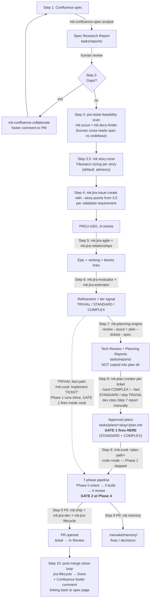
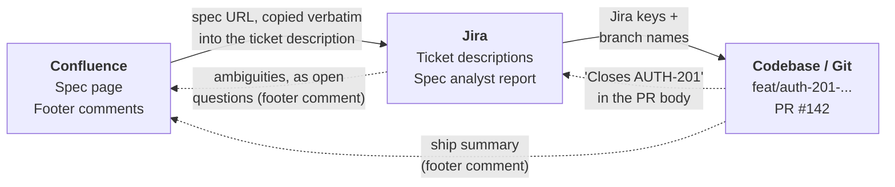

> A guided tour through the full developer loop. Each step shows the **prompt you type**, **which skills fire**, **which agent forks**, **what artifact gets written**, and **which gate decides whether you proceed**.

**Best for:** Developers who want to understand _why_ the workflow is shaped this way — not just the commands.
**Time estimate:** First read 20 min · Real run 1-4 hours depending on ticket size
**Skills used:** [mk:confluence-spec-analyst](/reference/skills/confluence-spec-analyst), [mk:confluence-collaborate](/reference/skills/confluence-collaborate), [mk:jira-issue](/reference/skills/jira-issue), [mk:jira-agile](/reference/skills/jira-agile), [mk:jira-relationships](/reference/skills/jira-relationships), [mk:jira-evaluator](/reference/skills/jira-evaluator), [mk:jira-estimator](/reference/skills/jira-estimator), [mk:planning-engine](/reference/skills/planning-engine), [mk:agent-detector](/reference/skills/agent-detector), [mk:scale-routing](/reference/skills/scale-routing), [mk:plan-creator](/reference/skills/plan-creator), [mk:cook](/reference/skills/cook), [mk:review](/reference/skills/review), [mk:ship](/reference/skills/ship), [mk:jira-dev](/reference/skills/jira-dev), [mk:jira-lifecycle](/reference/skills/jira-lifecycle), [mk:memory](/reference/skills/memory)

## Quick path

This page is a 20-minute read that explains every step. The steps themselves are:

```bash
/mk:confluence-spec-analyst analyze 12345 --include-children 1
/mk:jira-issue create --project AUTH --type Story ...   # one per story it found
/mk:planning-engine plan --tickets AUTH-201,AUTH-202 --capacity 40
/mk:cook AUTH-201                                       # then repeat per ticket
/mk:ship
```

**You end up with** a Confluence spec turned into merged PRs, with each handoff visible.
**If you only want the commands**, [Ticket to Code](/workflows/ticket-to-code) is the short
version of the second half.

## Prerequisites

Jira access needs the `jira-as` CLI and three variables in `.meowkit/.env`. [Jira Integration](/guides/jira-integration) covers the install, the token, what the skills will and will not do on their own, and what to check when authentication fails.

This walkthrough also reads Confluence. The same token and the same setup command cover it — see [Confluence Integration](/guides/confluence-integration), which is worth reading for the Cloud-only boundary if you are on Server or Data Center.

## The Principle

> **Every skill emits an artifact. Every gate is a human decision. No automation crosses the spec → ticket → code boundaries.**

This page exists because the seam between Confluence, Jira, and your codebase is where most workflows leak. MeowKit's design is to make every seam **observable** — you can see what each skill produced before deciding whether to advance.

## The Flow



<Callout title="Reading the diagram" type="info">

- **Solid arrows** are the default STANDARD / COMPLEX path: Step 3 feasibility scan → Step 8 plan-creator (Gate 1) → Step 9 cook in code mode (Gate 2 only — Phase 1 skipped).
- **Dashed arrow** is the TRIVIAL fast-path: skip Steps 7 and 8 entirely, hand cook a natural-language task. Cook's Phase 1 runs inline; both Gate 1 and Gate 2 fire inside the cook invocation.
- **Artifact locations are explicit**: `tasks/reports/` for spec + tech review (no plan exists yet), `tasks/plans/<slug>/` for plan-creator's output. No automatic copy or symlink between them.
- **Two hard gates**: Gate 1 = plan approved (Step 8 standalone OR cook Phase 1). Gate 2 = review verdict PASS/WARN (cook Phase 4). Both hook-enforced.
</Callout>

Each arrow is a place where you read an artifact and decide.

## The ten steps

<Cards>
  <Card title="Step 1 — Pull the spec out of Confluence" href="/workflows/spec-to-pr-walkthrough/step-01-pull-the-spec" description="mk:confluence-spec-analyst forks an agent and writes a Spec Research Report locally." />
  <Card title="Step 2 — Send open questions back to the PM" href="/workflows/spec-to-pr-walkthrough/step-02-open-questions" description="Footer comments carry ambiguities back to Confluence. The workflow pauses here." />
  <Card title="Step 3 — Tech feasibility breakdown" href="/workflows/spec-to-pr-walkthrough/step-03-tech-feasibility" description="Read-only pre-ticket scan with mk:scout + mk:docs-finder, before anything gets estimated." />
  <Card title="Step 3.5 — Story sizing" href="/workflows/spec-to-pr-walkthrough/step-03-5-story-sizing" description="mk:story-sizer gives Fibonacci sizes per story — advisory by default." />
  <Card title="Step 4 — Create the Jira tickets" href="/workflows/spec-to-pr-walkthrough/step-04-create-tickets" description="One verb, one issue. The Confluence URL in the description is the only sync mechanism." />
  <Card title="Step 5 — Group into an epic and rank" href="/workflows/spec-to-pr-walkthrough/step-05-epic-and-rank" description="Epic-add, rank, and blocks links — all dev-declared, never inferred." />
  <Card title="Step 6 — Refine and estimate" href="/workflows/spec-to-pr-walkthrough/step-06-refine-and-estimate" description="Evaluator grades ACs and complexity; estimator suggests points with uncertainty." />
  <Card title="Step 7 — Tech review against your codebase" href="/workflows/spec-to-pr-walkthrough/step-07-tech-review" description="mk:planning-engine finally has ticket keys — per-ticket review and sprint-level plan." />
  <Card title="Step 8 — Plan per ticket" href="/workflows/spec-to-pr-walkthrough/step-08-plan-per-ticket" description="Standalone mk:plan-creator moves Gate 1 to sprint kickoff. Tier-aware, not blanket." />
  <Card title="Step 9 — Implement with /mk:cook" href="/workflows/spec-to-pr-walkthrough/step-09-implement-with-cook" description="The 7-phase pipeline, phase by phase, with Gate 2 at Phase 4." />
  <Card title="Step 10 — After merge: close the loop" href="/workflows/spec-to-pr-walkthrough/step-10-close-the-loop" description="The only place the workflow writes back to Confluence." />
</Cards>

## What flows between systems



Solid arrows carry work forward; dashed arrows are the write-backs that close the loop.

Three systems, three artifacts crossing each seam. No more, no less.

## Skill catalog used in this walkthrough

| Phase     | Skill                                                                           | Read/Write                          | Notes                                                                       |
| --------- | ------------------------------------------------------------------------------- | ----------------------------------- | --------------------------------------------------------------------------- |
| Step 1    | `mk:confluence-spec-analyst`                                                    | read Confluence, write local report | Forks agent; multimodal optional                                            |
| Step 1    | `mk:multimodal` _(opt)_                                                         | read media                          | Image/PDF findings in the report                                            |
| Step 2    | `mk:confluence-collaborate`                                                     | write Confluence                    | Footer comments for open questions                                          |
| Step 3    | `mk:scout`                                                                      | read codebase                       | Pre-ticket fingerprint (cached for Step 7)                                  |
| Step 3    | `mk:docs-finder` _(opt)_                                                        | read external docs                  | Current third-party API/library docs                                        |
| Step 3.5  | `mk:story-sizer --paste --scout`                                                | read all                            | Per-story Fibonacci sizing + suggested create commands (v1: paste-only)     |
| Step 3.5  | `mk:story-sizer --paste --auto-create --project KEY` _(opt-in)_                 | delegated write Jira                | Batch ticket creation with dry-run + single confirmation gate               |
| Step 4    | `mk:jira-issue`                                                                 | write Jira                          | One verb per ticket, no bulk                                                |
| Step 4    | `mk:jira-fields` _(opt)_                                                        | read Jira                           | Resolves custom required fields                                             |
| Step 5    | `mk:jira-agile`                                                                 | write Jira                          | Epic-add + rank                                                             |
| Step 5    | `mk:jira-relationships`                                                         | write Jira                          | Blocks / depends-on links                                                   |
| Step 6    | `mk:jira-evaluator`                                                             | read Jira                           | Complexity + inconsistencies                                                |
| Step 6    | `mk:jira-estimator`                                                             | read Jira                           | Story-point suggestion                                                      |
| Step 7    | `mk:planning-engine review TICKET --scout`                                      | read all                            | Per-ticket Tech Review Report                                               |
| Step 7    | `mk:planning-engine plan --tickets ... --spec REPORT --scout`                   | read all                            | Sprint-level Planning Report with Spec Context section                      |
| Step 8    | `mk:plan-creator --hard` _(COMPLEX)_ / `--fast` _(STANDARD)_ / _skip (TRIVIAL)_ | write plan files                    | Standalone Gate 1 per ticket; durable plan artifacts                        |
| Step 9 P0 | `mk:agent-detector` + `mk:scale-routing`                                        | read                                | Tier + matched_flags                                                        |
| Step 9 P1 | `mk:plan-creator`                                                               | write plan files                    | **SKIPPED** in code mode (plan from Step 8) — runs only for TRIVIAL tickets |
| Step 9 P2 | `mk:testing` _(`--tdd`)_                                                        | write tests                         | RED-phase gate                                                              |
| Step 9 P3 | `mk:cook` inner build                                                           | write code                          | Incremental commits                                                         |
| Step 9 P4 | `mk:review`                                                                     | write verdict                       | Gate 2 enforced                                                             |
| Step 9 P5 | `mk:ship` + `mk:jira-dev` + `mk:jira-lifecycle`                                 | write git + Jira                    | Branch, PR, transition                                                      |
| Step 9 P6 | `mk:memory`                                                                     | write `.meowkit/memory/`             | Cross-session continuity                                                    |
| Step 10   | `mk:jira-lifecycle` + `mk:jira-collaborate` + `mk:confluence-collaborate`       | write Jira + Confluence             | Close the loop                                                              |

## Human gates summary

Every gate where automation stops and a human decides.

| Gate                                                                                   | Where                                                                             | Who decides                  |
| -------------------------------------------------------------------------------------- | --------------------------------------------------------------------------------- | ---------------------------- |
| Resolve spec ambiguities                                                               | After Step 1                                                                      | Dev + PM                     |
| Feasibility / defer decision per suggested story                                       | After Step 3                                                                      | Dev                          |
| Decide which stories to file from sizing report                                        | After Step 3.5                                                                    | Dev                          |
| Batch auto-create confirmation                                                         | Step 3.5 with `--auto-create`                                                     | Dev (single AskUserQuestion) |
| Which suggestions become tickets                                                       | Step 4                                                                            | Dev                          |
| Story-point estimate                                                                   | After Step 6                                                                      | Team (planning poker)        |
| Ticket ranking + dependencies                                                          | Step 5                                                                            | Dev / tech lead              |
| Tier-aware plan-creator decision (skip TRIVIAL / `--fast` STANDARD / `--hard` COMPLEX) | Start of Step 8                                                                   | Dev / tech lead              |
| **Gate 1** — plan approval                                                             | Step 8 standalone (STANDARD/COMPLEX), OR inside `/mk:cook` Phase 1 (TRIVIAL only) | Dev (hook-enforced)          |
| **Gate 2** — review verdict                                                            | Phase 4 of `/mk:cook` (Step 9)                                                    | Dev (hook-enforced)          |
| Ship despite WARN dimensions                                                           | After Gate 2                                                                      | Dev                          |

## Common deviations

| Situation                                     | Skip to                                                                              |
| --------------------------------------------- | ------------------------------------------------------------------------------------ |
| Spec is already a Jira ticket (no Confluence) | Step 6 — straight to evaluation                                                      |
| Tickets exist but no spec analysis was done   | Step 6; consider asking the PO to back-fill ACs                                      |
| Bug, not a feature                            | Use [Fix a Bug](/guides/fix-a-bug); spec-analyst doesn't apply                   |
| Hotfix (one-shot, zero blast radius)          | `/mk:fix` bypasses Gate 1 per `scale-adaptive-rules.md` Rule 4                       |
| Green-field product build                     | [Autonomous Build](/guides/autonomous-build) (`/mk:autobuild`) — different pipeline |

## When things go sideways

| Situation                               | What to do                                                                                                                                        |
| --------------------------------------- | ------------------------------------------------------------------------------------------------------------------------------------------------- |
| Spec changed mid-sprint                 | Re-run `/mk:confluence-spec-analyst` — the report includes a source-page hash so you can see what changed                                         |
| Estimate was way off                    | Update points via `/mk:jira-agile set-story-points`; the team retro picks this up                                                                 |
| Gate 1 plan rejected at Step 8          | Edit `tasks/plans/<slug>/phase-*.md` directly, re-prompt `/mk:plan-creator` (or just re-approve) before invoking `/mk:cook <plan-path>` at Step 9 |
| Plan went stale (>14 days since Step 8) | `mk:cook` will warn on stale plan in code mode — re-run `/mk:plan-creator` on that ticket before cook                                             |
| Gate 2 verdict FAIL                     | Fix the failing dimension, re-run `/mk:review`. No override.                                                                                      |
| Two tickets want the same file          | `mk:planning-engine` flagged this in Step 7 — sequence them, don't parallelize                                                                    |

## Related

- [Spec to Sprint Planning](/workflows/spec-to-sprint) — planner-focused upstream of this page
- [Ticket to Code](/workflows/ticket-to-code) — developer-focused; the per-ticket cycle this page nests inside
- [Agile / Scrum Workflow](/workflows/agile-scrum) — sprint-level rituals that bracket this loop
- [Autonomous Build](/guides/autonomous-build) — `/mk:autobuild` for green-field builds
- [Review Code](/guides/review-code) — deep-dive on Gate 2
- [Ship Safely](/guides/ship-safely) — deep-dive on Phase 5
