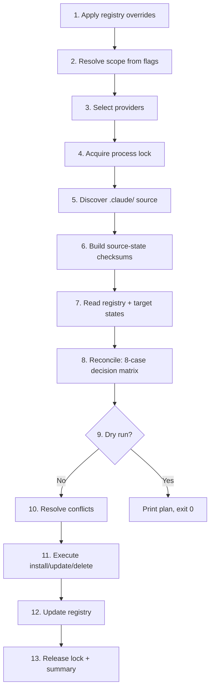

# CLI Usage — Migration

`mewkit migrate` exports your `.claude/` kit to external coding-agent tools. This page explains exactly what gets migrated, walks you through using the command, and breaks down the internal flow each invocation follows.

For the flag reference, see [Commands → migrate](/cli/commands#migrate). For tool-specific behavior and conflict recovery, see the [Migration Guide](/migration).

## What Gets Migrated

Six categories of content live under `.claude/` and migrate as separate types. Each tool accepts a different subset — see the [capability matrix](/migration#capability-matrix) to know which tools take which categories.

### 1. Agents

`.claude/agents/*.md` files — markdown subagent definitions with YAML frontmatter (`name`, `description`, `model`, `tools`).

| Discovery | Output |
|-----------|--------|
| `.claude/agents/scout.md` | `.cursor/rules/scout.mdc` (Cursor) · `.codex/agents/scout.toml` (Codex) · `.github/agents/scout.agent.md` (Copilot) |

mewkit normalizes the frontmatter per target tool — Copilot wants array `tools`, Cursor wants `alwaysApply`, Codex wants `developer_instructions` in TOML. The body text itself is shared but path references (`.claude/...`) and Claude-only tool names (`Read tool`, `Write tool`) are rewritten to provider-neutral phrasing for non-Claude targets.

### 2. Commands

`.claude/commands/meow/*.md` files — slash command definitions, including nested directories (e.g. `commands/meow/docs/init.md` becomes `/meow:docs:init`).

| Discovery | Output |
|-----------|--------|
| `.claude/commands/meow/cook.md` | `.codex/prompts/cook.md` (Codex) · `.gemini/commands/cook.toml` (Gemini CLI) · `.windsurf/workflows/cook.md` (Windsurf) |

Tools that don't support commands (Cursor, Roo, Cline, Goose, GitHub Copilot, Amp, Kilo, Kiro, OpenHands) skip this category with a warning.

### 3. Skills

`.claude/skills/<name>/` directories — multi-file skill bundles with `SKILL.md`, optional `references/`, optional `scripts/`. Skills migrate as **whole directories**, not files.

| Discovery | Output |
|-----------|--------|
| `.claude/skills/meow:cook/` (with SKILL.md, references/, scripts/) | `.cursor/skills/meow-cook/...` · `.agents/skills/meow-cook/...` (shared by 5 tools) · `.codex/skills/meow-cook/...` |

mewkit sanitizes colon-prefixed names (`meow:cook` → `meow-cook`) for cross-platform safety. Some tools share `.agents/skills/` as a common path — mewkit detects this and emits a banner.

### 4. Config

`CLAUDE.md` (your project's instructions for Claude Code) — single file, single output per provider.

| Discovery | Output |
|-----------|--------|
| `CLAUDE.md` | `.cursor/rules/project-config.mdc` (Cursor) · `AGENTS.md` (OpenCode/Codex/Goose, merged) · `GEMINI.md` (Gemini CLI) |

For tools using a single shared file (`AGENTS.md`, `GEMINI.md`), mewkit uses sentinel-bracketed merge: your config goes between `<!-- mewkit:start -->` and `<!-- mewkit:end -->`, preserving any user content outside those markers.

### 5. Rules

`.claude/rules/*.md` files — behavioral rules loaded by agents (e.g. `core-behaviors.md`, `security-rules.md`).

| Discovery | Output |
|-----------|--------|
| `.claude/rules/security-rules.md` | `.cursor/rules/security-rules.mdc` (Cursor) · `.factory/rules/security-rules.md` (Droid) |

Rules go through the same Claude-reference-stripping pass as config. Tool-specific phrasing replacements (e.g. `mewkit init` → `scaffold the kit`) keep the docs neutral when consumed by other agents.

### 6. Hooks

`.claude/hooks/*.{cjs,mjs,js}` files — runtime event handlers. Only **node-runnable** hooks migrate; shell hooks (`.sh`, `.ps1`, `.bat`, `.py`) are filtered at discovery and reported in the preflight summary.

| Discovery | Output |
|-----------|--------|
| `.claude/hooks/session-init.cjs` | `.codex/hooks/{hash}-session-init.cjs` + `.codex/hooks.json` entry (Codex) · `.factory/hooks/session-init.cjs` (Droid) |

Hook support is limited to **4 tools**: Claude Code, Codex, Droid, Gemini CLI. For Codex, mewkit generates per-hook wrapper scripts that scrub Claude-only fields per Codex's capability table — see [How Migration Works](#how-migration-works) below.

---

## Step-by-Step Guide

### Step 1 — Scaffold the kit

If you don't already have a `.claude/` in your project:

```bash
npx mewkit init
```

This downloads the latest MeowKit release and unpacks `.claude/`, `tasks/`, and `CLAUDE.md` into the current directory.

### Step 2 — Preview the migration

Always start with a dry run. It computes the full plan, prints what would be written, but writes nothing:

```bash
npx mewkit migrate cursor --dry-run
```

Expected output:

```
Discovering portable items...
Discovery complete.

Migrate plan
  Source: ./.claude/ (project)

  install:  95
  update:   0
  skip:     0
  conflict: 0
  delete:   0

[!] 5 shell hook(s) skipped (only node-runnable .cjs/.mjs/.js hooks migrate).

(dry run — no files written)
```

### Step 3 — Run the migration

```bash
npx mewkit migrate cursor
```

mewkit prompts before writing:

```
? Migrate 95 action(s)? Yes
```

On confirmation, files are written atomically (temp + rename) and the registry at `~/.mewkit/portable-registry.json` is updated.

### Step 4 — Verify

```bash
ls -la .cursor/rules/        # Should see migrated rules + agents
ls -la .agents/skills/       # Should see skill directories
cat ~/.mewkit/portable-registry.json | head -20   # Inspect registry
```

### Step 5 — Re-run safely

After `npx mewkit upgrade` (which refreshes `.claude/`) or after editing a target file directly, re-run migrate:

```bash
npx mewkit migrate cursor
```

The 8-case decision matrix takes over: unchanged items skip, kit updates apply, your hand-edits are preserved (or surface as conflicts you can resolve interactively).

### Step 6 — Multi-tool one-shot

To export to several tools without invoking migrate per tool:

```bash
# Interactive multiselect
npx mewkit migrate

# Pre-selected list (auto-yes)
npx mewkit migrate --all --yes

# Combined with init
npx mewkit init --migrate-to cursor,codex,droid
```

### Step 7 — Project vs. global scope

Default writes are project-local (`./.cursor/`, `./.codex/`). For global installs:

```bash
npx mewkit migrate cursor --global
# or
npx mewkit init --migrate-to cursor --migrate-global
```

Each scope has its own registry (`./.mewkit/portable-registry.json` vs `~/.mewkit/portable-registry.json`) and its own concurrency lock.

### Step 8 — Restrict scope

Skip categories you don't want to migrate:

```bash
# Only skills + rules
npx mewkit migrate cursor --only=skills,rules

# Everything except hooks
npx mewkit migrate gemini-cli --skip-hooks

# Only config (CLAUDE.md → AGENTS.md merge)
npx mewkit migrate codex --only=config
```

---

## How Migration Works

Each `mewkit migrate` invocation follows the same 9-step pipeline. Understanding it helps when troubleshooting.



### 1. Apply mewkit overrides

Before anything, mewkit patches the upstream provider registry with corrections from real-world docs:

- **Override A** — Kiro IDE: adds `~/.kiro/steering/` global paths.
- **Override B** — Antigravity: `--prefer-agents-md` opts into `AGENTS.md` instead of `GEMINI.md`.
- **Override C** — Windsurf: workflow `charLimit = 12000`.
- **Override D** — OpenCode: skills go to `.opencode/skills/` (not `.claude/skills/`).
- **Override G** — Kilo Code: marked `_unverified` to trigger runtime warning.

These run once per process, idempotent.

### 2. Resolve scope from flags

`resolveMigrationScope(argv, options)` builds a `MigrationScope` boolean record:

```ts
{ agents: true, commands: true, skills: true, config: true, rules: true, hooks: true }
```

- Default: all six types enabled
- `--only=skills,hooks` → narrows to listed types
- `--skip-config` → excludes config from the default-all
- `--only` + `--skip-*` together throws (mutex error, exit 2)

### 3. Select providers

Decision tree in `selectProviders`:

1. `options.tools` (CSV from init) — preset list, validated against the 15 known providers.
2. `options.tool` (positional argument) — single tool. Rejects `claude-code` (it's the source).
3. `--all` — all 15 target providers.
4. `--yes` (no tool) — runs `detectInstalledProviders` (`which cursor`, `which codex`, ...). On detection failure: throws (does NOT default to all 15 silently).
5. Interactive — `@clack/prompts` multiselect. Requires TTY.

### 4. Acquire process lock

A PID-based file lock at `<scope>/.mewkit/.lock` prevents two `mewkit migrate` runs from racing on the same registry:

- Project scope: `./.mewkit/.lock`
- Global scope: `~/.mewkit/.lock`

If the lock exists with a live PID, refuse with `Another mewkit migrate is in progress (PID X)`. If the lock is stale (PID dead, OR file older than 60s), auto-clear and retry.

### 5. Discover `.claude/` source

`discoverAll` walks every enabled type:

- `discoverAgents(.claude/agents/)` — every `*.md` file with frontmatter parsed.
- `discoverCommands(.claude/commands/meow/)` — recursive walk, preserving nesting via `segments[]`.
- `discoverSkills(.claude/skills/)` — directories containing `SKILL.md`, with colon-sanitized names.
- `discoverConfig(CLAUDE.md)` — single file.
- `discoverRules(.claude/rules/)` — recursive `*.md` walk.
- `discoverHooks(.claude/hooks/)` — top-level files filtered to `.cjs`/`.mjs`/`.js`/`.ts`. Shell hooks (`.sh`/`.ps1`/`.bat`/`.py`) are reported separately.

MeowKit-internal directories (`memory/`, `session-state/`, `modes/`, `rubrics/`, `benchmarks/`, `logs/`, `node_modules/`) are excluded at every walk.

### 6. Build source-state checksums

For each discovered item, mewkit:

1. Computes SHA-256 of the raw source body — the `sourceChecksum`.
2. For each selected provider, runs the converter (`md-to-mdc`, `fm-to-fm`, etc.) to compute the **target** content.
3. Computes SHA-256 of the converted output — the per-provider `convertedChecksum`.
4. Computes SHA-256 of the final on-disk shape (e.g. wrapped in a sentinel block for merge targets) — the per-provider `targetChecksum`.

The result is a `SourceItemState[]` that the reconciler compares against the registry.

### 7. Read registry + target states

- Read `~/.mewkit/portable-registry.json` (or `./.mewkit/portable-registry.json` for project scope) — the v3.0 registry with prior-install records.
- For each registered installation, read the target file from disk and compute its current SHA-256 — the live `currentTargetChecksum`.
- For merge-single targets (AGENTS.md, etc.), parse sentinel sections and compute per-section checksums.

### 8. Reconcile — the 8-case decision matrix

The pure reconciler (`reconcile()` in `reconciler.ts` — no I/O) walks every (item, provider) combination and produces an action:

| # | Source | Target | Registry | Action |
|---|--------|--------|----------|--------|
| 1 | Present | Missing | Missing | **install** (new-item) |
| 2 | Present | Missing | Missing for this provider, present for others | **install** (new-provider-for-item) |
| 3 | Unchanged | Unchanged | Match | **skip** (no-changes) |
| 4 | Unchanged | Edited by user | — | **skip** (user-edits-preserved) — `--force` flips to **install** |
| 5 | Changed | Unchanged | Match | **update** (source-changed) |
| 6 | Changed | Edited by user | — | **conflict** (both-changed) |
| 7 | Removed | Present in registry | — | **delete** (source-removed-orphan) |
| 8 | Present | Matches expected output | Unknown checksum (legacy) | **skip** + backfill registry |

The reconciler also detects:
- **Empty-dir override** — if user deleted the entire target directory, re-install all items unless `--respect-deletions`.
- **Path collisions** — multiple providers writing to the same path (e.g. `.agents/skills/`) — emits a banner via `bannerExtras`.

### 9. Dry run gate

If `--dry-run`, print the plan and exit 0. Nothing is written.

### 10. Resolve conflicts

For every action with `action: "conflict"`:

- Interactive (TTY + no `--yes`): prompt the user via `@clack/prompts`.
  - Choices: **Overwrite**, **Keep**, **Smart merge** (merge-target only), **Show diff** (limit 5 views per item).
- Non-interactive: default to "keep" (safe). `--force` overrides to "overwrite".

### 11. Execute install / update / delete

For each non-skip action:

- **per-file** strategy — atomic write (`tmp` + `rename`).
- **single-file** strategy — atomic write of the whole file.
- **merge-single** — read existing, parse sentinels, swap mewkit's section, atomic write.
- **yaml-merge** / **json-merge** — rebuild the entire merged file from all source items in scope.
- **codex-toml** / **codex-hooks** — defer to specialized installers (`installCodexAgents`, `mergeHooksSettings`).
- **delete** — `unlink` target + remove registry entry.

For Codex hook installs specifically:
1. Detect Codex version via `codex --version`.
2. Look up capability table — which events and matchers are supported.
3. Generate per-hook wrapper `.cjs` scripts that scrub unsupported fields at runtime.
4. Snapshot existing `~/.codex/hooks.json` (rollback safety).
5. Write merged `hooks.json` + write wrapper scripts (executable mode 0o755).
6. Set `[features] codex_hooks = true` in `~/.codex/config.toml` if needed.
7. On any failure: restore the snapshot.

### 12. Update registry

For each successful install/update:

```json
{
  "item": "scout",
  "type": "agent",
  "provider": "cursor",
  "global": false,
  "path": ".cursor/rules/scout.mdc",
  "sourcePath": ".claude/agents/scout.md",
  "sourceChecksum": "sha256-of-source-body",
  "targetChecksum": "sha256-of-written-content",
  "installSource": "kit",
  "installedAt": "2026-04-29T22:35:00Z"
}
```

Registry writes are atomic (`writeFile` to `.tmp` then `rename`) and protected by a separate registry-level lock to prevent concurrent corruption.

### 13. Release lock + summary

The `finally` block always releases the process lock. The orchestrator prints a final summary:

```
Migration complete
  95 succeeded
  0 failed
```

Failed items list their errors with re-run hints.

---

## See Also

- [Commands → migrate](/cli/commands#migrate) — every flag and exit code
- [Migration Guide](/migration) — capability matrix per tool, troubleshooting
- [Commands → init --migrate](/cli/commands#init-migrate-one-shot-scaffold-export) — chained scaffold + export
