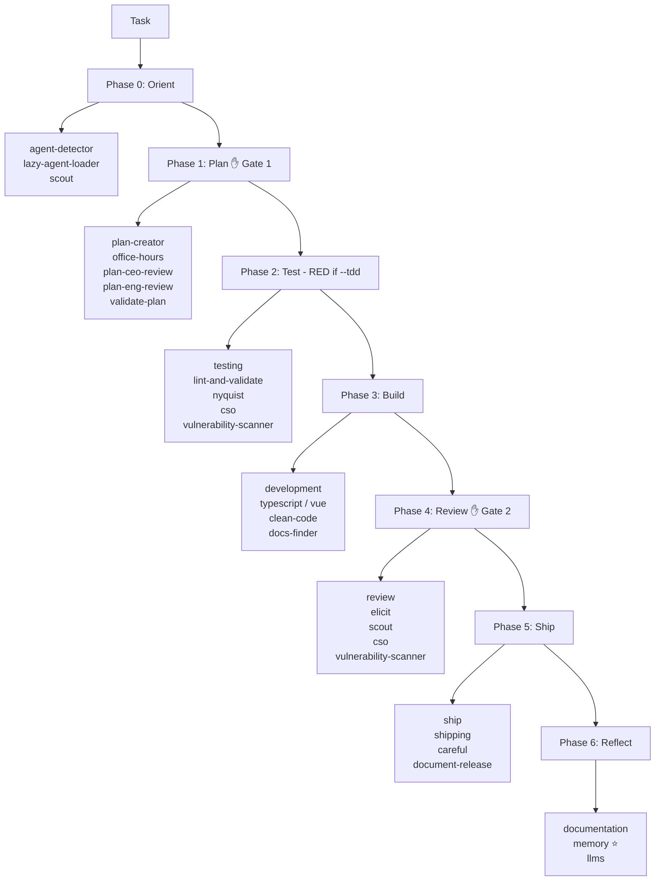

# Agent-Skill Architecture

Agents are specialists. Skills are tools agents load on demand.

Every task is routed to the right agent for its phase. That agent activates only the skills relevant to its work — not a global load of everything. This lazy loading keeps context windows lean and model costs predictable.

::: tip Key principle
Skills activate by task domain, not all at once. An orchestrator loads routing skills. A developer loads language-specific skills. A shipper loads deployment skills. No agent loads everything.
:::

## Project Context System

`docs/project-context.md` is the agent **constitution** — tech stack, conventions, anti-patterns, and testing approach. All agents load it at session start, before any task-specific context.

```
Session Start
     │
     ▼
Load docs/project-context.md   ← Always first
     │
     ▼
Load task-specific context
     │
     ▼
Route to agent
```

Without `project-context.md`, agents infer project conventions independently and make conflicting assumptions. With it, every agent shares the same ground truth.

Create or update it with:

```
/meow:docs-init    # generate from codebase analysis (new projects)
/meow:docs-sync    # diff-aware update after feature work
```

## Task Flow

```
Task Received
     │
     ▼
Phase 0: Orient ──→ agent-detector scores all agents
     │                lazy-agent-loader loads winner
     ▼
Phase 1: Plan ────→ planner loads: plan-creator, office-hours, plan-eng-review
     │
     ▼
Phase 2: Test ────→ tester loads: testing, lint-and-validate (RED if --tdd, optional otherwise)
     │
     ▼
Phase 3: Build ───→ developer loads: development, typescript/vue, clean-code
     │
     ▼
Phase 4: Review ──→ reviewer loads: review, cso, vulnerability-scanner
     │
     ▼
Phase 5: Ship ────→ shipper loads: ship, careful, document-release
     │
     ▼
Phase 6: Reflect ─→ documenter loads: documentation, memory
                    analyst loads: memory
```

## Agent → Skills Mapping

| Agent | Phase | Skills Loaded |
|-------|-------|---------------|
| orchestrator | 0 | agent-detector, lazy-agent-loader, scout |
| planner | 1 | plan-creator, plan-ceo-review, plan-eng-review, validate-plan, office-hours |
| architect | 1 | plan-creator (ADR references) |
| tester | 2 | testing, lint-and-validate, qa, qa-manual, nyquist |
| developer | 3 | development, typescript, vue, frontend-design, clean-code, docs-finder |
| reviewer | 4 | review, elicit, scout, cso, vulnerability-scanner |
| evaluator | 3, 4 | evaluate, rubric, trace-analyze, benchmark |
| security | 2, 4 | cso, vulnerability-scanner, skill-template-secure |
| shipper | 5 | ship, shipping, careful |
| documenter | 6 | documentation, document-release, llms |
| analyst | 0, 6 | memory |
| brainstormer | 1 | office-hours |
| journal-writer | 6 | memory |
| ui-ux-designer | 3 | frontend-design, ui-design-system |
| git-manager | 5, any | ship (git operations only) |

::: info Evaluator agent (added v2.2.0)
The `evaluator` is the behavioral counterpart to the structural `reviewer`. It grades running builds against weighted rubrics using active verification (driving the build via browser/curl/CLI). In harness pipelines (`meow:harness`), the generator (developer) and evaluator are hard-separated to prevent self-eval bias. See [Harness Architecture](/guide/harness-architecture) and the [evaluator agent reference](/reference/agents/evaluator).
:::

## Skill Activation by Phase



## Plan-First Gate Pattern

Most skills enforce a plan-first gate: before doing significant work they check that an approved plan exists.

```
Task arrives
     │
     ▼
Plan exists? ──No──→ Create plan ──→ ✋ Gate 1 (human approval)
     │                                       │
    Yes ◄──────────────────────────── Approved
     │
     ▼
Proceed with implementation
```

Skills that enforce this gate:

| Skill | Gate behavior | Skip condition |
|-------|---------------|----------------|
| meow:cook | Create plan if missing | Plan path arg, `--fast` mode |
| meow:fix | Plan if > 2 files | `--quick` mode |
| meow:ship | Require approved plan | Hotfix with human approval |
| meow:cso | Scope audit via plan | `--daily` mode |
| meow:qa | Create QA scope doc | Quick tier |
| meow:review | Read plan for context | PR diff reviews |
| meow:workflow-orchestrator | Route to plan-creator | Fasttrack mode |
| meow:investigate | Produces input FOR plans | Always skips |
| meow:office-hours | Pre-planning skill | Always skips |
| meow:retro | Data-driven, no plan | Always skips |
| meow:document-release | Scope from diff | Post-ship sync |

::: info Why some skills skip the gate
`meow:investigate` and `meow:office-hours` produce planning input — they run before a plan exists by design. `meow:retro` is data-driven and has no implementation output to scope.
:::

## Step-File Architecture

Complex skills decompose into JIT-loaded step files instead of one monolithic SKILL.md:

```
skills/meow:review/
├── SKILL.md           # Entrypoint — metadata only, no workflow
├── workflow.md        # Step sequence definition
├── step-01-blind-review.md
├── step-02-edge-cases.md
├── step-03-criteria-audit.md
└── step-04-triage.md
```

**Why step files?**

- **Token efficiency** — only the active step is in context, not the entire workflow
- **Auditability** — each step produces a discrete artifact
- **Resumability** — state persists to `session-state/{skill-name}-progress.json`; interrupted workflows resume from the last completed step

**Rules:**
- One step at a time — never load multiple steps simultaneously
- Never skip steps — even empty steps run quickly and preserve sequence integrity
- Fix step files when wrong — don't work around them

### Currently step-file enabled

| Skill | Steps | What each step does |
|-------|-------|---------------------|
| `meow:review` | 4 | Blind review → Edge cases → Criteria audit → Triage |
| `meow:plan-creator` | 9 (00–08) | Scope → Research → Codebase → Draft → Semantic checks → Red-team → Interview → Gate 1 → Hydrate |

`meow:plan-creator` also has a fast-mode path (`workflow-fast.md`) that runs steps 00→03→04→07→08, skipping research, codebase analysis, red-team, and the validation interview.

Skills under 150 lines stay monolithic — step files add overhead only worth it for 3+ distinct phases.

## Cross-Cutting Skills

Some skills activate across multiple phases rather than being owned by a single agent.

| Skill | Activates when |
|-------|----------------|
| `careful` | Any phase with destructive commands |
| `freeze` | Any phase — scopes a debug session |
| `scout` | Phase 0 + any exploration task |
| `docs-finder` | Any phase needing up-to-date library docs |
| `multimodal` | Any phase with visual content or images |
| `session-continuation` | Cross-session handoff required |

::: warning
Cross-cutting skills are loaded by individual agents as needed — they are not globally pre-loaded. Loading them unconditionally would inflate every task's context cost.
:::

## Quick-Start: Which Skill Do I Need? (v1.1.0)

| I want to... | Skill | Phase |
|--------------|-------|-------|
| Plan a feature | `meow:plan-creator` | 1 |
| Validate a plan before building | `meow:validate-plan` | 1 |
| Brainstorm approaches | `meow:brainstorming`, `meow:office-hours` | 1 |
| Write tests first (TDD) | `meow:testing` | 2 |
| Check test-to-requirement coverage | `meow:nyquist` | 2, 4 |
| Implement a feature | `meow:cook` | 0-6 |
| Fix a bug | `meow:fix` | 3 |
| Debug an issue | `meow:debug`, `meow:investigate` | 3 |
| Review code | `meow:review` | 4 |
| Deepen review findings | `meow:elicit` | 4 |
| Security audit | `meow:cso`, `meow:audit` | 2, 4 |
| Ship / deploy | `meow:ship` | 5 |
| Update docs after shipping | `meow:document-release` | 6 |
| Run a retrospective | `meow:retro` | 6 |
| Explore the codebase | `meow:scout` | 0 |
| Look up library docs | `meow:docs-finder` | any |

## Subagent Status Protocol (v1.1.0)

All subagents report structured status on completion:

```
**Status:** DONE | DONE_WITH_CONCERNS | BLOCKED | NEEDS_CONTEXT
**Summary:** [1-2 sentences]
**Concerns/Blockers:** [if applicable]
```

See `output-format-rules.md` Rule 5 for full protocol.

## Full Skill Registry

See [SKILLS_INDEX.md](/reference/skills-index) for the complete list of all 60+ skills with owner, phase, type, and architecture.
