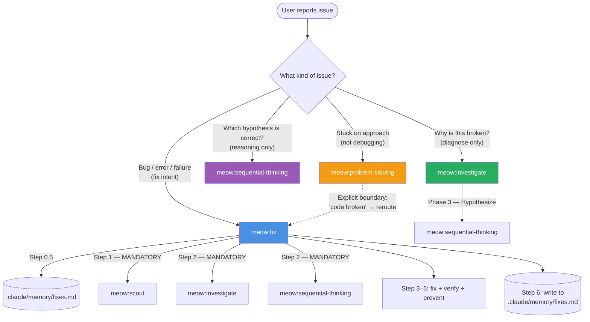
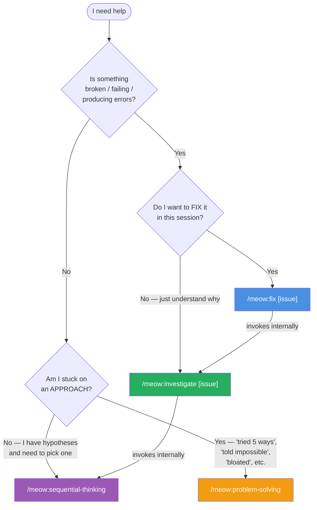
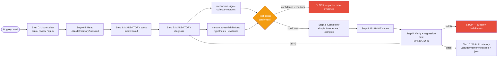
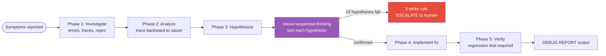
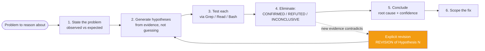
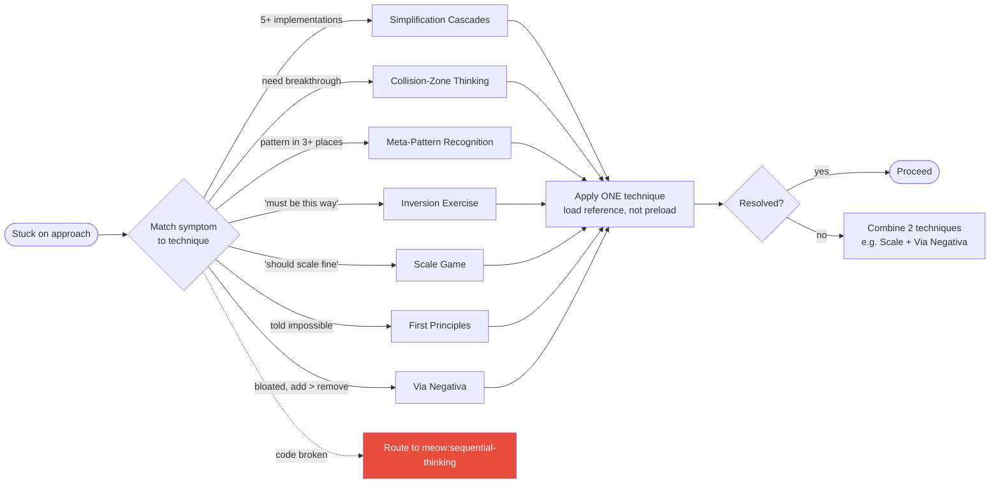
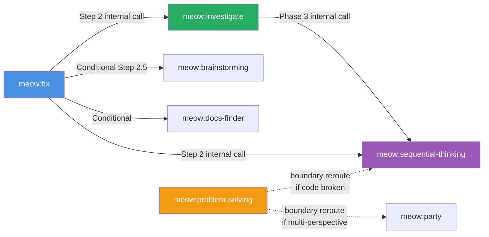

# Debugging & Thinking Skills — Decision Guide

Four meowkit skills sit on adjacent but distinct axes. Picking the wrong one wastes tokens and produces bad answers. This guide is the boundary map — each rule traced to the actual SKILL.md, not inferred.

## TL;DR — One Decision Matrix

Match the **strongest** signal in your current situation to ONE skill. Do not stack multiple starting skills.

| Your situation | Starting skill | Why |
|---|---|---|
| Bug, error, test failure, CI issue, type error, lint — anything broken | **`meow:fix`** | Top-level bug-fix orchestrator. Mandatorily invokes scout + investigate + sequential-thinking. |
| Pure diagnostic question — "why is this broken?" without intent to fix yet | **`meow:investigate`** | 5-phase root-cause debugging. Read-only until hypothesis confirmed. Feeds into fix later. |
| Structured reasoning about evidence — "these are my hypotheses, which is correct?" | **`meow:sequential-thinking`** | Hypothesis table, evidence-based elimination, revision. Not scoped to bugs — also for architecture decisions. |
| Stuck on **approach**, not on **cause** — "I've built this 5 ways and it still feels wrong" | **`meow:problem-solving`** | Strategic unsticking. 7 non-default techniques. **Not** for debugging. |

::: tip Default when unsure
Anything that smells like "something is broken" → `meow:fix`. It will invoke the others internally. The only time to skip `meow:fix` is when you explicitly do NOT want to fix (just diagnose), or when you are not dealing with a bug at all.
:::

## The Real Composition (from SKILL.md files)

These skills aren't peers — they compose. This diagram reflects exactly what each `SKILL.md` does internally:

Read this diagram as: **`meow:fix` is the orchestrator that calls `meow:investigate` which calls `meow:sequential-thinking`**. `meow:problem-solving` stands apart — it's the only one on the strategic-unsticking axis, not the debugging axis.

## Which Skill to Start With — Decision Tree

## Skill-by-Skill: What Actually Happens

### `meow:fix` — The Top-Level Bug Orchestrator

**When it triggers:** bug, error, test failure, CI issue, type error, lint, log error, UI issue, code problem. The description is intentionally broad — this is the front door for anything broken.

**What it actually does** (from `.claude/skills/meow:fix/SKILL.md`):

**Hard gates:**
- HARD-GATE — no fix proposed before Steps 1–2 (scout + diagnose) complete
- BLOCK — confidence below "medium" forces more evidence
- STOP — 3 failed fix attempts triggers architecture review, not a fourth attempt

**Use `meow:fix` when:** you have a concrete broken thing AND you want it fixed this session.

### `meow:investigate` — Pure Root-Cause Debugging

**When it triggers:** "debug this", "why is this broken", "root cause analysis", troubleshooting.

**What it actually does** (from `.claude/skills/meow:investigate/SKILL.md`):

**Constraints (real, from SKILL.md):**
- Read-only until hypothesis confirmed
- Freeze hook on `Edit` / `Write` — enforces scope boundary via `bin/check-freeze.sh`
- 3-strike rule — if 3 hypotheses fail, escalate; do not keep guessing
- `> 5 files touched` — `AskUserQuestion` about blast radius first

**Use `meow:investigate` when:** you want to understand the root cause without necessarily fixing it in the same session. Also fires automatically inside `meow:fix` Step 2.

### `meow:sequential-thinking` — The Reasoning Engine

**When it triggers:** complex multi-step reasoning, debugging where root cause isn't obvious, architecture decisions with competing trade-offs, `meow:fix` diagnosis phase, any "I think it's X" that needs evidence.

**What it actually does** (from `.claude/skills/meow:sequential-thinking/SKILL.md`):

**Diagnostic framework references (new in v2.4.5):**
- `references/five-whys-plus.md` — post-mortems, recurring problems, human-error investigations
- `references/scientific-method.md` — A/B tests, performance investigations, production incidents
- `references/kepner-tregoe.md` — multi-system bugs, contested root causes (IS/IS-NOT matrix)

**Use `meow:sequential-thinking` when:** you have competing hypotheses and need the evidence-based elimination discipline. Works standalone for architecture decisions too.

### `meow:problem-solving` — The Non-Debugging Sibling

**When it triggers:** stuck on **approach** (not cause). Complexity spiraling, innovation block, recurring patterns, forced-assumption solutions, scale uncertainty, told-it's-impossible, bloated systems needing subtraction.

**What it actually does** (from `.claude/skills/meow:problem-solving/SKILL.md`):

**Explicit boundary (baked into the description):**

> For evidence-based root-cause debugging, use `meow:sequential-thinking` instead.

**Use `meow:problem-solving` when:** the block is *how* to approach a problem, not *why* something broke.

## Five Real Scenarios — Mapped to Skills

### Scenario 1: Test suite red after a refactor

> "I refactored the auth middleware. Three tests now fail with `TypeError: cannot read property 'id' of undefined`."

→ **`meow:fix`**. Concrete broken thing + fix intent + error signal. `meow:fix` will invoke scout (map refactor blast radius), investigate (collect stack traces), sequential-thinking (hypothesize what changed), then fix the root cause.

### Scenario 2: Intermittent production bug, already fixed twice, still recurring

> "Payment retries succeed most of the time but we see 0.3% duplicate-charge reports. We added idempotency keys last sprint. Still happening."

→ **`meow:fix`** first. It will read `.claude/memory/fixes.md` for prior sessions on this bug class. If the pattern "adding X to fix problem caused by adding Y" emerges during diagnosis, follow up with **`meow:problem-solving`** (Via Negativa) to consider removing the retry wrapper rather than adding a fourth guard.

### Scenario 3: "Why did deployment fail last night?"

> "The 22:00 deploy went red but CI is green now. What happened?"

→ **`meow:investigate`**. Pure diagnostic intent — no fix is required yet; the deploy already succeeded on retry. `meow:investigate` produces a DEBUG REPORT; you decide afterward if a fix is needed.

### Scenario 4: Architecture trade-off with competing positions

> "Should we move order-processing to a queue or keep it inline? I have arguments for both."

→ **`meow:sequential-thinking`** directly. Not a bug, not stuck on approach — a reasoning task. The hypothesis table supports "pick between known options with evidence." For multi-perspective debate, escalate to `meow:party`.

### Scenario 5: Seven features built, none feel right

> "I've implemented this notification system five different ways. Every implementation has ugly special cases."

→ **`meow:problem-solving`** → Simplification Cascades. "Same thing 5+ ways, growing special cases" is the trigger-row for this technique. Look for the one insight that eliminates the special cases.

## The Common Misroutes

These are the patterns meowkit users hit most often. Memorize them.

| Wrong | Right | Why |
|---|---|---|
| Starting with `meow:problem-solving` for a bug | `meow:fix` or `meow:investigate` | problem-solving's description explicitly reroutes "code broken" away. Its axis is approach, not cause. |
| Starting with `meow:sequential-thinking` for a bug you want fixed | `meow:fix` | `meow:fix` already invokes sequential-thinking at Step 2 AND adds scout + memory + verify + prevent. Using sequential-thinking alone skips the scout and leaves you without a regression test. |
| Starting with `meow:investigate` then separately running `meow:fix` | `meow:fix` only | `meow:fix` Step 2 already invokes investigate. Running them separately duplicates work and produces two DEBUG REPORTs. |
| Stacking `meow:problem-solving` + `meow:sequential-thinking` in one prompt | Pick ONE — based on whether you're stuck on approach or cause | Claude Code has no chain operator. Stacking just sends the second skill name as arguments to the first. |
| Starting with `/meow:fix` for "design this from scratch" | `meow:plan-creator` or `meow:brainstorming` | `meow:fix` is for broken things. Green-field design is a different axis entirely. |

## Hand-offs Between Skills

Once started, a skill may hand off. These hand-offs are **real** (coded into the SKILL.md files), not suggestions:

## Anti-Patterns

From the `Gotchas` sections of each SKILL.md:

- **Guessing root causes** — "I think it's X" without evidence. Fix: let `meow:sequential-thinking` enforce evidence.
- **Fixing symptoms** — test passes but underlying issue remains. Fix: trace backward, symptom → cause → ROOT cause.
- **Skipping scout** — diagnosing without codebase context. `meow:fix` Step 1 is MANDATORY, not optional.
- **No regression test** — bug resurfaces next sprint. `meow:fix` Step 5 BLOCKs without one.
- **3+ failed fix attempts** — insanity loop. Both `meow:fix` and `meow:investigate` STOP at 3; time to question the architecture with the user.
- **Debugging misroute to problem-solving** — "my code is broken" is not problem-solving territory. Route to `meow:sequential-thinking` or `meow:fix`.
- **Tool-stacking in problem-solving** — running 3 techniques at once hides which one worked. One at a time.

## See Also

- [`meow:fix`](/reference/skills/fix) — full reference
- [`meow:investigate`](/reference/skills/investigate) — full reference
- [`meow:sequential-thinking`](/reference/skills/sequential-thinking) — full reference
- [`meow:problem-solving`](/reference/skills/problem-solving) — full reference
- [Agent-Skill Architecture](/guide/agent-skill-architecture) — how agents compose skills
- [Workflow Phases](/guide/workflow-phases) — where each skill sits in the 7-phase pipeline
