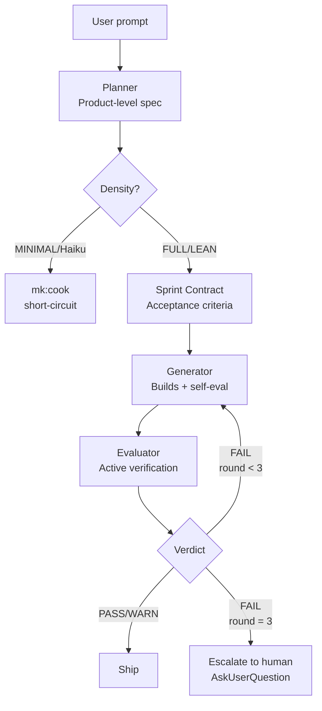
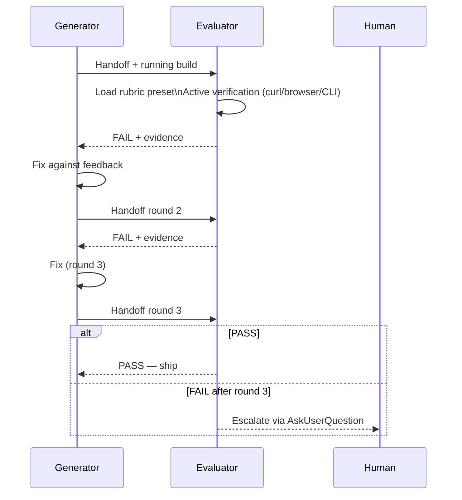
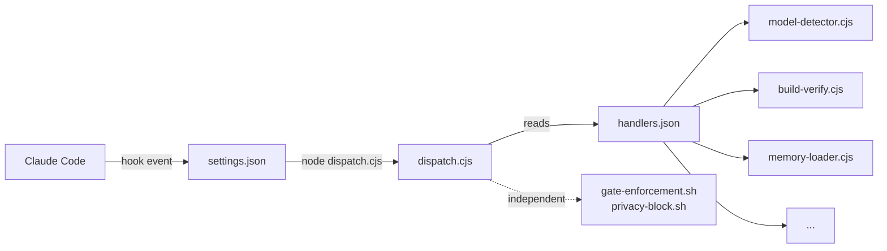

# Harness Architecture

For the conceptual overview of MeowKit's harness system — what a harness is, the harness² concept, 7-layer taxonomy, 5 functional pillars, and core principles — see the dedicated **[Understanding the Harness](/guide/understanding-the-harness)** page.

This page covers the **`/mk:harness`** autonomous build pipeline specifically.

## TL;DR

`/mk:harness` is MeowKit's autonomous build pipeline. It splits work across four roles — planner, generator, evaluator, and orchestrator — so no single agent grades its own output. A sprint contract defines what "done" means. The generator builds; the evaluator verifies against a running build. The loop repeats up to 3 rounds before escalating to you.

## Why This Exists

**Self-evaluation bias.** When the same model that writes code also grades it, leniency drift kicks in. Anthropic researchers measured this: agents identify real issues, then reason themselves into accepting them. Out-of-box Claude as its own QA will find problems and then explain why they aren't that big a deal.

**The dead-weight thesis.** Intermediate-tier models (Sonnet, Opus 4.5) under-scope without explicit scaffolding. Left alone, they produce "competent but generic" output — missing ambition, missing edge cases, missing the product soul. The harness forces product-level specification before a line of code is written, which drives capable models to build ambitious products instead of safe stubs.

## The Four Roles

### Planner

Runs in product-level mode (`mk:plan-creator --product-level`). Produces **user stories and features**, not file names or class names. The constraint is intentional: micro-sharding the plan causes cascading errors because the generator loses room to discover better solutions. The planner sets ambition; the generator finds the path.

### Generator (Developer Agent)

Implements the product from the sprint contract. Runs `mk:cook` internally for each sprint. Produces source code + a self-eval checklist before handoff. MUST NOT grade its own output — that's the evaluator's job. See [Rule 2 — Generator ≠ Evaluator](#self-eval-bias).

### Evaluator

Fresh context, skeptic persona, external subagent. Grades the running build against the rubric composition preset. Must drive active verification (browser navigation, curl, CLI) — static analysis alone is forbidden. See [Active Verification Hard Gate](#active-verification-hard-gate).

### Orchestrator

The harness script itself. Manages the iteration loop, budget tracking, escalation, and density selection. Humans interact with the orchestrator via flags and the HITL gate at escalation.

## Pipeline Flow



## Second Look: Iteration Loop Detail



## Sprint Contract

The sprint contract (`tasks/contracts/{date}-{slug}-sprint-N.md`) is a signed agreement between planner and generator on what the generator must build before any source code is written.

**Why it's required in FULL density:** without a contract, capable models substitute features silently — building what's easiest rather than what was specified. The contract is the scope fence.

**In LEAN density (Opus 4.6+):** optional. The model can self-derive testable criteria from the product spec. Skip if estimated acceptance criteria count is fewer than 5.

See the full spec at [/reference/skills/sprint-contract](/reference/skills/sprint-contract).

## Iteration Loop

The harness loop is capped at **3 rounds** by default (override: `--max-iter N`).

- **Round 1–3:** generator → evaluator → FAIL → fix → repeat.
- **After round 3:** if still FAIL, `AskUserQuestion` presents three choices: skip and ship as-is, retry with human guidance, or abandon the run.

Budget guardrails are enforced independently of round count — see [Budget Thresholds](#budget-thresholds). Both caps can trigger independently: a $100 breach on round 1 halts the run the same as exhausting 3 rounds.

**Rule 4:** iteration cap = 3. Agents that can't converge in 3 rounds won't converge in 5. The failure is deeper than iteration count; human escalation breaks the tie. See `.claude/rules/harness-rules.md` Rule 4.

## Active Verification Hard Gate

The evaluator **must** drive the running build via active verification:

- Browser navigation (screenshots, click-through)
- `curl` against live endpoints
- CLI invocation

Static-analysis-only verdicts are rejected. `validate-verdict.sh` enforces this mechanically: PASS verdicts with an empty `evidence/` directory are converted to FAIL automatically.

**Why:** tests can pass against mocks while the real endpoint returns 500. Anthropic's audit found 4.5 of 6 red-team scenarios slip past static analysis. The active-verification gate is the only mitigation in the registry marked NEVER PRUNE — see [/guide/trace-and-benchmark](/guide/trace-and-benchmark) for the dead-weight audit registry.

Rule 8 in `.claude/rules/harness-rules.md`.

## Self-Eval Bias

**Rule 2 — Generator ≠ Evaluator.** This is a hard separation enforced architecturally by running the evaluator as a fresh-context subagent.

When Claude graded its own output in internal tests, it identified real issues — then talked itself into accepting them. An external evaluator loaded with a skeptic persona (`mk:evaluate/prompts/skeptic-persona.md`) and re-anchored per criterion is the only known mitigation.

The evaluator is the [evaluator agent](/reference/agents/evaluator). It runs in isolation: no shared context, no memory of the generator's reasoning, no access to the generator's self-eval notes.

## Budget Thresholds

| Threshold | Behavior |
|---|---|
| $30 warn | Print warning; run continues |
| $100 hard block | Halt; set `final_status=TIMED_OUT` |
| User cap (`--budget` or `MEOWKIT_BUDGET_CAP`) | Overrides hard block; can be lower or higher |

Multi-hour runs accumulate cost faster than humans notice. The three-tier policy (warn → hard → user) catches both runaway runs and intentional high-budget research.

## When to Use `/mk:harness` vs `/mk:cook`

| Use `/mk:cook` for | Use `/mk:harness` for |
|---|---|
| Single feature, single sprint | Whole product / green-field app |
| Bug fix | "Build me a X" prompt |
| Refactor | Multi-hour autonomous run |
| Doc update | Ambitious multi-sprint build |
| TRIVIAL / Haiku model | STANDARD or COMPLEX tier |

## Adaptive Density

The harness auto-scales scaffolding based on model capability. Haiku short-circuits to `mk:cook`. Sonnet and Opus 4.5 get the full pipeline. Opus 4.6+ gets a leaner config — full pipeline is dead weight for capable models with 1M context + auto-compaction.

Full explanation: [/guide/adaptive-density](/guide/adaptive-density).

## Related

- [/reference/skills/harness](/reference/skills/harness) — skill spec
- [/reference/agents/evaluator](/reference/agents/evaluator) — evaluator agent
- [/guide/adaptive-density](/guide/adaptive-density) — density selection
- [/guide/rubric-library](/guide/rubric-library) — how builds are graded
- [/guide/middleware-layer](/guide/middleware-layer) — supporting hooks
- [/guide/trace-and-benchmark](/guide/trace-and-benchmark) — meta-loop
- [/reference/rules-index#harness-rules](/reference/rules-index#harness-rules) — all 11 harness rules

## Node.js Hook Dispatch System (v2.3.0)

MeowKit v2.3.0 evolved the hook layer from ad-hoc shell scripts to a registry-driven Node.js dispatch system. Shell hooks parsed JSON via Python fallback (jq → python → grep). Node.js parses natively in one line.

### Architecture

`dispatch.cjs` is a central event dispatcher registered in `settings.json` for five events: `SessionStart`, `PostToolUse` (Edit|Write and Bash matchers), `Stop`, and `UserPromptSubmit`. When the event fires, Claude Code calls `node dispatch.cjs <EventName> [Matcher]`, which reads `handlers.json` to find the matching handler modules and dispatches to them sequentially.



### Handler Registry (handlers.json)

`handlers.json` maps each event + optional matcher to an array of handler module paths:

```json
{
  "PostToolUse": {
    "Edit|Write": ["./handlers/build-verify.cjs", "..."],
    "Bash":       ["./handlers/budget-tracker.cjs"]
  },
  "Stop":             ["./handlers/checkpoint-writer.cjs"],
  "SessionStart":     ["./handlers/model-detector.cjs", "./handlers/orientation-ritual.cjs"],
  "UserPromptSubmit": ["./handlers/memory-loader.cjs"]
}
```

### Handler Modules

| Handler | Event | Matcher | Purpose |
|---------|-------|---------|---------|
| `model-detector.cjs` | SessionStart | — | Reads `model` field from stdin; writes tier + density to `session-state/detected-model.json` |
| `orientation-ritual.cjs` | SessionStart | — | Resumes from checkpoint if one exists |
| `build-verify.cjs` | PostToolUse | Edit\|Write | Compile/lint with file-hash cache |
| `loop-detection.cjs` | PostToolUse | Edit\|Write | Warns at 4 edits, escalates at 8 |
| `budget-tracker.cjs` | PostToolUse | Edit\|Write, Bash | Estimates cost; warns at $10, blocks at $25 |
| `auto-checkpoint.cjs` | PostToolUse | Edit\|Write | Writes checkpoint every 20 calls |
| `memory-loader.cjs` | UserPromptSubmit | — | Injects domain-filtered lessons to stdout |
| `checkpoint-writer.cjs` | Stop | — | Sequenced checkpoint with git state |

### Shared Libraries

Three shared modules in `.claude/hooks/lib/` support the handlers:

| Library | Purpose |
|---------|---------|
| `parse-stdin.cjs` | Parses Claude Code JSON-on-stdin once; shared by all handlers |
| `shared-state.cjs` | In-process state bag enabling cross-handler state (not possible with independent shell hooks) |
| `checkpoint-utils.cjs` | Read/write checkpoint files; shared by orientation-ritual and checkpoint-writer |

### SPOF Protection

Security hooks (`gate-enforcement.sh`, `privacy-block.sh`) are intentionally **not** routed through the dispatcher. They remain independent entries in `settings.json`. A failure in `dispatch.cjs` gracefully exits 0 (never blocks Claude Code), but security hooks continue firing independently — no single point of failure.

Full details: [What's New in v2.3.0](/guide/whats-new/v2.3.0).

## Canonical Sources

- `.claude/rules/harness-rules.md` — the 11 rules governing the harness
- `docs/harness-runbook.md` — user-facing runbook (flags, density, artifacts, troubleshooting)
- `.claude/skills/harness/references/adaptive-density-matrix.md` — density decision matrix
