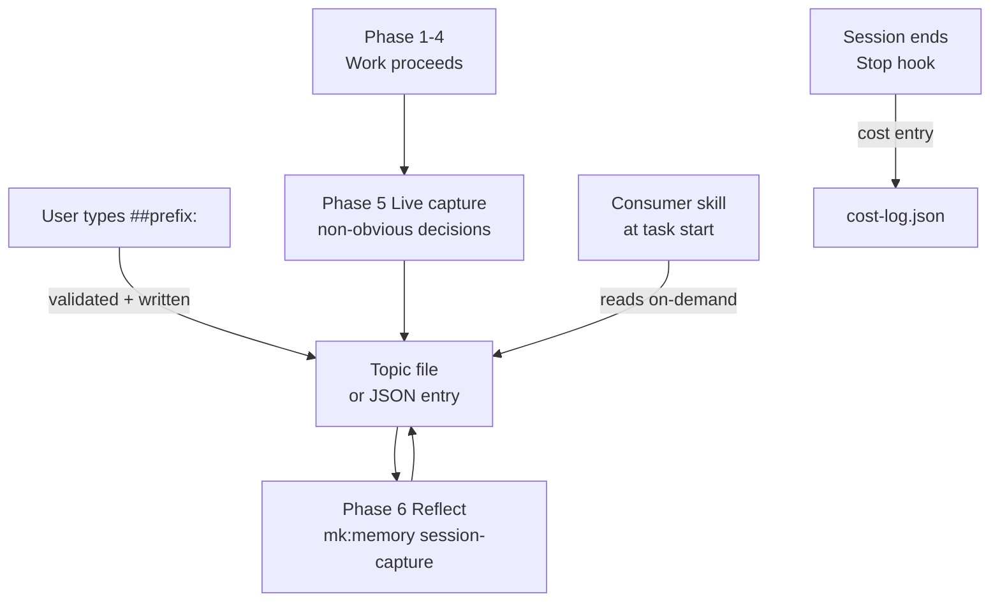

# Memory System

MeowKit's memory system lets the AI agent learn from past sessions, track costs, and accumulate institutional knowledge. It is team-shared (in-repo, version-controlled) and complementary to Claude Code's machine-local auto-memory.

## Topic files

Memory is split into focused topic files. Each skill reads only the files it needs — there is no auto-injection into every prompt.

| File | Purpose | Format | Consumer |
|------|---------|--------|---------|
| `memory/fixes.md` | Bug-class session learnings | Markdown | mk:fix |
| `memory/fixes.json` | Machine-queryable fix patterns (v2.0.0) | JSON | mk:fix |
| `memory/review-patterns.md` | Review and architecture patterns; per-evaluation verdict rows (v2.5.0) | Markdown | mk:review, mk:plan-creator, mk:evaluate (writer) |
| `memory/review-patterns.json` | Machine-queryable review patterns (v2.0.0) | JSON | mk:review, mk:plan-creator |
| `memory/architecture-decisions.md` | Architectural decisions | Markdown | mk:plan-creator, mk:cook, mk:ship (reader) |
| `memory/architecture-decisions.json` | Machine-queryable decisions (v2.0.0) | JSON | mk:plan-creator, mk:cook |
| `memory/security-notes.md` | Curated security findings | Markdown | mk:cso, mk:review |
| `memory/cost-log.json` | Token usage per task; per-benchmark baseline entries (v2.5.0) | JSON | analyst agent, mk:benchmark (writer) |
| `memory/decisions.md` | Long-form architecture decision records; party synthesis outputs (v2.5.0) | Markdown | architect agent, mk:party (writer, required) |
| `memory/security-log.md` | Raw security audit log; `mk:careful` override audit trail (v2.5.0) | Markdown | security agent, mk:careful (writer) |

## How it works



### Capture flow

1. **Immediate capture** (`##prefix:` messages): written instantly by `immediate-capture-handler.cjs` — crash-resilient
2. **Live capture** (before shipping): agent captures non-obvious decisions, rejected approaches, surprises — context lost otherwise
3. **Session capture** (Phase 6): `mk:memory` session-capture extracts patterns/decisions/failures and appends to topic files

### On-demand read path

Skills include a "Load memory" step in their SKILL.md. The agent reads only the topic file(s) relevant to the current task. No content is injected into every prompt turn.

## Immediate capture (##prefix:)

For crash-resilient knowledge capture, type messages with `##` prefix:

| Prefix | Routes to | Type |
|--------|-----------|------|
| `##pattern: bug-class <description>` | `fixes.json` | JSON pattern entry |
| `##pattern: <description>` | `review-patterns.json` | JSON pattern entry |
| `##decision: chose X over Y because…` | `architecture-decisions.json` | JSON decision entry |
| `##note: check this later` | `quick-notes.md` | Freeform (classified at Reflect) |

**Why double hash?** Single `#` conflicts with markdown headers and `#123` issue references.

Captures are validated against injection patterns before writing. Invalid content is blocked with a visible warning.

## Split JSON schema (v2.0.0)

```json
{
  "version": "2.0.0",
  "scope": "fixes",
  "consumer": "mk:fix",
  "patterns": [
    {
      "id": "gnu-grep-bre-macos",
      "type": "failure",
      "category": "bug-class",
      "severity": "critical",
      "domain": ["shell", "macos", "grep"],
      "applicable_when": "Writing shell scripts that use grep with alternation or quantifiers",
      "context": "macOS ships BSD grep which silently ignores GNU BRE extensions.",
      "pattern": "Always use grep -E (ERE) for alternation and quantifiers.",
      "frequency": 4,
      "lastSeen": "2026-04-18"
    }
  ],
  "metadata": {
    "created": "2026-04-18",
    "last_updated": "2026-04-18"
  }
}
```

### Field reference

| Field | Required | Description |
|-------|----------|-------------|
| `id` | Yes | Unique kebab-case identifier |
| `type` | Yes | `failure` (avoid) or `success` (repeat) |
| `category` | Yes | `bug-class`, `pattern`, `decision` |
| `severity` | Yes | `critical` or `standard` |
| `domain` | Yes | Array of domain keyword tags |
| `applicable_when` | Yes | One sentence: conditions for future agents to use this |
| `context` | No | Additional background |
| `pattern` | Yes | What to do (or not do) |
| `frequency` | Yes | Number of sessions that surfaced this |
| `lastSeen` | Yes | Date of last occurrence |

## Skill-triggered writes (v2.5.0)

Three skills that previously accumulated knowledge only in-session now persist their outputs. All three `mkdir -p .claude/memory` before the append, so a missing parent directory does not silently lose the entry.

| Skill | Target file | When it writes | Entry shape |
|---|---|---|---|
| `mk:evaluate` | `review-patterns.md` | After each completed evaluation | Table row: `\| {date} \| {artifact-id} \| {verdict} \| {top-criterion} \| {score} \|` |
| `mk:benchmark` | `cost-log.json` | After each completed benchmark run | Object: `{run_id, date, tier, pass_rate, avg_score, total_cost_usd}` appended to top-level array |
| `mk:party` | `decisions.md` | After synthesis round concludes (required, not optional) | Heading: `## {date} — {decision-title}` + Context / Decision / Rationale / Dissent |
| `mk:careful` | `security-log.md` | On every warn/override event | Table row with timestamp, pattern, severity, command — log auto-initialized with header |

## Pruning

When topic files grow large (> 300 lines or JSON > 50 entries), run:

```
/mk:memory --prune              # default 90-day threshold
/mk:memory --prune --days 180   # custom threshold
/mk:memory --prune --dry-run    # preview without writing
```

**What gets pruned:** `severity: standard` entries with a parseable date older than threshold.

**What is exempt:** `severity: critical` / `security` entries; entries without a parseable date.

Pruned entries are moved to `lessons-archive.md` for recovery.

## Cost tracking

Every session appends to `cost-log.json` via the Stop hook (`post-session.sh`). Fields: `date`, `session_id`, `model`, `estimated_cost_usd`, token counts, `cache_read_tokens`, `cache_creation_tokens`, `recent_files`.

View cost report with `npx mewkit memory --stats`.

## Session state vs memory

MeowKit also persists a **session-state** layer at `session-state/` — distinct from memory. The two layers serve different purposes:

| Layer | Path | Lifetime | What it holds |
|---|---|---|---|
| Memory | `.claude/memory/` | Durable across sessions; pruned manually via `/mk:memory --prune` | Curated learnings, patterns, decisions, cost log — stuff humans should review later |
| Session state | `session-state/` | Cleared on session-id change by `project-context-loader.sh` | Live counters, hash caches, doom-loop guards, checkpoints — stuff the agent rebuilds itself |

Rule of thumb: if the agent that produced the artifact would want a human to inspect it later → memory. If the agent would rebuild it on demand → session state.

### Resume checkpoint (v2.7.2)

`session-state/checkpoints/` holds **one** file: `checkpoint-latest.json`. It is overwritten atomically (`.tmp` + rename) by two writers — the Stop hook on every assistant turn, and the phase-transition trigger on writes to `tasks/plans/`, `tasks/contracts/`, or `tasks/reviews/`. On session resume, `orientation-ritual.cjs` reads this file once and injects model tier, harness density, active plan path, git-drift warning, and budget summary into the new session's context.

Notable design points:

- **Single file, no rotation.** Earlier versions used a pointer file plus numbered `checkpoint-NNN.json` snapshots, with no rotation logic — checkpoints accumulated unboundedly. v2.7.2 collapses this to one overwriting file. Existing numbered files are stale and ignored by the reader; safe to delete.
- **Sequence is display-only.** The `sequence` field shown in `Resuming session #N` is a monotonic counter sourced from the file itself; concurrent writers may compute the same value. The display is informational, not a session identifier.
- **Path-traversal and injection guard.** Before emitting the active plan path into the resumed session's context, `orientation-ritual.cjs` filters `..` traversal and control-character payloads via the `safePlanPath` content check.
- **`/mk:harness --resume` does NOT use this file.** Harness reconstructs run state from `run.md` frontmatter inside the harness run directory, independently of the session-state checkpoint.

Other notable session-state files: `budget-state.json` (live token/cost accumulator), `edit-counts.json` (doom-loop guard), `precompletion-attempts.json` (Stop-gate re-entry counter), `build-verify-cache.json` (hash-based skip cache for compile/lint). All are session-scoped and reset on new session.

### Why Claude Code's `--resume` cannot replace session-state

Claude Code's `--resume` and MeowKit's session-state share a trigger word ("session") but operate at different layers and solve different problems. They are complementary, not redundant. **For the full comparison with file-by-file map and four concrete unlocks, see [Session State vs --resume](/guide/session-state-vs-resume).**

| Layer | Claude Code `--resume` | MeowKit `session-state/` |
|---|---|---|
| What it restores | Conversation transcript (messages + tool calls) | Hook-layer enforcement state (counters, caches, gates) |
| Operates at | Protocol / dialogue layer | Hook / runtime-policy layer |
| Knows about | What was said | What the process is allowed to do next |
| Cannot restore | Hook counters, build-skip caches, environment drift | Conversation context (the model derives that from `--resume`) |

The right axis is **convo-layer vs enforcement-layer**, not redundant vs complementary. They cover different failure modes entirely.

**Four concrete things `session-state/` enables that `--resume` cannot:**

| Capability | Mechanism | File |
|---|---|---|
| Pre-model policy enforcement | `loop-detection.cjs` blocks `@@LOOP_DETECT_ESCALATE@@` on PostToolUse before the model sees the tool result | `edit-counts.json` |
| Hook composition as shared bus | Five handlers (model-detector, budget-tracker, auto-checkpoint, build-verify, loop-detection) cross-read state | All session-state files |
| Hash-based build skip cache | `build-verify.cjs` skips `tsc --noEmit` / `eslint` on unchanged files via content-addressed hash | `build-verify-cache.json` |
| Adaptive harness density per model tier | Cheaper models get MINIMAL density; Opus 4.6+ gets LEAN — density drives downstream hook behavior | `detected-model.json` |

`--resume` restores what the model *knows*. Session-state controls what the model is *allowed to do next*. Both are needed; neither replaces the other.

**Note on project files:** Claude Code does re-read `CLAUDE.md` and `.claude/rules/*.md` on `--resume` because they are project files loaded at session start. So *some* behavioral constraints survive `--resume`. The gap MeowKit's session-state fills is specifically the runtime-policy state — counters, caches, hashes, drift — that lives in files Claude Code does not load.

## MeowKit vs Claude Code memory

| Aspect | MeowKit Memory | Claude Code Auto-Memory |
|--------|---------------|------------------------|
| Location | In-repo (`.claude/memory/`) | Machine-local (`~/.claude/projects/`) |
| Audience | Team (shared via git) | Individual (per machine) |
| Content | Lessons, patterns, costs | Preferences, debugging notes |
| Loading | On-demand by consumer skills | Automatic (Claude Code managed) |
| Promotion | Human-gated → CLAUDE.md | Automatic |

Use MeowKit for team knowledge. Use Claude Code auto-memory for personal insights.

## Privacy

All memory stays project-local in `.claude/memory/`. No data leaves the machine.

`.claude/memory/*` is gitignored by default (only `.gitkeep` is tracked). Memory content is developer-specific working state — session history, transient captures, cost telemetry — and is not shared via the repo. If you want a team-shared subset of learnings, promote high-value patterns to `CLAUDE.md` or `.claude/rules/` (both are committed).

## Migration from pre-simplification MeowKit

If you have an active `lessons.md` from a previous MeowKit version:

```bash
node .claude/scripts/memory-topic-file-migrator.cjs
```

The script is idempotent. It categorizes existing entries into topic files and archives `lessons.md` with a stub header.
