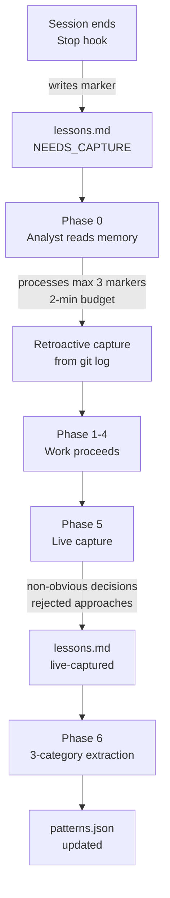

# Memory System

MeowKit's memory system lets the AI agent learn from past sessions, track costs, and accumulate institutional knowledge. It is team-shared (in-repo, version-controlled) and complementary to Claude Code's machine-local auto-memory.

## Memory files

| File | Purpose | Format | Read at | Written at |
|------|---------|--------|---------|------------|
| `memory/lessons.md` | Session learnings (patterns/decisions/failures) | Markdown | Phase 0 | Stop hook + Phase 0 retroactive + Phase 5 live |
| `memory/patterns.json` | Recurring patterns with frequency + severity | JSON | Phase 0 | Phase 6 |
| `memory/cost-log.json` | Token usage per task | JSON | On demand | Per task |
| `memory/decisions.md` | Architecture decision log | Markdown | Planning | On ADR creation |
| `memory/security-log.md` | Injection audit findings | Markdown | Review | On audit |

## How it works



### Capture pipeline

1. **Stop hook** (`post-session.sh`): writes a structured `NEEDS_CAPTURE` marker with timestamp and recent file count
2. **Phase 0 retroactive capture**: analyst processes pending markers (max 3 most recent, 2-min budget). Reconstructs WHAT changed from `git log`. Older markers auto-skipped as `skipped-too-old`
3. **Phase 5 live capture**: before shipping, agent captures WHY decisions were made — rejected approaches, corrections, surprises. This context is lost in retroactive capture
4. **Phase 6 extraction**: analyst categorizes learnings into patterns/decisions/failures and updates `patterns.json`

### Self-improving loop

After ~10 captured sessions, the pattern-extraction skill proposes high-frequency patterns for promotion to `CLAUDE.md`. Promotion requires human approval — never auto-applied.

```
Sessions → capture → patterns.json
                         ↓
               pattern-extraction (freq ≥ 3)
                         ↓
               Human approval → CLAUDE.md rule
                         ↓
               Future sessions follow new rules
```

## patterns.json schema

```json
{
  "version": "1.0.0",
  "patterns": [
    {
      "id": "always-validate-dto",
      "type": "success",
      "category": "pattern",
      "severity": "critical",
      "scope": "packages/api",
      "context": "NestJS endpoint development",
      "applicable_when": "Creating any API endpoint that accepts user input",
      "pattern": "Always create a DTO with class-validator decorators",
      "frequency": 5,
      "lastSeen": "2026-03-25"
    }
  ],
  "metadata": {
    "sessions_captured": 0,
    "last_updated": null,
    "next_review_at_session": 10
  }
}
```

### Field reference

| Field | Required | Description |
|-------|----------|-------------|
| `id` | Yes | Unique kebab-case identifier |
| `type` | Yes | `success` (repeat) or `correction` (avoid) |
| `category` | No | `pattern`, `decision`, or `failure` (defaults to `pattern`) |
| `severity` | No | `critical` or `standard` (defaults to `standard`) |
| `scope` | No | Directory path where pattern applies. Omit = project-wide |
| `context` | Yes | When this pattern applies |
| `applicable_when` | No | One sentence: conditions for future agents to use this |
| `pattern` | Yes | What to do (or not do) |
| `frequency` | Yes | Number of sessions that surfaced this |
| `lastSeen` | Yes | Date of last occurrence |

### Promotion criteria

A pattern is proposed for CLAUDE.md promotion when ALL are true:

- `frequency >= 3` — appeared in multiple sessions
- `severity == "critical"` OR `frequency >= 5` — high impact or very recurrent
- Generalizable — not feature-specific
- Saves ≥ 30 min if known in advance
- Human approval required

## Consolidation

When memory grows large, run the consolidation reference manually. It uses a 4-branch classification rubric:

| Classification | Condition | Action |
|---------------|-----------|--------|
| **Clear match** | One existing entry owns the lesson | Merge into owner |
| **Ambiguous** | Multiple plausible owners | Ask user to choose |
| **No match** | New durable lesson, no owner | Create new entry |
| **No durable signal** | Transient noise | Skip |

### Consolidation triggers

| File | Threshold |
|------|-----------|
| `lessons.md` | > 20 session entries |
| `patterns.json` | > 50 patterns |
| `cost-log.json` | > 500 entries (archive to monthly files) |

## MeowKit vs Claude Code memory

Both systems coexist without conflict:

| Aspect | MeowKit Memory | Claude Code Auto-Memory |
|--------|---------------|------------------------|
| Location | In-repo (`.claude/memory/`) | Machine-local (`~/.claude/projects/`) |
| Audience | Team (shared via git) | Individual (per machine) |
| Content | Lessons, patterns, costs | Preferences, debugging notes |
| Promotion | Human-gated → CLAUDE.md | Automatic (no gate) |
| Consolidation | Manual (rubric-based) | Automatic (dream, undocumented) |

Use MeowKit for team knowledge. Use Claude Code auto-memory for personal insights.

## Privacy

All memory stays project-local in `.claude/memory/`. No data leaves the machine. Add `.claude/memory/` to `.gitignore` if you don't want it in version control.
