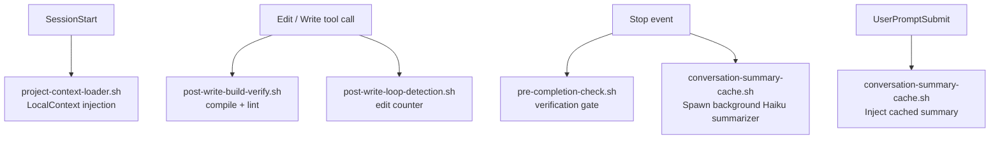

# Middleware Layer

## What Middleware Hooks Do

Middleware hooks are thin shell scripts that sit between the model and its tools. They intercept Claude Code events (file writes, session starts, session stops, prompt submissions) and inject feedback or context without requiring any agent or skill change.

Three properties make them valuable:

- **Cheap** — each hook runs in milliseconds and exits 0 on success; no LLM calls except the summary cache
- **Composable** — hooks are independent; adding or removing one doesn't affect others
- **Pruneable** — each hook is measured via the dead-weight audit; if it stops paying its delta, it can be removed without touching the agent layer

Middleware is orthogonal to agents. A developer agent has no awareness of the loop detection hook firing — it just sees a warning message in its context. The separation is intentional.

## The Biggest Single Failure Mode

> Agents write code, re-read their own code, declare it good, stop.

This is what the middleware layer was built to interrupt. Without external feedback:

1. The agent edits a file
2. It reads the file back
3. It decides the file looks correct
4. It stops — without running tests, without verification evidence

Each hook below targets a specific escape vector for this failure mode.

## The Five Middleware Hooks

| Hook | Event | Purpose |
|---|---|---|
| `post-write-build-verify.sh` | PostToolUse (Edit/Write) | Compile/lint on source file writes; hash-cache to skip unchanged files |
| `post-write-loop-detection.sh` | PostToolUse (Edit/Write) | Warn at 4 edits to same file; escalate at 8 |
| `pre-completion-check.sh` | Stop | Block session end if no verification evidence exists; 3-attempt guard |
| `project-context-loader.sh` (LocalContext) | SessionStart | Inject directory tree, tool availability, package scripts |
| `conversation-summary-cache.sh` | Stop + UserPromptSubmit | Summarize transcript via Haiku on Stop; inject summary on next prompt |

## Hook Event Flow

## `post-write-build-verify.sh`

**Event:** PostToolUse on Edit/Write

Classifies the written file by extension (`.ts`/`.tsx` → `tsc --noEmit | eslint`; `.py` → `ruff check | mypy`; `.go` → `go build ./...`; etc.) and runs the appropriate compile/lint chain. Errors are emitted to stdout as a structured `@@BUILD_VERIFY_ERROR@@` block, which Claude Code injects back into the model's context.

Key behaviors:
- **Hash cache** (`session-state/build-verify-cache.json`): skips re-running on unchanged files. Only triggers on content change.
- **Never blocks**: always exits 0. Errors are feedback, not gate enforcement.
- **Env bypass**: `MEOWKIT_BUILD_VERIFY=off` skips entirely. `MEOWKIT_HARNESS_MODE=MINIMAL` also skips. LEAN density still runs it.

LangChain research measured a +10.8 point improvement in harness output quality from this single hook. It's in the KEEP column of the dead-weight audit registry.

## `post-write-loop-detection.sh`

**Event:** PostToolUse on Edit/Write

Tracks per-file edit counts keyed by `{session_id}:{realpath}` in `session-state/edit-counts.json`. Thresholds:

- **N = 4:** warning emitted — "You have edited this file 4 times. Reconsider your approach."
- **N = 8:** escalation emitted — "Max edit budget exceeded. Halt and re-plan."

Neither threshold blocks the agent — both inject feedback via stdout. The escalation text is deliberately strong: repeated small variations to the same file almost always indicate a flawed approach, not a file-level problem.

State is cleared per session by `project-context-loader.sh` on session ID change.

**Env bypass:** `MEOWKIT_LOOP_DETECT=off`

## `pre-completion-check.sh`

**Event:** Stop (session end)

The hard gate against "declare done without evidence." Before the session stops, this hook checks for any ONE of:

1. Evaluator verdict file for the active plan slug (`tasks/reviews/*-evalverdict.md`)
2. Signed sprint contract (`tasks/contracts/*-sprint-*.md` with `status: signed`)
3. Test-pass markers in the last 500 lines of the trace log
4. `meow:review` verdict file (`tasks/reviews/*-verdict.md`)

If none are found **and** attempts < 3: emits `{"decision":"block"}` JSON — Claude Code re-enters the session and the model sees the block reason.

If none are found **and** attempts ≥ 3: soft nudge only (to prevent an infinite loop). The session is allowed to end with a warning.

**Density behavior:**
- `LEAN` density: soft nudge only — trusts the model
- `MINIMAL` density: skipped entirely

**Env bypass:** `MEOWKIT_PRECOMPLETION=off`

## LocalContext (SessionStart)

**Event:** SessionStart — `project-context-loader.sh`

Injected at session start, before any task context. Provides:

- Directory tree of the project root
- Available CLI tools (`node`, `python3`, `pnpm`, `docker`, etc.)
- Package scripts from `package.json` (so the agent knows `pnpm dev`, `pnpm test`, etc.)
- Session ID reset (clears per-session state files in `session-state/`)

Without this, agents open a session with no awareness of what tools are available or how to run the project. They infer from file contents — which is slower and less reliable than direct injection.

## `conversation-summary-cache.sh` (Phase 9)

**Events:** Stop (summarize) + UserPromptSubmit (inject)

Long harness sessions accumulate transcript fast. Re-reading the full transcript on every turn consumes ~48KB of context per turn in mid-to-long sessions. This hook maintains a Haiku-summarized snapshot and injects it instead.

**On Stop:** spawns a background worker via `nohup bash $tmpfile &` + `disown` (fire-and-forget — cannot block the Stop hook). The worker:

1. Checks throttle thresholds: transcript size > 20KB **AND** (event gap ≥ 30 events OR growth ≥ 5KB since last summary)
2. If throttled, tails the last 300 lines of the transcript
3. Pipes through `claude -p --model haiku` with a fixed prompt template
4. Scrubs secrets via `lib/secret-scrub.sh`
5. Atomically writes to `.claude/memory/conversation-summary.md`

**On UserPromptSubmit:** reads the cached summary, verifies session ID matches, strips frontmatter, and emits a `## Prior conversation summary` block (capped at 4KB) before the model sees the new prompt.

**Token math (typical 50-turn session):**

| | Without cache | With cache |
|---|---|---|
| Per-turn context from transcript | ~48 KB | ~4 KB |
| Total over 50 turns | ~2.4 MB | ~200 KB |
| Summarization cost | $0 | ~$0.01–$0.02 |

**Inspecting the cache:** `.claude/memory/conversation-summary.md` is a plain markdown file. Open it to see what the agent will inject on the next turn. Edit it manually if a summary went off-rails.

**Graceful degradation:** if the `claude` CLI is missing or summarization fails, the hook exits 0 silently. Full transcript re-reads continue as before — zero blast radius.

**Env bypass:** `MEOWKIT_SUMMARY_CACHE=off` disables both paths.

## Opt-Out Matrix

| Env var | Effect |
|---|---|
| `MEOWKIT_BUILD_VERIFY=off` | Skip `post-write-build-verify.sh` |
| `MEOWKIT_LOOP_DETECT=off` | Skip `post-write-loop-detection.sh` |
| `MEOWKIT_PRECOMPLETION=off` | Skip `pre-completion-check.sh` |
| `MEOWKIT_SUMMARY_CACHE=off` | Skip both Stop + UserPromptSubmit paths of `conversation-summary-cache.sh` |
| `MEOWKIT_HARNESS_MODE=LEAN` | PreCompletion falls back to soft nudge; BuildVerify still runs |
| `MEOWKIT_HARNESS_MODE=MINIMAL` | Skip BuildVerify + PreCompletion entirely |
| `MEOWKIT_SUMMARY_THRESHOLD=N` | Override 20KB minimum transcript size for summarization |
| `MEOWKIT_SUMMARY_TURN_GAP=N` | Override 30-event minimum gap between summaries |
| `MEOWKIT_SUMMARY_GROWTH_DELTA=N` | Override 5KB growth-delta minimum between summaries |

## Hook Order Independence

Hooks registered on the same event (e.g., both `post-write-build-verify.sh` and `post-write-loop-detection.sh` fire on PostToolUse Edit/Write) **must not rely on execution order**. If one hook fails or runs first, the other must still work correctly.

Cross-hook state passes exclusively through `session-state/` filesystem files — never in-memory or shared env vars. See `.claude/hooks/HOOKS_INDEX.md` for the full state file table.

Rule 11 from `.claude/rules/harness-rules.md` governs the summary cache specifically. The broader hook independence principle is documented in HOOKS_INDEX.md §"Hook Order Independence."

## Node.js Handler Modules (v2.3.0)

MeowKit v2.3.0 added a parallel dispatch path alongside the shell hooks above. The Node.js handlers are routed through `dispatch.cjs` using the `handlers.json` registry — they do not replace the shell hooks; both paths run on the same events.

The key advantage over shell hooks: `shared-state.cjs` enables cross-handler state within a single dispatch call — something independent shell processes cannot share.

| Handler | File | Event | Matcher | Purpose |
|---------|------|-------|---------|---------|
| model-detector | `handlers/model-detector.cjs` | SessionStart | — | Reads stdin `model` field; writes tier to `session-state/detected-model.json` |
| orientation-ritual | `handlers/orientation-ritual.cjs` | SessionStart | — | Resumes from checkpoint if one exists |
| build-verify | `handlers/build-verify.cjs` | PostToolUse | Edit\|Write | Compile/lint; cached by file hash |
| loop-detection | `handlers/loop-detection.cjs` | PostToolUse | Edit\|Write | Warns at 4 edits, escalates at 8 |
| budget-tracker | `handlers/budget-tracker.cjs` | PostToolUse | Edit\|Write, Bash | Estimates cost; warns at $10, blocks at $25 |
| auto-checkpoint | `handlers/auto-checkpoint.cjs` | PostToolUse | Edit\|Write | Checkpoint every 20 calls |
| memory-loader | `handlers/memory-loader.cjs` | UserPromptSubmit | — | Injects domain-filtered lessons to stdout |
| checkpoint-writer | `handlers/checkpoint-writer.cjs` | Stop | — | Sequenced checkpoint with git state |

Note: `build-verify.cjs` and `loop-detection.cjs` cover the same events as `post-write-build-verify.sh` and `post-write-loop-detection.sh`. Both paths run. The Node.js handlers add budget tracking and checkpoint features that the shell hooks do not provide.

See [harness-architecture](/guide/harness-architecture) for the dispatch flow diagram.

## Canonical Sources

- `.claude/hooks/HOOKS_INDEX.md` — full hooks table with events, matchers, timeouts, input contracts
- `.claude/rules/harness-rules.md` — Rule 11 (conversation summary cache discipline)
- `.claude/hooks/lib/read-hook-input.sh` — shared JSON-on-stdin parser used by all hooks

## Related

- [/reference/hooks](/reference/hooks) — full hooks reference page
- [/guide/harness-architecture](/guide/harness-architecture) — how middleware fits the pipeline
- [/guide/trace-and-benchmark](/guide/trace-and-benchmark) — trace records emitted by these hooks
- [/reference/rules-index#harness-rules](/reference/rules-index#harness-rules) — Rule 11 (summary cache)
