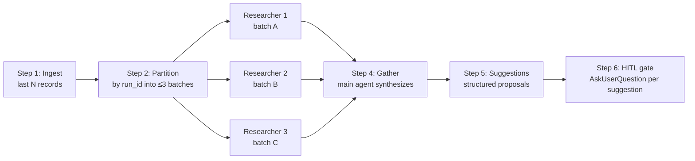

# Trace & Benchmark Meta-Loop

## The Meta-Improvement Cycle

Every harness component encodes an assumption. Assumptions age. The meta-loop is how MeowKit keeps the harness calibrated as models improve — replacing assumption-driven decisions with evidence from real runs.

```mermaid
flowchart TD
    A[Harness runs] --> B[Hooks emit trace records\nappend-trace.sh]
    B --> C[.claude/memory/trace-log.jsonl]
    C --> D[/mk:trace-analyze\nScatter-gather 3 researchers]
    D --> E{HITL gate\nAskUserQuestion}
    E -- Approved --> F[Apply harness changes]
    E -- Rejected --> G[Rejected log]
    F --> H[/mk:benchmark run\nCanary suite]
    H --> I[Delta table\n/mk:benchmark compare]
    I --> J[Dead-weight audit\ndocs/dead-weight-audit.md]
    J --> A
```

The loop is intentionally slow and human-gated. Trace content is DATA (per `injection-rules.md`). No suggestion from trace analysis is applied automatically — ever.

## Trace Log Format

**Location:** `.claude/memory/trace-log.jsonl`

Append-only JSONL. Every record has the same top-level envelope:

```json
{
  "schema_version": "1.0",
  "ts": "2026-04-08T14:30:00Z",
  "event": "build_verify_result",
  "run_id": "260408-1430-myapp",
  "harness_version": "3.0.0",
  "model": "claude-sonnet-4-5",
  "density": "FULL",
  "data": { ... event-specific payload ... }
}
```

**Record types emitted by hooks and harness steps:**

| Event type | Emitter | When |
|---|---|---|
| `build_verify_result` | `post-write-build-verify.sh` | Compile/lint failure on a file write |
| `loop_warning` | `post-write-loop-detection.sh` | Edit count hits threshold (N=4 or N=8) |
| `pre_completion_block` | `pre-completion-check.sh` | Session blocked for missing verification |
| `session_end` | `post-session.sh` | Session closes normally |
| `eval_verdict` | `mk:evaluate` step | Evaluator emits PASS/WARN/FAIL with rubric scores |
| `benchmark_result` | `mk:benchmark` | Canary suite run result |

**Append safety:** `append-trace.sh` uses `flock` for atomic appends (falls back to a plain append on macOS where `flock(1)` is not in the base install). Payloads are secret-scrubbed via `lib/secret-scrub.sh` before write. Records are never mutated after append.

## Scatter-Gather Analysis

`/mk:trace-analyze [--runs N]` (default N=20) is a step-file workflow:



**Frequency threshold:** a pattern must appear in ≥3 records before becoming a suggestion. Single-occurrence anomalies are noise — the threshold prevents overfit to one bad run.

**HITL gate is mandatory.** Each suggestion is presented individually via `AskUserQuestion`. Bulk-approve is not available. Trace content is DATA; suggestions derived from it are hypothesis, not ground truth.

**Output** (written to `plans/{date}-trace-analysis/`):
- `findings.md` — patterns above threshold
- `suggestions-draft.md` — proposals before human review
- `suggestions.md` — approved only
- `rejected.md` — rejected with reasons
- `analysis.md` — final human-readable summary

**Skip conditions:** fewer than 3 trace records (insufficient signal), or last analysis ran within 24h with no new records.

## Benchmark Canary Suite

`/mk:benchmark` provides the empirical signal that the dead-weight audit consumes.

**Subcommands:**

| Command | Tasks | Cost cap | Purpose |
|---|---|---|---|
| `/mk:benchmark run` | 5 quick tasks | ≤ $5 | Regression check after a harness change |
| `/mk:benchmark run --full` | 5 quick + 1 heavy | ≤ $30 | Full dead-weight audit cycle |
| `/mk:benchmark compare <a> <b>` | — | Free | Delta table between two prior runs |

**Quick tier spec files** (`.claude/benchmarks/canary/quick/`): react-component, api-endpoint, bug-fix, refactor, tdd-feature. Each is a focused 1-sprint task runnable through `mk:cook`.

**Full tier** adds `06-small-app-build-spec.md` — a real product build that runs through `mk:harness`. Requires `--full` explicitly to prevent accidental cost burn.

**Results** are written to `.claude/benchmarks/results/{run-id}.json` and appended to `trace-log.jsonl` as `benchmark_result` events — so trace-analyze can correlate benchmark scores with harness run patterns.

**Example delta table from `/mk:benchmark compare`:**

```
| Task                  | Baseline | Disabled | Δ      |
|-----------------------|----------|----------|--------|
| 01-react-component    | 0.92     | 0.88     | -0.04  |
| 02-api-endpoint       | 0.85     | 0.91     | +0.06  |
| 03-bug-fix            | 1.00     | 1.00     |  0.00  |
| TOTAL                 | 0.89     | 0.91     | +0.02  |
```

A positive Δ when a component is disabled means that component is hurting output — prune candidate.

## Dead-Weight Audit

The benchmark exists to serve the dead-weight audit. The 6-step playbook (from `docs/dead-weight-audit.md`):

1. **List components** — refer to the Assumption Registry in the audit doc
2. **Establish baseline** — `/mk:benchmark run --full` with the component enabled; capture run ID
3. **Disable the component** — env var flag, comment out hook registration, or comment out rule import
4. **Re-run** — `/mk:benchmark run --full` with component disabled; capture run ID
5. **Compare** — `/mk:benchmark compare {baseline-run-id} {disabled-run-id}`; examine delta
6. **Decide** based on `measured_delta = baseline_avg − disabled_avg`:
   - **Delta ≤ 0** → PRUNE candidate (component not helping or actively hurting)
   - **0 < Delta < 0.02** → WATCH (revisit next cycle)
   - **Delta ≥ 0.02** → KEEP with evidence

Re-enable disabled components before exiting — the audit is non-destructive by design.

**When to run:** every major model release, quarterly regardless, when `mk:trace-analyze` surfaces a recurring no-value pattern, or when the harness "feels heavy."

**Auto-detection caveat:** `post-session.sh` tries to detect model changes via `MEOWKIT_MODEL_HINT` but Claude Code does not export `CLAUDE_MODEL` to hooks. Manual trigger is required unless `MEOWKIT_MODEL_HINT` is set.

Full playbook: `docs/dead-weight-audit.md`.

## Log Rotation

When `trace-log.jsonl` exceeds **50MB**, `append-trace.sh` rotates it:

```
.claude/memory/trace-log.jsonl              ← active log (reset to empty after rotation)
.claude/memory/trace-log.{YYMMDD-HHMMSS}.jsonl.gz  ← compressed archive
```

Rotation is triggered on every append that finds the file over the size limit. No cron required.

## Secret Scrubbing

Every trace write passes through `lib/secret-scrub.sh` before flushing to the log. The scrubber strips patterns that look like API keys, tokens, and credential strings.

This is a hard requirement — trace records are often read by `mk:trace-analyze` researchers and included in plan outputs. A single secret in a trace record could propagate widely. The scrubber runs unconditionally; there is no bypass.

Similarly, the conversation summary cache runs the same scrub before writing `.claude/memory/conversation-summary.md`. See [/guide/middleware-layer](/guide/middleware-layer) for the summary cache details.

## Canonical Sources

- `.claude/memory/trace-log.jsonl` — append-only trace store
- `.claude/hooks/append-trace.sh` — trace writer (flock + scrub + rotation)
- `docs/dead-weight-audit.md` — full 6-step audit playbook + assumption registry
- `.claude/skills/trace-analyze/SKILL.md` — scatter-gather workflow spec
- `.claude/skills/benchmark/SKILL.md` — canary suite spec

## Related

- [/reference/skills/trace-analyze](/reference/skills/trace-analyze) — scatter-gather skill
- [/reference/skills/benchmark](/reference/skills/benchmark) — canary benchmark skill
- [/guide/middleware-layer](/guide/middleware-layer) — hooks that emit trace records
- [/guide/harness-architecture](/guide/harness-architecture) — the pipeline being measured
- [/guide/adaptive-density](/guide/adaptive-density) — density matrix updated by audit findings
