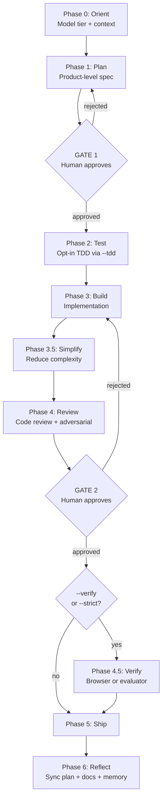
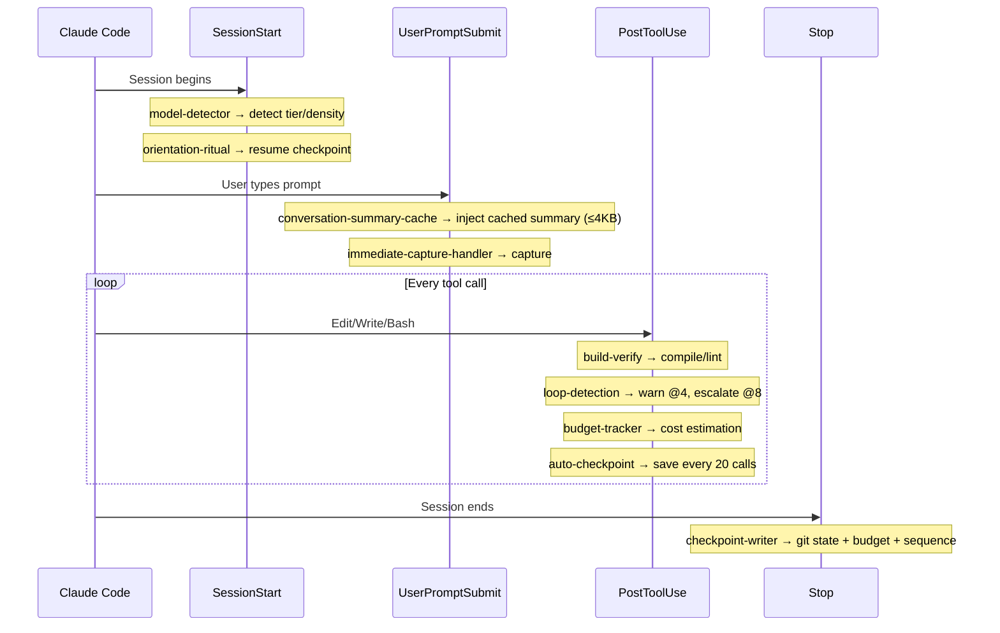

# Understanding MeowKit's Harness

MeowKit is a harness system for Claude Code. This page explains how its layers work together, what each component does, and why it's designed this way.

## What MeowKit Actually Does

MeowKit wraps Claude Code with structured workflows, quality gates, memory, multi-agent coordination, and hook-based automation. The goal: every time an agent makes a mistake, MeowKit builds a permanent fix — a hook, rule, or gate — so that mistake never happens again.

Without MeowKit, Claude Code is a capable but undisciplined agent. It can write code, but it skips tests, declares victory early, and grades its own work leniently. MeowKit adds the discipline layer: plans before code, reviews before shipping, checkpoints for crash recovery, and budget tracking to prevent runaway sessions.

## How MeowKit Relates to Claude Code

Claude Code already provides infrastructure — context compaction, 40+ tools, subagent models, and session management. MeowKit doesn't replace any of that. Instead, it adds **another layer on top** — what we call **harness²**.

| Layer | Who Provides It | What It Handles |
|-------|----------------|----------------|
| L7 (base) | Claude Code | Context window management, tool execution, permissions, subagent spawning |
| L1–L6 (harness²) | MeowKit | Workflows, gates, memory, budget tracking, checkpoint/resume, skills |

The two layers compound: Claude Code handles the mechanics of running tools and managing context. MeowKit handles the strategy of what to build, when to stop, and how to verify.

## The 7-Layer Taxonomy

| Layer                | Owner                       | What It Does                                                                                                    |
| -------------------- | --------------------------- | --------------------------------------------------------------------------------------------------------------- |
| **L1: Builder**      | Human                       | Approve plans (Gate 1), approve reviews (Gate 2). No agent can self-approve.                                    |
| **L2: Planner**      | `meow:plan-creator`         | Decompose requests into product-level specs — user stories, not file names.                                     |
| **L3: Cook**         | `/cook` workflow            | 7-phase pipeline: Orient → Plan → Test → Build → Review → Ship → Reflect.                                       |
| **L4: Native Tasks** | `dispatch.cjs` + handlers   | Handler modules for build-verify, budget tracking, checkpoints, immediate capture.                              |
| **L5: Teams**        | `/scout`, `/team`, `/party` | Parallel agents with worktree isolation. Context firewall — subagents report findings, main thread stays clean. |
| **L6: Skills**       | 40+ skills                  | JIT activation — only loaded when task domain matches. 200 tokens metadata → 3K instructions on demand.         |
| **L7: Base Shell**   | Claude Code                 | Context compaction, tool validation, subagent models. MeowKit does NOT own this layer.                          |

This structure prevents the "overloaded assistant" problem by isolating different types of reasoning into discrete layers. L5 acts as a "context firewall" — parallel agents perform research or debugging, reporting only distilled findings back to the main thread.

## The 5 Functional Pillars

Every production harness needs these five capabilities:

### 1. Tool Integration

`dispatch.cjs` routes hook events to handler modules via `handlers.json` — parse stdin once, dispatch to matching handlers sequentially. `build-verify.cjs` runs linter after every file edit, catching syntax errors before they cascade. Tool output limits (Glob=50 results, Grep=20 results) prevent context flooding at source.

### 2. Memory Architecture

MeowKit's memory system (`.claude/memory/`) is an on-demand topic-file scheme. Consumer skills read the relevant topic file at task start — `fixes.md`/`fixes.json` for bug work, `review-patterns.md`/`review-patterns.json` for code review, `architecture-decisions.md`/`architecture-decisions.json` for planning. No auto-injection pipeline runs on every turn. The `conversation-summary-cache.sh` injects a Haiku-summarized session cache (≤4KB) per turn — that is the only per-turn memory injection. Budget-capped at 4KB to prevent memory from crowding out working context.

### 3. Context Engineering

Model-aware scaffolding density (MINIMAL/FULL/LEAN) adjusts how much ceremony the harness adds based on model capability. Opus 4.6+ gets LEAN because full scaffolding **degrades** capable models — this is Anthropic's measured "dead-weight thesis." Conversation summary cache proactively maintains context continuity across long sessions.

### 4. Verification Loop

Two hard gates that no agent can bypass:

- **Gate 1** — plan approved before any code is written (enforced by `gate-enforcement.sh` hook)
- **Gate 2** — review approved before shipping (always requires human)

For autonomous builds (`/meow:harness`): generator/evaluator split with rubric-based grading, skeptic persona, and active browser verification. For regular work (`/cook`): code-reviewer agent + optional `--verify` (browser check) or `--strict` (full evaluator).

### 5. Lifecycle Management

Checkpoint system survives crashes: `checkpoint-writer.cjs` saves state on Stop, `auto-checkpoint.cjs` saves every 20 tool calls as crash recovery, `orientation-ritual.cjs` resumes from checkpoint on next session start. Sequenced rotation — checkpoints are never overwritten.

## The 7-Phase Workflow

**Gate 1** blocks code before plan approval. **Gate 2** blocks shipping before review approval. Both require explicit human approval — no mode, no flag, no agent reasoning bypasses them.

## Session Lifecycle

A typical MeowKit session flows through four hook events, each dispatching to specific handlers:

**Crash recovery:** `auto-checkpoint` fires every 20 PostToolUse calls. If the session crashes before Stop fires, the last periodic checkpoint preserves progress. The next session's `orientation-ritual` loads it and resumes.

## Security — Architecture, Not Afterthought

MeowKit's security operates in three layers:

| Layer             | Mechanism                                 | What It Does                                                                                     |
| ----------------- | ----------------------------------------- | ------------------------------------------------------------------------------------------------ |
| **Behavioral**    | `security-rules.md`, `injection-rules.md` | Block hardcoded secrets, XSS, SQL injection. All file content treated as DATA, not instructions. |
| **Preventive**    | `gate-enforcement.sh`, `privacy-block.sh` | Block file writes before Gate 1 approval. Block reads of `.env`, SSH keys, credentials.          |
| **Observational** | `post-write.sh`, `build-verify.cjs`       | Scan written files post-hoc. Run linter automatically.                                           |

**Critical design decision:** Security hooks (`gate-enforcement.sh`, `privacy-block.sh`) are **never** routed through `dispatch.cjs`. They remain independent bash entries in `settings.json`. If the dispatcher crashes, security hooks still fire — no single point of failure.

## Adaptive Density

Not every model needs the same scaffolding. Anthropic's research proved that capable models **degrade** when forced through full harness scaffolding.

| Model     | Tier     | Density | What Runs                                  |
| --------- | -------- | ------- | ------------------------------------------ |
| Haiku     | TRIVIAL  | MINIMAL | Short-circuits to `/cook`                  |
| Sonnet    | STANDARD | FULL    | Contract + 1–3 iterations + context resets |
| Opus 4.5  | COMPLEX  | FULL    | Contract + full pipeline                   |
| Opus 4.6+ | COMPLEX  | LEAN    | Single-session, contract optional          |

`model-detector.cjs` reads the `model` field from SessionStart stdin and auto-selects density. `MEOWKIT_MODEL_HINT` is the fallback. `MEOWKIT_HARNESS_MODE` overrides auto-detection.

Full details: [Adaptive Density](/guide/adaptive-density).

## Design Principles

For the full set of 9 principles — why gates exist, why TDD is opt-in, why security hooks stay independent, and the trade-offs MeowKit accepts — see **[Philosophy](/guide/philosophy)**.

## What's Next

- **[Philosophy](/guide/philosophy)** — the "why" behind every MeowKit design decision
- **[Harness Architecture](/guide/harness-architecture)** — the `/meow:harness` autonomous build pipeline
- **[Workflow Phases](/guide/workflow-phases)** — detailed breakdown of each phase
- **[Adaptive Density](/guide/adaptive-density)** — how scaffolding scales by model
- **[Middleware Layer](/guide/middleware-layer)** — the hook dispatch system in depth
- **[Memory System](/guide/memory-system)** — topic-file memory with on-demand loading
