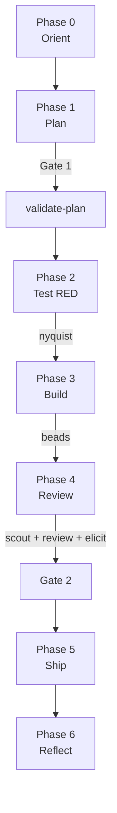
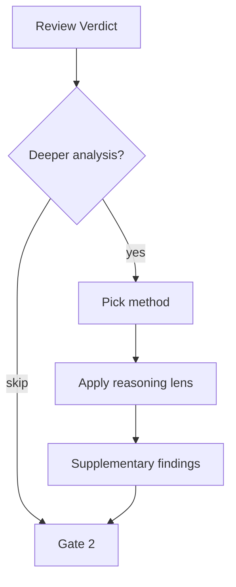

# v1.1.0 — The Reasoning Depth Release

Focused upgrade: deeper review reasoning, resumable builds, and systematic coverage mapping.

## Full v1.1.0 Workflow



## New Skills

### meow:elicit — Structured second-pass reasoning

Post-verdict deeper analysis using 8 elicitation methods. Invoked after a reviewer verdict to push harder on borderline dimensions, surface hidden assumptions, or stress-test a PASS decision before Gate 2.

The 8 methods probe from different angles: devil's advocate, steelman, inversion, pre-mortem, boundary probing, assumption surfacing, counterfactual, and first-principles. Each method is independent — elicitation selects the subset most relevant to the verdict's weak points.



[meow:elicit reference →](/reference/skills/elicit)

### meow:validate-plan — 8-dimension plan quality check

Runs automatically after the planner produces a plan file, before Gate 1 is presented. Checks 8 dimensions: problem clarity, binary success criteria, explicit out-of-scope, pattern fit, actionable risks, clean bead boundaries, realistic effort, and testable acceptance criteria.

A plan that fails any dimension is revised before the human sees it. Gate 1 is only presented after `validate-plan` passes.

[meow:validate-plan reference →](/reference/skills/validate-plan)

### meow:nyquist — Test-to-requirement coverage mapping

Maps written tests to acceptance criteria from the plan file. Ensures that every binary criterion has at least one test targeting it — before Phase 3 begins. Named after Nyquist sampling theorem: you need sufficient test density to faithfully represent the requirement space.

Run at the end of Phase 2 (Test RED) to confirm coverage before handing off to the developer.

[meow:nyquist reference →](/reference/skills/nyquist)

## Enhanced Review Pipeline

### Scout integration

`meow:scout` runs optionally before the main review to detect edge cases, unusual patterns, and context the parallel reviewers might miss. Scout findings are injected into the review context as a pre-loaded brief.

### Elicitation hook

After the reviewer issues a verdict, `meow:elicit` can be invoked for a structured second pass. This is particularly useful when a dimension produced WARN — elicitation either upgrades WARN to PASS (with evidence) or downgrades it to FAIL (with specific findings).

## Execution Resilience

### Beads pattern for COMPLEX builds

COMPLEX tasks (5+ files) are decomposed into **beads** — atomic, independently committable work units. Each bead covers a bounded set of files, has a clear done state, and produces one conventional commit.

If the session is interrupted, the developer resumes from the last uncommitted bead. No work is duplicated or lost.

```
bead-01 → commit → bead-02 → commit → bead-03 → ...
```

### Bead template for plan decomposition

The planner includes a bead section in COMPLEX plan files. Each bead entry specifies: files owned, acceptance check, and commit message template. Developers follow the bead list sequentially without re-interpreting scope at each step.

---

## Agent System

### Subagent Status Protocol

Every subagent MUST end responses with a structured status block. Four statuses, deterministic routing:

| Status                 | Meaning                                              |
| ---------------------- | ---------------------------------------------------- |
| **DONE**               | Task completed successfully                          |
| **DONE_WITH_CONCERNS** | Completed, flagged doubts                            |
| **BLOCKED**            | Cannot complete — something must change before retry |
| **NEEDS_CONTEXT**      | Missing information — provide it, then re-dispatch   |

### Sub-agent type classification

Agents are now classified as **Core** (pipeline, sequential) or **Support** (on-demand, spawnable). The agents index includes a Type column. See [Agents Overview](/reference/agents/).

### [AGENTS_INDEX.md](/reference/agents-index)

Centralized registry at `.claude/agents/AGENTS_INDEX.md` with columns: Agent file, Type, Role, Source, Workflow phases, Auto-activate, CE version, Last improved.

### [SKILLS_INDEX.md](/reference/skills-index)

Centralized skill registry at `.claude/agents/SKILLS_INDEX.md` — single source of truth for skill discovery, dependencies, and activation conditions.

---

## Documentation

### Enforcement mechanism matrix in [RULES_INDEX](/reference/rules-index)

[`RULES_INDEX.md`](/reference/rules-index) now includes a full enforcement mechanism matrix: each rule mapped to its mechanism (Behavioral / Hook / Data), whether it can be overridden, and the exception condition.

### Quick-start skill selection guide

New section in the skills docs: a decision table for selecting the right skill given task type, complexity, and phase. Replaces the need to read every SKILL.md before knowing what to use.

### Delegation checklist in orchestration rules

`orchestration-rules.md` now includes a pre-delegation checklist (5 items) and a delegation prompt template. Prevents the most common subagent failure: missing file ownership or acceptance criteria in the prompt.
