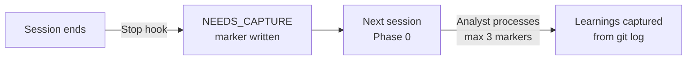
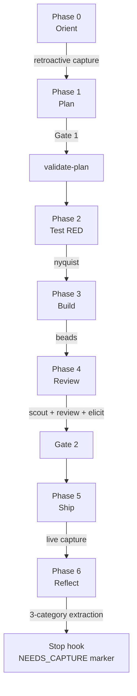

# v1.2.0 — The Memory Activation Release

MeowKit's memory system was designed in v1.0.0 but never activated — zero sessions captured. This release fixes the capture pipeline, enriches the schema with insights from 6 external frameworks, and adds consolidation tooling for when memory reaches scale.

## The Problem

MeowKit's memory files have been empty since launch:

```
lessons.md:     Header template only
patterns.json:  { "patterns": [], "sessions_captured": 0 }
decisions.md:   Empty placeholder
```

**Root cause:** The `post-session.sh` Stop hook fires at session end but writes an HTML comment placeholder. No agent is alive during the hook to extract actual learnings. The placeholder is invisible to future sessions.

## What Changed

### Fixed Session Capture Pipeline

The capture pipeline now uses a **retroactive capture** pattern:



1. **Stop hook** writes structured markers (timestamp + file count) instead of HTML comments
2. **Phase 0** retroactive capture processes pending markers (max 3, 2-min budget)
3. **Phase 5** live capture preserves WHY decisions were made (retroactive can only recover WHAT)

### Enriched Learning Format

Learnings are now captured in **3 categories** (inspired by [Khuym compounding](https://github.com/ngocsangyem/MeowKit)):

| Category | What Gets Captured |
|----------|-------------------|
| **Patterns** | Reusable approaches, code patterns, architecture decisions |
| **Decisions** | Choices with rationale, tagged as GOOD_CALL / BAD_CALL / SURPRISE / TRADEOFF |
| **Failures** | Mistakes with root cause analysis and prevention rules |

### Enriched `patterns.json` Schema

Three new optional fields (backward compatible):

```json
{
  "id": "always-validate-dto",
  "type": "success",
  "category": "pattern",           // NEW: pattern | decision | failure
  "severity": "critical",          // NEW: critical | standard
  "applicable_when": "Creating any API endpoint that accepts user input",  // NEW
  "scope": "packages/api",
  "context": "NestJS endpoint development",
  "pattern": "Always create a DTO with class-validator decorators",
  "frequency": 5,
  "lastSeen": "2026-03-25"
}
```

Existing entries without new fields remain valid. Missing `severity` defaults to `"standard"`.

### Stronger Promotion Criteria

Patterns are now promoted to CLAUDE.md when ALL criteria are met:

| Criterion | Before (v1.1.0) | After (v1.2.0) |
|-----------|-----------------|-----------------|
| Frequency | ≥ 3 | ≥ 3 |
| Severity | — | Must be `critical` OR frequency ≥ 5 |
| Generalizable | — | Must apply beyond one feature |
| Time savings | — | Must save ≥ 30 min if known in advance |
| Human approval | Required | Required (unchanged) |

### Consolidation Rubric

New `consolidation.md` reference with a 4-branch classification system (inspired by Khuym dream):

| Classification | Condition | Action |
|---------------|-----------|--------|
| **Clear match** | One existing entry owns the lesson | Auto-merge |
| **Ambiguous** | Multiple plausible owners | Ask user to choose |
| **No match** | New durable lesson | Create new entry |
| **No durable signal** | Transient or noise | Skip |

Invoke manually when memory reaches thresholds: 20+ sessions, 50+ patterns, 500+ cost entries.

### Comprehensive Documentation

New [`docs/memory-system.md`](/guide/memory-system) covers: architecture, activation, session capture, pattern promotion, consolidation, schema reference, FAQ, limitations, and migration.

## Cross-Framework Research

Six frameworks were analyzed for memory-related features:

| Framework | Relevance | Key Takeaway |
|-----------|-----------|-------------|
| **Khuym** | Highest | Category split, consolidation rubric, promotion criteria |
| **GSD** | Moderate | Session persistence patterns (HANDOFF.json, STATE.md) |
| **CKE** | Moderate | L1-L5 layered memory architecture (L3-L5 deferred) |
| **Superpowers** | Low | Stateless by design — no memory |
| **gstack** | Low | Observability only, no agent learning |
| **BMAD** | Low | Artifact-driven state, no consolidation |

## What's Deferred (v1.3+)

| Feature | Why Deferred |
|---------|-------------|
| `meow:dream` background consolidation | Memory empty — nothing to consolidate yet |
| Git-as-memory-log (CKE pattern) | Useful for skill refinement loops, not urgent |
| L3-L5 layered memory (vector DB) | Only justified at 1000+ memories |
| Automatic cross-machine sync | Complexity not justified |

## Updated Flow Diagram



## Files Changed

| File | Change |
|------|--------|
| `session-capture.md` | 3-category extraction + enriched schema |
| `pattern-extraction.md` | Stronger promotion criteria |
| `consolidation.md` | NEW — Khuym-style rubric |
| `SKILL.md` (memory) | Updated references + schema notes |
| `post-session.sh` | Structured NEEDS_CAPTURE markers |
| `CLAUDE.md` | Phase 0 retroactive + Phase 5 live capture |
| `auto-dream-reference.md` | Deferred to v1.3+ |
| `docs/memory-system.md` | NEW — comprehensive guide |
