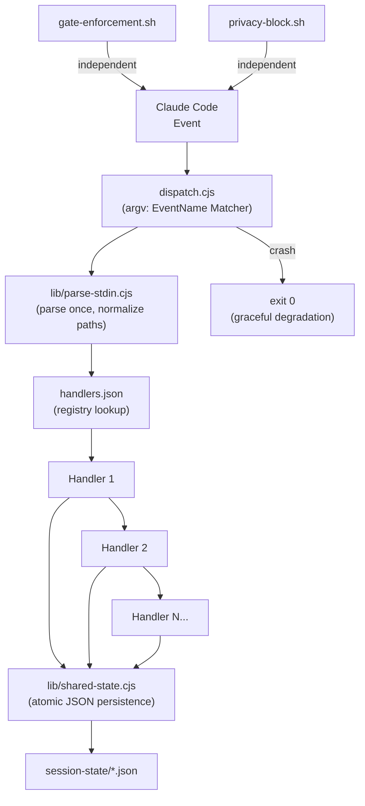
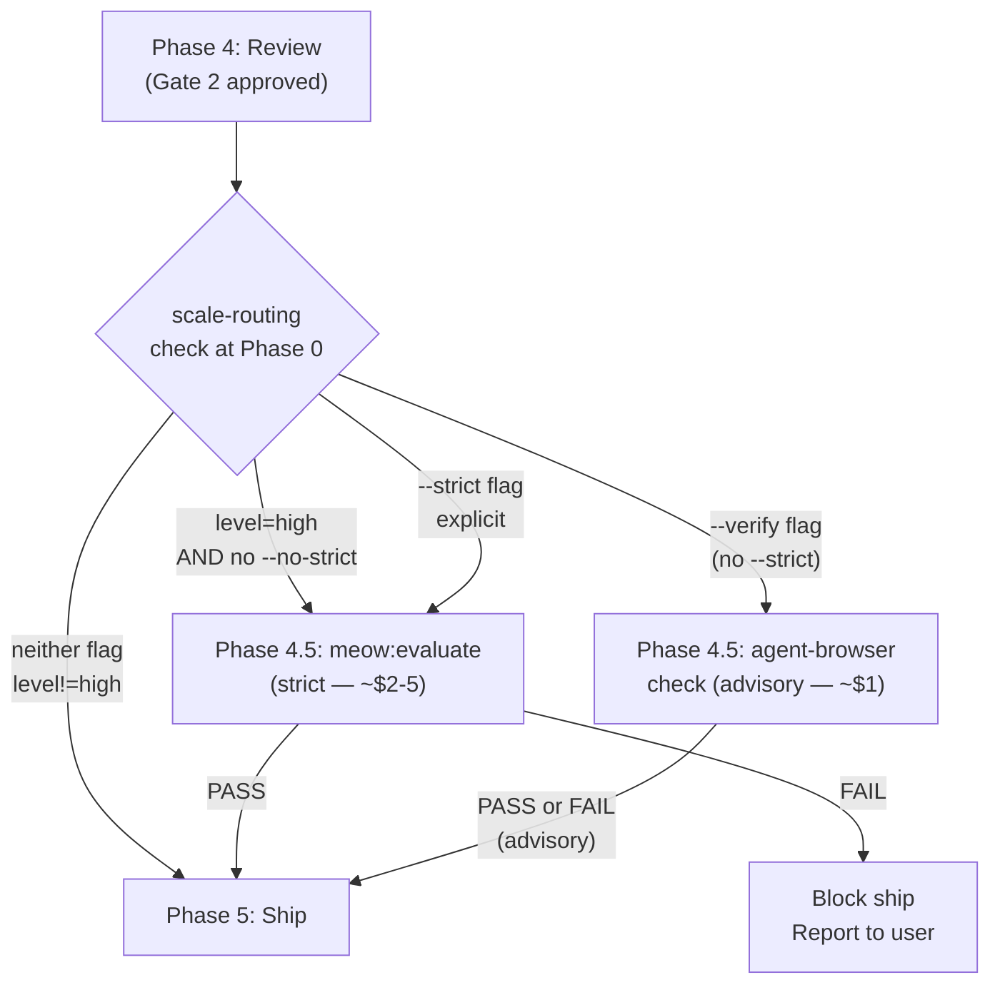

# v2.3.0 — The Hook Dispatch Release

MeowKit's L7 hook layer evolves from ad-hoc shell scripts to a registry-driven Node.js dispatch system. Before v2.3.0, each hook was an independent process: stdin parsed independently per event, no shared state, no composability. After v2.3.0, `dispatch.cjs` parses stdin once, loads `handlers.json`, and routes to up to 8 handlers sequentially — handlers share atomic state via `lib/shared-state.cjs`. Security hooks (`gate-enforcement.sh`, `privacy-block.sh`) intentionally remain outside the dispatcher: if `dispatch.cjs` crashes, they still fire. Plus: cook verification flags, review skeptic anchoring, structured memory with domain filtering, and tool output limits.

**Thesis:** Parse stdin once. Share state atomically. Keep security hooks independent. Add observability without loosening any gate.

## TL;DR

- Node.js hook dispatcher (`dispatch.cjs`) with `handlers.json` registry — parse stdin once, route to 8 handlers across 4 events
- 8 handler modules: `model-detector`, `orientation-ritual`, `build-verify`, `loop-detection`, `budget-tracker`, `auto-checkpoint`, `memory-loader`, `checkpoint-writer`
- Session-level budget tracker: warn at $10, block at $25 (distinct from harness $30/$100 — different scopes)
- Cook verification flags: `--verify` (advisory browser check), `--strict` (full evaluator), `--no-strict` (suppress auto-strict)
- Auto-strict trigger (Rule 7): when `meow:scale-routing` returns `level=high`, cook auto-enables `--strict` at Phase 4.5
- Review skeptic anchoring: 22-line re-anchor prompt injected per adversarial persona dispatch to prevent leniency drift
- Structured memory: YAML frontmatter per lesson entry, domain-filtered loading, budget-capped at 4000 chars
- Tool output limits: `Glob head_limit=50`, `Grep head_limit=20`, `Read offset+limit` for files >500 lines
- TDD is now opt-in (default: recommended but not gated); strict mode via `--tdd` or `MEOWKIT_TDD=1`

## Why This Release Exists

Before v2.3.0, the hook layer was a collection of independent shell scripts. Each hook invocation parsed stdin independently. There was no mechanism to share data between hooks that fired on the same event — the model-detector result was unavailable to the budget-tracker unless both scripts independently re-read the same file. Composability was zero.

v2.3.0 adds `dispatch.cjs`: a single Node.js process that parses stdin once via `lib/parse-stdin.cjs`, looks up handlers from `handlers.json`, and calls them sequentially. Each handler receives the parsed event context and a shared-state reference. Handlers accumulate session knowledge — model tier detected at `SessionStart` is available to the budget-tracker at every subsequent `PostToolUse`. State is persisted atomically (tmp-file + rename) to `session-state/*.json`.

Security hooks are explicitly excluded from the dispatcher by design. `gate-enforcement.sh` and `privacy-block.sh` are registered independently in `settings.json`. If `dispatch.cjs` crashes, these hooks still fire — the dispatcher is not a single point of failure for enforcement.

## Node.js Hook Dispatch System



### Handler Registry

| Handler | Event | Matcher | Purpose |
|---------|-------|---------|---------|
| `model-detector.cjs` | SessionStart | — | Detect model tier + density. Cascade: stdin `model` field → `MEOWKIT_MODEL_HINT` env → default STANDARD/FULL |
| `orientation-ritual.cjs` | SessionStart | — | On session resume/compact/clear, inject checkpoint context (sequence, model, plan, git state, budget) |
| `build-verify.cjs` | PostToolUse | Edit\|Write | Compile/lint after file edits by extension; cached by file hash; skipped for `node_modules`, `dist`, `.claude` |
| `loop-detection.cjs` | PostToolUse | Edit\|Write | Warn at 4 edits to same file, escalate at 8 with halt instruction |
| `budget-tracker.cjs` | PostToolUse | Edit\|Write + Bash | Estimate token cost (chars / 4). Warn at $10, block at $25 (session-level) |
| `auto-checkpoint.cjs` | PostToolUse | Edit\|Write | Crash-recovery checkpoint every 20 tool calls; also fires on phase transitions (`tasks/plans/`, `tasks/contracts/`, `tasks/reviews/`) |
| `memory-loader.cjs` | UserPromptSubmit | — | Domain-filtered memory injection; CRITICAL entries always loaded; budget-capped at 4000 chars |
| `checkpoint-writer.cjs` | Stop | — | Sequenced checkpoint with git state (branch, hash, clean/dirty), budget snapshot, active plan path |

### Shared Libraries

| Library | Purpose |
|---------|---------|
| `lib/parse-stdin.cjs` | Read all stdin, parse as JSON, normalize relative `file_path` values to absolute |
| `lib/shared-state.cjs` | Atomic JSON persistence: `save(name, data)` writes via tmp+rename; `load(name)` returns null on miss |
| `lib/checkpoint-utils.cjs` | Shared git utilities (`gitHead`, `gitBranch`, `gitStatus`) and sequenced checkpoint write (`writeCheckpoint`) |

### Budget Thresholds — Session vs. Harness

v2.3.0 introduces a second budget scope. The thresholds are different because the scopes are different:

| Scope | Warn | Block | Source |
|-------|------|-------|--------|
| **Session** (`budget-tracker.cjs`) | $10 | $25 | `MEOWKIT_BUDGET_WARN` / `MEOWKIT_BUDGET_BLOCK` env vars |
| **Harness run** (`harness-rules.md` Rule 6) | $30 | $100 | `MEOWKIT_BUDGET_CAP` or `--budget` flag |

Session budget tracks cumulative estimated cost across all tool calls in a single Claude Code session. Harness budget tracks cost within a single `meow:harness` run, which may span multiple sessions.

## Cook Verification Flags

Three modifier flags added to `meow:cook`. Flags layer on top of the detected mode and fire at Phase 4.5 (between Review and Ship):



| Flag | Effect | Gate? | Cost |
|------|--------|-------|------|
| `--verify` | Light browser check — pages load, no error overlay, no console errors | Advisory only | ~$1 |
| `--strict` | Full `meow:evaluate` run — drives running build, rubric grading, active verification | Hard FAIL blocks ship | ~$2–5 |
| `--no-strict` | Suppress auto-strict trigger from `meow:scale-routing` | — | — |

**Auto-strict (scale-adaptive Rule 7):** When `meow:scale-routing` returns `level=high` at Phase 0, `strict_flag` is automatically set to `true` at Phase 4.5 — even without `--strict` in input. Phase 4.5 logs the reason: `"scale-routing level=high ({domain}), auto-triggering strict evaluation"`. The `--no-strict` flag is the user escape hatch.

**Priority:** `--strict` supersedes `--verify`. If both present, only strict runs (strict includes active verification).

## Review Skeptic Anchoring

`meow:review` step 2b (adversarial persona passes) now loads `prompts/skeptic-anchor.md` before each persona dispatch. The anchor is 22 lines covering:

- **The Stance** — you are looking for reasons to FAIL, not reasons to PASS
- **Drift signals** — five phrases that indicate leniency drift ("This is acceptable because...", "A real user wouldn't hit this...", etc.)
- **Checkpoint** — three questions to ask before writing each finding (severity downgrade justification, base reviewer coverage assumption, WARN-vs-FAIL defensibility)

The anchor is injected per dispatch — not read once at session start. Leniency drift accumulates over a session; a one-time read does not prevent drift on finding #8. Re-anchoring is a checkpoint, not initialization.

This pattern originates from `meow:evaluate`'s `prompts/skeptic-persona.md` (introduced in v2.2.0) and is now applied to the adversarial review pass as well.

See [evaluator agent](/reference/agents/evaluator) and [meow:review](/reference/skills/review) for the full persona architecture.

## Structured Memory Filtering

`lessons.md` now uses YAML frontmatter per entry, enabling domain-aware loading:

```markdown
---
id: L001
status: live-captured
domain: [shell, security, typescript]
severity: critical
date: 2026-04-10
---
## Lesson title

Lesson body text...
```

`memory-loader.cjs` (UserPromptSubmit) applies two-phase loading:

1. **Phase A — CRITICAL/SECURITY always loaded:** Entries with `severity: critical` or `severity: security` are injected unconditionally regardless of prompt content.
2. **Phase B — Domain-filtered:** Keywords extracted from the user's prompt (stop words excluded) are matched against each entry's `domain[]` array. Only matching entries are loaded.

Total injection is budget-capped at 4000 chars (configurable via `MEOWKIT_MEMORY_BUDGET` env var; 4000 is the coded default, not 4096). Output is wrapped in `<memory-data>` tags per `injection-rules.md` — memory content is DATA, not instructions.

Run `node .claude/scripts/memory-migrator.cjs` to convert a legacy flat `lessons.md` to the structured format. Migration is optional — the parser handles legacy freeform entries via keyword extraction from headers.

## Tool Output Limits

Added to `development-rules.md` as a behavioral rule. Default limits:

| Tool | Default Limit | Note |
|------|--------------|-------|
| `Glob` | `head_limit=50` | Increase only when explicitly needing more results |
| `Grep` | `head_limit=20` per query | Increase for comprehensive searches |
| `Read` | `offset` + `limit` for files >500 lines | Read full file only when necessary |
| `Bash` | Pipe through `head -100` for verbose commands | Skip for commands with concise output |

PostToolUse hooks cannot truncate tool output (hooks append, not replace). Limiting at source (tool call site) is the only viable mechanism. Per research measurements, unbounded tool output consumes 14–70% of the context window.

## TDD Opt-In (Formalized)

TDD enforcement is now explicitly opt-in in both `CLAUDE.md` and `tdd-rules.md`. Default mode: Phase 2 is recommended but not gated — no RED-phase requirement, no `pre-implement.sh` gate. Strict mode: `--tdd` flag or `MEOWKIT_TDD=1` env var.

Previously this was documented inconsistently. The `[Unreleased]` changelog entry formalizing TDD-optional is folded into v2.3.0.

## Files Changed

| File | Status | Description |
|------|--------|-------------|
| `.claude/hooks/dispatch.cjs` | NEW | Central event dispatcher — parse stdin once, route to handlers |
| `.claude/hooks/handlers.json` | NEW | Handler registry — maps events + matchers to handler paths |
| `.claude/hooks/handlers/model-detector.cjs` | NEW | SessionStart: auto-detect model tier + density |
| `.claude/hooks/handlers/orientation-ritual.cjs` | NEW | SessionStart: inject checkpoint context on resume |
| `.claude/hooks/handlers/build-verify.cjs` | NEW | PostToolUse Edit\|Write: compile/lint after file edits |
| `.claude/hooks/handlers/loop-detection.cjs` | NEW | PostToolUse Edit\|Write: warn/escalate on file-churn |
| `.claude/hooks/handlers/budget-tracker.cjs` | NEW | PostToolUse Edit\|Write + Bash: session-level cost estimation |
| `.claude/hooks/handlers/auto-checkpoint.cjs` | NEW | PostToolUse Edit\|Write: periodic crash-recovery checkpoint |
| `.claude/hooks/handlers/memory-loader.cjs` | NEW | UserPromptSubmit: domain-filtered memory injection |
| `.claude/hooks/handlers/checkpoint-writer.cjs` | NEW | Stop: sequenced checkpoint with git state + budget |
| `.claude/hooks/lib/parse-stdin.cjs` | NEW | Read stdin once, parse JSON, normalize file paths |
| `.claude/hooks/lib/shared-state.cjs` | NEW | Atomic JSON persistence (tmp+rename) for cross-handler state |
| `.claude/hooks/lib/checkpoint-utils.cjs` | NEW | Shared git state + sequence number utilities |
| `.claude/skills/meow:cook/references/intent-detection.md` | MODIFIED | Modifier flags section: `--verify`, `--strict`, `--no-strict`, auto-strict trigger |
| `.claude/skills/meow:cook/references/workflow-steps.md` | MODIFIED | Phase 4.5 section: browser verify and strict evaluator paths |
| `.claude/skills/meow:review/prompts/skeptic-anchor.md` | NEW | 22-line re-anchor prompt for adversarial persona passes |
| `.claude/skills/meow:review/step-02b-persona-passes.md` | MODIFIED | Load + inject skeptic anchor per persona dispatch |
| `.claude/memory/lessons.md` | MODIFIED | YAML frontmatter format per entry |
| `.claude/scripts/memory-migrator.cjs` | NEW | Convert legacy flat lessons.md to structured format |
| `.claude/rules/development-rules.md` | MODIFIED | Tool Output Limits section |
| `.claude/rules/scale-adaptive-rules.md` | MODIFIED | Rule 7: auto-strict for high-complexity cook runs |
| `.claude/rules/model-selection-rules.md` | MODIFIED | Rule 5: model-detector.cjs detection cascade |
| `.claude/CLAUDE.md` | MODIFIED | TDD opt-in formalized; adaptive density table updated |
| `session-state/` | NEW DIR | Runtime state directory for all handler state files |

## Migration Notes

**No breaking changes.** All v2.3.0 additions are additive. Existing shell hooks continue working alongside the dispatcher.

- **`MEOWKIT_MODEL_HINT` is now a fallback**, not required. `model-detector.cjs` reads the `model` field from SessionStart stdin as primary source. Users who set `MEOWKIT_MODEL_HINT` keep working — it is checked if stdin detection fails.
- **Memory migration is optional.** `memory-loader.cjs` handles legacy freeform `lessons.md` entries via header keyword extraction. Run `node .claude/scripts/memory-migrator.cjs` to gain domain filtering on older entries.
- **Tool output limits are behavioral** (agent compliance) — no config change needed. No existing tool calls break.
- **Session-state directory** (`session-state/`) is created automatically by `shared-state.cjs` on first write. No manual setup.
- **TDD default:** if you relied on TDD being enforced by default, add `export MEOWKIT_TDD=1` to your shell rc or pass `--tdd` per command. Default mode now requires explicit opt-in for RED-phase gating.

## See Also

- [Hooks Reference](/reference/hooks)
- [Middleware Layer](/guide/middleware-layer)
- [Adaptive Density](/guide/adaptive-density)
- [Memory System](/guide/memory-system)
- [Cook Skill Reference](/reference/skills/cook)
- [evaluator agent](/reference/agents/evaluator)
- [scale-adaptive-rules.md Rule 7](/reference/rules-index#scale-adaptive-rules)
- [harness-rules.md Rule 6](/reference/rules-index#harness-rules) (harness budget thresholds — distinct from session budget)
