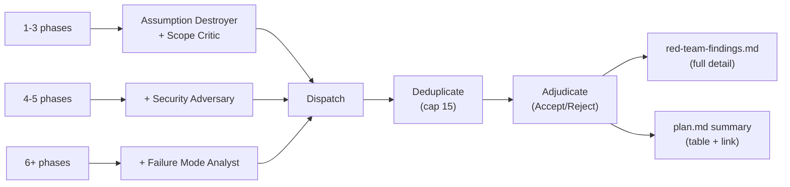
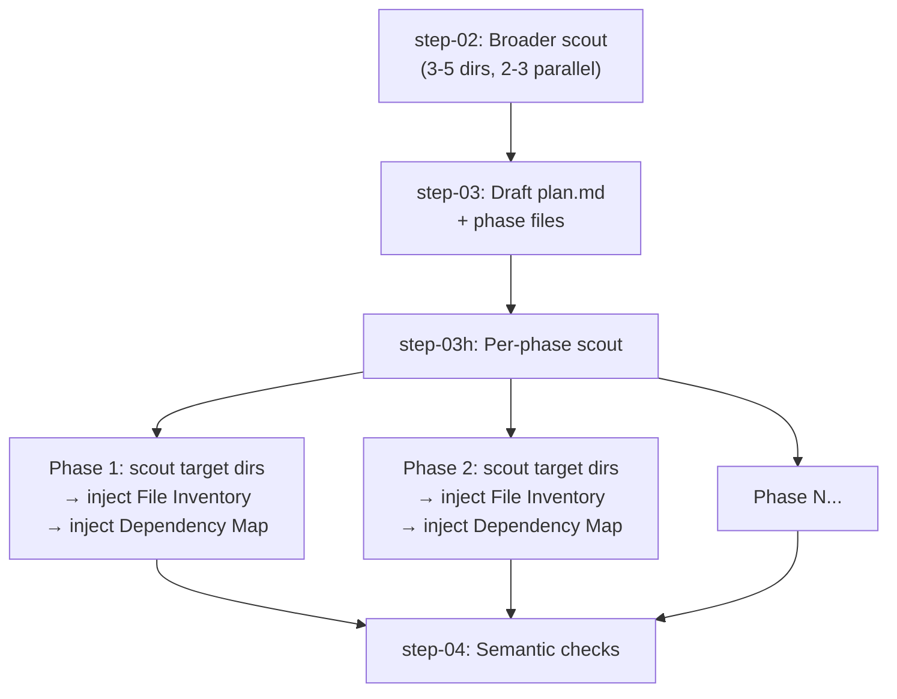

# v2.3.1 — The Plan Creator Intelligence Release

The plan-creator skill (`meow:plan-creator`) gets its biggest upgrade since v1.3.2. Before v2.3.1, red-team had 2 personas, no standalone subcommands, no per-phase scouting, and no TDD structure injection. After v2.3.1: 4 adversarial personas, 3 standalone subcommands, `--deep` mode with file inventory per phase, `--tdd` composable flag, enhanced validation with detection keywords, memory capture at Gate 1, and a solution design checklist.

**Thesis:** Better plans → fewer implementation surprises. Every improvement targets catching issues earlier — at plan time, not code time.

## TL;DR

- **4-persona red team** — Security Adversary + Failure Mode Analyst added; phase-count scaling (1-3=2, 4-5=3, 6+=4)
- **Red-team findings file** — separate `red-team-findings.md` with full 7-field detail, linked from plan.md summary
- **`--deep` mode** — hard pipeline + per-phase scouting: file inventory + dependency maps embedded in each phase
- **`--tdd` composable flag** — combines with any mode; injects 4 TDD sections (Tests Before, Refactor, Tests After, Regression Gate) into phase files
- **Standalone subcommands** — `/meow:plan red-team {path}`, `/meow:plan validate {path}`, `/meow:plan archive`
- **Enhanced validation framework** — detection keywords per category, 2-4 option format, section mapping for answer propagation, recording rules
- **Memory capture at Gate 1** — planning mode, scope, research highlights, red-team summary persisted to `lessons.md`
- **Solution design checklist** — 5-dimension trade-off analysis reference for Architecture/Risk sections

## Why This Release Exists

Plan-creator v1.5.0 (shipped in v2.3.0) was solid but had gaps identified by comparing against CK-Plan's reference implementation. The red team only had 2 of 4 adversarial lenses — security and failure-mode analysis were missing. There was no way to run red-team or validation on an existing plan without re-running the full pipeline. Per-phase scouting didn't exist — step-02 scouted once, then phase files were written blind to their target directories. TDD plans weren't structurally different from non-TDD plans. And planning decisions were lost at session end because no memory capture happened at Gate 1.

v2.3.1 fills every gap.

## 4-Persona Red Team

Red team now scales across 4 adversarial lenses instead of 2:



### New Personas

| Persona | Focus | Category Tag |
|---------|-------|-------------|
| **Security Adversary** | Auth bypass, injection vectors, data exposure, OWASP Top 10, dependency trust, privilege escalation | `security` |
| **Failure Mode Analyst** | Race conditions, cascading failures, data loss, recovery gaps, resource exhaustion, partial state | `reliability` |

Both follow the same 7-field finding format as existing personas: Severity, Location, Flaw, Failure Scenario, Evidence, Suggested Fix, Category.

### Findings File

Red-team now writes a **separate `red-team-findings.md`** in the plan directory with full detail for all findings. Plan.md gets a summary table with a link:

```
tasks/plans/YYMMDD-name/
├── plan.md                 ← summary table + link
├── red-team-findings.md    ← NEW: full 7-field findings
├── phase-01-*.md
└── ...
```

Multiple red-team sessions are safe — previous findings files get date-suffixed, new sessions append to plan.md.

## --deep Mode

`--deep` is `--hard` plus per-phase scouting. After step-03 drafts phase files, each phase gets a targeted `meow:scout` on its Related Code Files directories:



**Bounds:** max 3 tool calls per phase scout, max 7 phases. Auto-detected when 5+ directories affected OR refactor + complex classification.

**When to use:** Major refactors, large codebase migrations, unfamiliar codebases where you need file-level visibility per phase.

## --tdd Composable Flag

`--tdd` layers TDD structure onto **any** planning mode. When set, each phase file gets 4 additional sections after Implementation Steps:

1. **Tests Before** — failing tests to write before implementation
2. **Refactor Opportunities** — what to clean up after green
3. **Tests After** — integration/regression tests post-refactor
4. **Regression Gate** — specific test commands to verify no regressions

Detection: `--tdd` flag in arguments OR `MEOWKIT_TDD=1` env var. Composable: `--hard --tdd`, `--deep --tdd`, `--fast --tdd` all work.

Non-TDD plans are unchanged (standard 12-section template).

## Standalone Subcommands

Three operations that previously required the full planning pipeline now work as standalone subcommands:

| Subcommand | Usage | What It Does |
|------------|-------|-------------|
| `red-team` | `/meow:plan red-team tasks/plans/260411-auth/` | 4-persona adversarial review; writes `red-team-findings.md` + plan.md summary |
| `validate` | `/meow:plan validate tasks/plans/260411-auth/` | Critical question interview; propagates answers to phase files with Validation Log |
| `archive` | `/meow:plan archive` | Scan completed/cancelled plans; optionally capture learnings; move to `.archive/` or delete |

**Use case:** Re-run red-team after modifying phases. Validate a plan from a previous session. Clean up completed plans.

## Enhanced Validation Framework

`references/validation-questions.md` now includes:

- **Detection keywords** per category (e.g., "database", "schema" → Architecture; "assume", "expect" → Assumptions)
- **Question format rules** — 2-4 concrete options, mark recommended, "Other" automatic
- **Section mapping** — answers propagate to specific phase sections (Architecture answers → `## Architecture`, Risk answers → `## Risk Assessment`)
- **Recording rules** — full Validation Log with question text, options, answer, rationale, impact

## Memory Capture at Gate 1

After Gate 1 approval, planning context is captured to `.claude/memory/lessons.md`:

- Planning mode, scope mode, workflow model, TDD flag
- Key research findings (1-2 lines)
- Red-team accepted findings count
- Status: `live-captured`

This preserves WHY decisions were made — previously lost at session end.

## Solution Design Checklist

New `references/solution-design-checklist.md` — a 5-dimension trade-off analysis reference loaded by step-03 when writing Architecture and Risk Assessment sections:

1. **YAGNI/KISS/DRY** — every component maps to an acceptance criterion
2. **Security** — auth/authz, input validation, sensitive data handling
3. **Performance** — bottlenecks, caching, N+1, resource limits
4. **Edge cases** — error scenarios, partial failure, retry/idempotency
5. **Architecture** — component boundaries, data flow, API contracts

## Files Changed

| File | Status | Description |
|------|--------|-------------|
| `prompts/personas/plan-security-adversary.md` | NEW | Security adversary persona (auth bypass, injection, OWASP) |
| `prompts/personas/plan-failure-mode-analyst.md` | NEW | Failure mode analyst persona (race conditions, cascading failures) |
| `references/solution-design-checklist.md` | NEW | 5-dimension trade-off analysis checklist |
| `references/archive-workflow.md` | NEW | Archive subcommand workflow |
| `references/red-team-standalone.md` | NEW | Standalone red-team subcommand reference |
| `references/validate-standalone.md` | NEW | Standalone validate subcommand reference |
| `SKILL.md` | MODIFIED | Added --deep, --tdd, 4 new persona refs, 3 subcommand refs, archive trigger |
| `step-00-scope-challenge.md` | MODIFIED | --deep auto-detection, --tdd flag detection, tdd_mode output |
| `step-02-codebase-analysis.md` | MODIFIED | Deep mode: 2-3 parallel scouts |
| `step-03-draft-plan.md` | MODIFIED | Solution design checklist ref, TDD sections, per-phase scouting, fixed 3i→3j |
| `step-05-red-team.md` | MODIFIED | 4-persona scaling, red-team-findings.md output |
| `step-07-gate.md` | MODIFIED | Memory capture after Gate 1 approval |
| `step-08-hydrate-tasks.md` | MODIFIED | planning_mode schema: added deep + product-level |
| `workflow.md` | MODIFIED | deep mode, tdd_mode variable |
| `references/phase-template.md` | MODIFIED | Optional TDD sections, fixed step reference |
| `references/validation-questions.md` | MODIFIED | Detection keywords, format rules, section mapping, recording rules |

### Ecosystem Sync (downstream consumers updated)

| File | Status | Description |
|------|--------|-------------|
| `agents/planner.md` | MODIFIED | All 6 modes, --tdd composable, 3 subcommands, red-team-findings.md output |
| `agents/orchestrator.md` | MODIFIED | --deep in Planning Depth table with auto-trigger |
| `agents/reviewer.md` | MODIFIED | red-team-findings.md in Required Context |
| `agents/evaluator.md` | MODIFIED | red-team-findings.md in Required Context |
| `agents/SKILLS_INDEX.md` | MODIFIED | plan-creator v1.5.0 description, 5 step-file skills in footer |
| `meow:cook/references/workflow-steps.md` | MODIFIED | --deep/--tdd passthrough, red-team-findings.md in Phase 4 |
| `meow:review/step-01-gather-context.md` | MODIFIED | red-team-findings.md as supplementary context |
| `meow:help/SKILL.md` | MODIFIED | 3 standalone subcommands listed |
| `meow:harness/step-00-tier-detection.md` | MODIFIED | --deep for FULL density |
| `meow:validate-plan/SKILL.md` | MODIFIED | Deduplication note vs plan-creator validation |
| `meow:plan-ceo-review/SKILL.md` | MODIFIED | red-team-findings.md context loading |
| `meow:plan-ceo-review/SKILL.md` | MODIFIED | red-team-findings.md context loading |
| `meow:trace-analyze/SKILL.md` | MODIFIED | --deep for multi-module findings |
| `meow:bootstrap/references/workflow-full.md` | MODIFIED | --deep note for 5+ dir projects |
| `CLAUDE.md` | MODIFIED | Planner description + modes/subcommands line |
| `rules/tdd-rules.md` | MODIFIED | Plan-creator --tdd composable integration note |
| `references/gate-1-approval.md` | MODIFIED | --deep row in cook-command table |

## Migration Notes

**No breaking changes.** All v2.3.1 additions are additive.

- Existing plans are unaffected — new personas only activate for new red-team runs
- `--tdd` is opt-in — non-TDD plans retain the standard 12-section template
- `--deep` is opt-in — `--hard` behavior unchanged
- Standalone subcommands are new entry points, not changes to existing ones
- Validation framework enhancements are backward-compatible — step-06 works the same with richer guidance

## See Also

- [Plan Creator Reference](/reference/skills/plan-creator)
- [Workflow Phases](/guide/workflow-phases)
- [v1.3.2 — Plan Quality Release](/guide/whats-new/v1.3.2) (original plan-creator overhaul)
- [v1.4.0 — Plan Intelligence Release](/guide/whats-new/v1.4.0) (red-team extraction)
