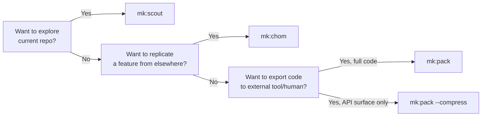

# v2.3.12 — External Codebase Packing + chom v2 Rigor

One new skill and one refactor. `mk:pack` fills a real gap — exporting external repositories as single AI-friendly files for handoff to other LLMs or reviewers. `mk:chom` adopts selective rigor from `ck:xia`: 4 user-explicit modes, speed flags, sequential-thinking escalation, and honest boundary rules that correct a previously-fabricated claim.

## What Changed

### NEW: `mk:pack`

Pack an external repository into a single AI-friendly file (markdown/xml/json/plain).

- **`/mk:pack <source>`** — auto-named output at `.claude/packs/{YYYYMMDD-HHMM}-{slug}.{ext}`
- **Sources:** `owner/repo`, full GitHub URL, or local path (must be outside current git root)
- **Formats:** markdown (default), xml, json, plain
- **`--compress`** — Tree-sitter signature extraction (classes/functions/interfaces, bodies omitted). Ideal for "what's the public API of library X" queries where full files would exceed context.
- **Secret scanning on by default** (Secretlint, origin sourced from repomix docs). Disable with `--no-security-check` (explicit flag + emitted warning).
- **Self-pack guard** — refuses to pack the current git root unless `--self` is passed. Prevents accidental self-reingest that would burn context.
- **No global install required** — `npx --yes repomix@^1.11` per invocation, caret-pinned.

**Use cases:**
- Pasting a third-party library into an external LLM (ChatGPT, Gemini, claude.ai web)
- Security audit of `vendor/library` before adoption
- Research snapshots for offline reading or review handoff

**NOT for packing the current project to re-read in the same session** — `mk:scout` is the correct tool for inbound analysis because Explore subagents read files in isolated contexts and return distilled summaries. Pack dumps raw content into the caller's context.

### REFACTORED: `mk:chom` v2

chom preserves its strengths (7-question challenge framework, HARD GATE, 5-type input routing, security anchor) and adopts selective rigor from `ck:xia`:

- **4 user-explicit modes:** `--compare` / `--copy` / `--improve` / `--port`. chom does NOT auto-derive adaptation depth — user picks explicitly to bias Phase 3 focus.
  - `--compare`: analysis only (phases 1–3)
  - `--copy`: transplant-minimal focus
  - `--improve`: anti-pattern detection focus
  - `--port`: idiomatic translation focus
  - no flag: full 6-phase workflow, emits Replication Spec without mode declaration
- **Speed flags (default off):**
  - `--lean`: skip Phase 1 researcher-agent background gathering (effective for freeform inputs; no-op for git/local/web/image)
  - `--auto`: auto-approve non-HARD-GATE steps
- **HARD GATE non-bypassable:** no flag, including `--lean` or `--auto`, skips Phase 4 human approval
- **Intent detection table** — keyword hints (e.g. "port from", "like how X does it") map to suggested mode flags
- **Sequential-thinking escalation** — for features with ≥3 architectural layers or stateful workflows, chom emits handoff text directing the user to `/mk:sequential-thinking`, then return to chom. Never auto-invokes.
- **Boundary Rules (new section):** chom emits handoff text only; does NOT invoke `/mk:plan-creator`, `/mk:brainstorming`, `/mk:cook`, or `/mk:sequential-thinking` mid-flow. This is chom's design choice for phase ownership, not a MeowKit platform rule.
- **Enriched handoff output:** Replication Spec now carries challenge-reds summary + risk score. plan-creator decides adaptation depth.
- **Migration note:** `--analyze` (v1 default) now aliases the no-flag default with a deprecation notice. Removed in v1.2.

### Flow: pack vs chom vs scout

## Why This Matters

Two quiet fixes correct false statements in the previous release:

1. **"Skills can't call skills" was not a MeowKit rule.** Red-team verification showed this claim (previously in chom's Boundary Rules) is unsourced — `lessons-build-skill.md` explicitly says skills *can* reference each other. chom's handoff-text-only pattern is a design choice for phase ownership, not a platform restriction. Framing corrected.

2. **"Packing burns 40–70% of context" was fabricated.** pack SKILL.md now carries honest context-isolation framing: scout wins for inbound analysis because Explore subagents use isolated contexts and return distilled summaries, not because "lazy reading" is inherently better.

## Files Changed

| File | Change |
|------|--------|
| `.claude/skills/pack/` | NEW skill (SKILL.md, references/options.md, references/gotchas.md, scripts/self-pack-guard.sh) |
| `.claude/skills/chom/SKILL.md` | Refactored (+74/-22 lines) — 4 modes, speed flags, boundary rules, honest framing |
| `.gitignore` / `.gitignore.meowkit` | Added `.claude/packs/` |

Challenge framework unchanged — `references/challenge-framework.md` untouched.

## Breaking Changes

None. All changes are additive. `--analyze` alias preserved with deprecation notice for one release.

## Migration

No action required for existing `mk:chom` workflows — `--analyze` continues to work (emits deprecation notice). Re-invoke with `--copy`, `--improve`, or `--port` to bias analysis toward a specific adaptation depth.

## Related

- [mk:pack reference](/reference/skills/pack)
- [mk:chom reference](/reference/skills/chom)
- [mk:scout reference](/reference/skills/scout) — correct tool for inbound analysis
- [Full changelog](/changelog)
