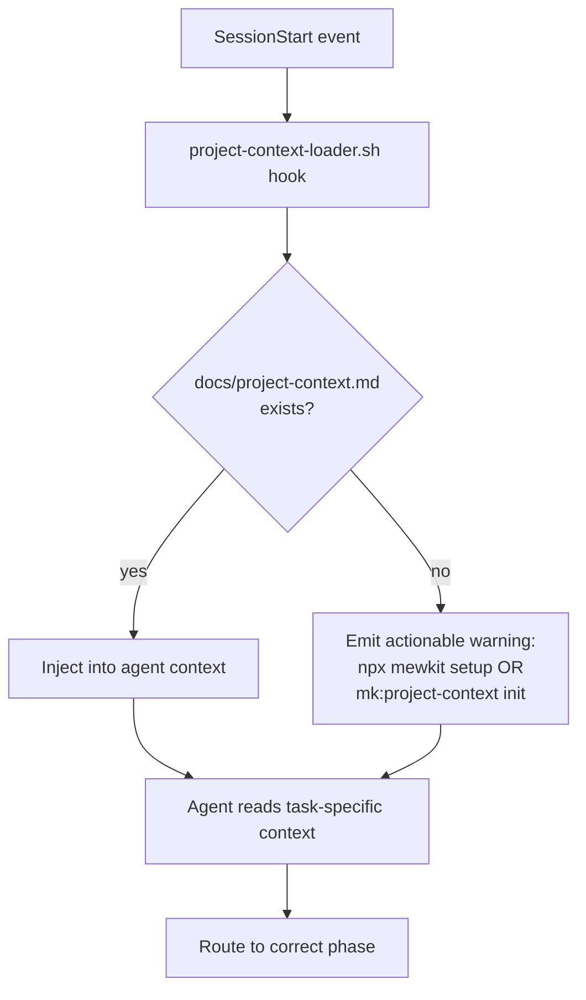

# v2.4.0 — The Agent Constitution Release

Three plans executed in a single audit-and-fix cycle. The headline change is `docs/project-context.md` — the agent constitution loaded by every agent at session start via a hook. Alongside it: 61/64 audit findings resolved, setup discoverability hardened, and a new `mk:project-context init` action for new projects.

## Highlights

- **Agent constitution** — `docs/project-context.md` (286 lines, 11 sections) is now the single source of truth for every agent. All 16 agents wired identically, CF3 closed.
- **`npx mewkit setup` surfaces everywhere** — README, CLAUDE.md, and project-context.md now all surface the bootstrap command. Silent `venv` failures (H11) eliminated.
- **`mk:project-context init`** — new subcommand writes a TODO-filled skeleton from `templates/skeleton.md` for users starting from scratch.
- **Full skill audit delta** — 5 red-team teams, 64 findings, 61 resolved, 0 regressions vs the 260411 baseline.

## Headline: Agent Constitution

`docs/project-context.md` is the agent constitution: a 286-line, 11-section document that defines tech stack, conventions, and anti-patterns for every agent session. It closes CF3 (agents operating without shared ground truth) permanently.

### What the 11 sections cover

| # | Section | Purpose |
|---|---------|---------|
| 1 | Project overview | What the project is, one paragraph |
| 2 | Tech stack | Languages, frameworks, runtimes |
| 3 | Directory structure | Where things live |
| 4 | Conventions | Naming, file size, commit format |
| 5 | Anti-patterns | What not to do, with reasons |
| 6 | Testing approach | Frameworks, coverage expectations |
| 7 | Security rules | Project-specific additions |
| 8 | Deployment | How the project ships |
| 9 | Dependencies | Key external dependencies |
| 10 | Known issues | Ongoing debt or constraints |
| 11 | Decision log | Significant past decisions |

### How every agent loads it

The `project-context-loader.sh` hook fires at `SessionStart`. It reads `docs/project-context.md` and injects it into the agent's context before any task-specific material. All 16 agents share an identical first Required Context bullet:

```
- `docs/project-context.md` — tech stack, conventions, anti-patterns (agent constitution)
```

### SessionStart flow



Before this release, missing `project-context.md` caused a silent failure — the loader script exited non-zero with no user-visible message. The fix in `mk:plan-creator/step-02-codebase-analysis.md` now emits an actionable warning pointing to the bootstrap command.

## Audit Cycle Delta

Five parallel red-team teams audited 78 skills, 16 agents, 7 hook events, and 20 commands. Consolidated findings after dedup: 64 total (6 Critical / 18 High / 34 Medium / 6 Low).

- 61/64 findings resolved in this release cycle
- 0 regressions vs the 260411 baseline (16 prior findings confirmed resolved)
- 3 remaining findings: intentionally deferred (low severity, no user-facing impact)

## Discoverability: npx mewkit setup

H11 (silent venv failures) was the most reported friction point: users would run a Python-backed skill and see a cryptic import error with no indication that `npx mewkit setup` was required.

### What changed

- **README** — `npx mewkit setup` is now listed as required bootstrap step, not buried in troubleshooting
- **CLAUDE.md** — "Python Scripts" section now leads with the setup command
- **`docs/project-context.md`** — new "Bootstrap" entry in the conventions section
- **`ensure-skills-venv.sh`** — new SessionStart hook creates the Python venv if absent (idempotent via `ensureVenv` guard)

### Hook + CLI compose cleanly (R1 reconciliation)

The `ensure-skills-venv.sh` hook and `npx mewkit setup` CLI do the same thing. R1 decision: keep both. The hook is a safety net (fires automatically, idempotent). The CLI is the user-facing bootstrap. Neither replaces the other.

```
User runs: npx mewkit setup
  → venv created, dependencies installed

SessionStart fires: ensure-skills-venv.sh
  → ensureVenv guard: venv already exists → no-op
  → venv missing → creates it silently
```

## New: mk:project-context init Action

`/mk:project-context init` writes a TODO-filled skeleton from `templates/skeleton.md` to `docs/project-context.md`. Designed for users starting a new project who don't yet have a constitution.

```bash
/mk:project-context init
# Writes docs/project-context.md with TODO placeholders
# User fills in project-specific details
# All agents immediately benefit from the shared context
```

The skeleton covers all 11 sections with commented instructions. Existing `docs/project-context.md` is not overwritten — the command exits with a message if the file already exists.

## Also in This Release

**Deprecation fixes (RF-13)**
- `mk:debug`, `mk:documentation`, `mk:shipping` frontmatter gained correct `deprecation` YAML keys

**Path fix (CF4 residual)**
- `mk:cook/SKILL.md:159` — bare `memory/lessons.md` reference corrected to `.claude/memory/lessons.md`

**Domain-specific Gotchas (12 skills)**
- Real, skill-specific gotchas added to: vue, typescript, database, build-fix, lint-and-validate, frontend-design, project-organization, jira, intake, figma, docs-finder, elicit

**Gate-rules wiring (7 skills)**
- plan-creator, workflow-orchestrator, sprint-contract, cook, ship, review, cso now reference `gate-rules.md` in Required Context

**Agent Required Context additions**
- planner + reviewer: added `gate-rules.md`
- evaluator: added `rubric-rules.md`
- architect: full Required Context section added
- All 16 agents: `docs/project-context.md` as first Required Context bullet

**Evaluator phase-drift resolved**
- Consistent wording "Phase 3 (active verification) + Phase 4 (contract reviewer)" across evaluator.md, AGENTS_INDEX, and CLAUDE.md

**Phantom command refs fixed**
- `meow.md` dispatcher: `mk:plan` corrected to `mk:plan-creator`, `mk:test` corrected to `mk:testing`

**INDEX cleanup**
- SKILLS_INDEX: duplicate `mk:scout` row removed, footer count corrected 67 → 74 unique registered
- HOOKS_INDEX: reclassified — 12 on disk, 10 registered handlers + 3 library modules (memory-filter/parser/injector imported by memory-loader)

**New SessionStart hook**
- `ensure-skills-venv.sh` creates Python venv if absent (safety net for H11)

**`.venv/` gitignored**
- Added to both `.gitignore` and `.claude/gitignore.meowkit` (distributed template)

**CLAUDE.md "Commands vs Skills" section**
- Explains 3 valid command patterns (skill-composing, agent-invoking, standalone)
- Audit rubric RF-14 added to prevent false-positive phantom flagging

## Files Changed

| Category | Count | Examples |
|----------|-------|---------|
| SKILL.md files (Gotchas, gate-rules, deprecation) | 19 | mk:vue, mk:typescript, mk:cook, mk:ship |
| Agent `.md` files (Required Context) | 16 | All 16 agents |
| Commands | 1 | meow.md dispatcher |
| Rules | 0 | (rubric RF-14 added inline to CLAUDE.md) |
| Indexes | 2 | SKILLS_INDEX.md, HOOKS_INDEX.md |
| Scripts/hooks | 2 | ensure-skills-venv.sh, project-context-loader.sh |
| Docs | 4 | docs/project-context.md (new), README, CLAUDE.md, mk:plan-creator/step-02 |
| Templates | 1 | templates/skeleton.md (new) |

## Migration Notes

No breaking changes. All updates are additive or correctional.

**Existing users:** Benefits apply automatically at next session start. The `project-context-loader.sh` hook fires on `SessionStart` — no manual steps.

**Projects without `docs/project-context.md`:** The loader now emits an actionable warning instead of failing silently. Run `/mk:project-context init` to generate a skeleton, or `npx mewkit setup` for the full bootstrap.

**`npx mewkit setup`** remains the required bootstrap step for new installs. The `ensure-skills-venv.sh` hook supplements but does not replace it.

**Downstream users of the distributed template** (`.claude/gitignore.meowkit`): `.venv/` is now in the template gitignore — pull the update to avoid accidentally committing the venv.
