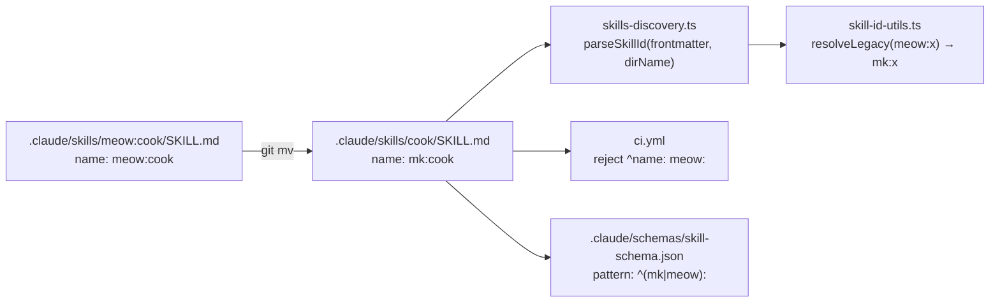

# v2.7.0 — The Namespace Rename Release

The `meow:` namespace is renamed to `mk:`. Folders move from `.claude/skills/meow:<x>/` to `.claude/skills/<x>/`. Skill identity moves from `meow:<x>` to `mk:<x>`. Slash commands move from `/meow:<x>` to `/mk:<x>`. The `meow:` form keeps working during a one-release deprecation window via a stderr-warning alias resolver — hard-cuts in v2.8.0.

The motivation is cross-platform safety: the colon in `meow:<x>` is reserved on Windows NTFS (alternate data stream marker), making the skills folder un-checkoutable on Windows + WSL host filesystems. Bare-name folders work everywhere.

## Highlights

- **77 skill folders renamed.** `.claude/skills/meow:<x>/` → `.claude/skills/<x>/` for all 77 skills, preserving git history (rename detection, R100). Cross-platform safe; Windows/WSL users no longer hit the reserved-character checkout error.
- **Skill identity is now frontmatter-driven, not folder-name-driven.** The loader (`skills-discovery.ts`) reads `name:` from SKILL.md frontmatter to derive the canonical id. Folder name is reduced to a path token. New helper `skill-id-utils.ts` validates ids, normalizes legacy prefixes, and emits a one-time stderr deprecation warning per `meow:<x>` reference encountered.
- **Slash commands moved.** `.claude/commands/meow/*.md` → `.claude/commands/mk/*.md`. Type `/mk:cook` instead of `/meow:cook`. The 21 existing slash commands all work; the 56 phantom skill-only aliases were deliberately not generated.
- **CI gate added.** `.github/workflows/ci.yml` rejects any new `^name: meow:` SKILL.md frontmatter and any `/meow:` slash reference in `.claude/commands/`, `.claude/rules/`, `CLAUDE.md`. Schema regex widened to `^(mk|meow):[a-z][a-z0-9-]*$` for the deprecation window — narrows back to `^mk:` in v2.8.0.
- **One million+ legacy reference points cleaned.** `~1,690` lines in `.claude/`, `~2,600` in `website/`/`docs/`, two manifest files, agent files, rule files, hook scripts, schema, tests — all swept in lockstep with the folder rename. CI cross-ref script (`check-skill-cross-refs.sh`) and frontmatter validator (`validate-skill-frontmatter.py`) rewritten to scan bare-name folders and now fail-closed on zero matches (no more phantom-pass).

## Breaking Changes

| Surface             | Before                          | After                                                                     |
| ------------------- | ------------------------------- | ------------------------------------------------------------------------- |
| Skill folder        | `.claude/skills/meow:cook/`     | `.claude/skills/cook/`                                                    |
| SKILL.md `name:`    | `name: meow:cook`               | `name: mk:cook`                                                           |
| Slash command path  | `.claude/commands/meow/cook.md` | `.claude/commands/mk/cook.md`                                             |
| User invocation     | `/meow:cook`                    | `/mk:cook`                                                                |
| In-prompt skill ref | `meow:scout`                    | `mk:scout`                                                                |
| Schema regex        | `^meow:[a-z][a-z0-9-]*$`        | `^(mk\|meow):[a-z][a-z0-9-]*$` (v2.7.x); `^mk:[a-z][a-z0-9-]*$` (v2.8.0+) |

Backward-compat (v2.7.x only — removed in v2.8.0):

- `meow:<x>` text references in agent prompts → `resolveLegacy()` returns `mk:<x>` and emits one-time stderr warning per id.
- SKILL.md frontmatter accepts both `meow:` and `mk:` (CI lint rejects new `meow:` additions).
- `/meow:<x>` slash commands **NO LONGER WORK** in v2.7.0 — slash command folder was renamed, not aliased. Retype as `/mk:<x>`.

## What the rename touches



## New Files

| File                                                           | Purpose                                                                                                                                                                                                                              |
| -------------------------------------------------------------- | ------------------------------------------------------------------------------------------------------------------------------------------------------------------------------------------------------------------------------------ |
| `packages/mewkit/src/migrate/discovery/skill-id-utils.ts`      | Single helper for skill-id parsing, validation, legacy-alias resolution. Exports `parseSkillId`, `resolveLegacy`, `_resetWarnState`, regex constants. Path-traversal guard: rejects basenames not matching `^[a-z][a-z0-9-]{0,62}$`. |
| `packages/mewkit/src/migrate/__tests__/skill-id-utils.test.ts` | 13 unit tests covering valid prefixes, fallback synthesis, malformed frontmatter, path traversal, dedup behavior, JSON-stdout cleanliness.                                                                                           |
| `website/guide/whats-new/v2.7.0.md`                            | This page.                                                                                                                                                                                                                           |

## Loader changes

- `SkillInfo.id` is now a required field, derived from frontmatter `name:` field, normalized through `resolveLegacy`. Previously the canonical key was the sanitized folder name (`sanitizeSkillName(":") → "-"`); that produced `meow-cook` as the working id. Post-rename the working id is `mk:cook`.
- `setup.ts:54` `collectSkillDeclaredDeps()` filter changed from `d.name.startsWith("meow:")` (name-based) to `existsSync(skillDir/SKILL.md)` (content-based). Any folder containing a SKILL.md is a skill, regardless of prefix.
- `discoverSkills()` itself was already content-based (no prefix filter); only the setup-wizard helper needed the change.

## CI improvements

| Check                             | What it does                                                                                                                                                                                                               |
| --------------------------------- | -------------------------------------------------------------------------------------------------------------------------------------------------------------------------------------------------------------------------- |
| `Reject residual meow: namespace` | New step in `.github/workflows/ci.yml`. Greps `.claude/skills/*/SKILL.md` for `^name: meow:` and `.claude/commands/`, `.claude/rules/`, `CLAUDE.md` for `/meow:[a-z]`. Fails the build if either is non-empty.             |
| `Validate skill frontmatter`      | `validate-skill-frontmatter.py` glob fixed from `meow:*/SKILL.md` to `*/SKILL.md`. Adds zero-match guard: returns exit 2 if scan finds zero SKILL.md files (prevents phantom-pass when the glob silently matches nothing). |
| `Validate skill cross-refs`       | `check-skill-cross-refs.sh` rewritten — inventory built from bare-name folders, scans for `mk:[a-z][a-z0-9-]*` references, fails on empty inventory.                                                                       |

## Migration Notes

For users with an existing MeowKit install:

```bash
npx mewkit upgrade
```

The upgrade pipeline detects `.claude/skills/meow:*/` folders, prompts for confirmation, then renames them and rewrites SKILL.md frontmatter to `mk:`. The migrator:

- Aborts on a dirty git tree (asks the user to commit/stash first).
- Validates each folder basename against `^[a-z][a-z0-9-]{0,62}$` — refuses path-traversal names.
- Reconciles `~/.mewkit/portable-registry.json` keys (strips `meow-` prefix from `item` field).
- Logs a summary of renamed folders, rewritten frontmatter, and updated registry entries.

If you have custom scripts or aliases that invoke `/meow:cook`, retype them as `/mk:cook`. The slash-command folder was renamed (not aliased) in v2.7.0; in-prompt text references like `meow:scout` continue to work via the resolver during the v2.7.x deprecation window.

## Files changed

| Surface                   | Files | Notes                                                                                                                                                  |
| ------------------------- | ----- | ------------------------------------------------------------------------------------------------------------------------------------------------------ |
| Skill folders             | 77    | `git mv` rename preserves history (R100 in `git log`)                                                                                                  |
| SKILL.md frontmatter      | 77    | `name:` field rewritten to `mk:<x>`                                                                                                                    |
| Skill bodies (cross-refs) | many  | All `meow:<x>` mentions inside `.claude/skills/*/` rewritten to `mk:<x>`                                                                               |
| Agent files               | 14    | `/meow:` invocations and `.claude/skills/meow:*/scripts/...` paths updated                                                                             |
| Rule files                | 18    | All cross-references to skills updated                                                                                                                 |
| Hooks                     | 6     | `gate-enforcement.sh`, `privacy-block.sh`, `post-session.sh`, `project-context-loader.sh`, `pre-completion-check.sh`, `memory-topic-file-migrator.cjs` |
| Schema                    | 1     | Regex widened to accept both prefixes during transition                                                                                                |
| CI workflows              | 1     | New lint step + fixed validator glob + rewritten cross-ref script                                                                                      |
| Slash commands            | 21    | Folder `commands/meow/` → `commands/mk/`                                                                                                               |
| VitePress site            | ~130  | Sidebar labels + reference pages + guide pages                                                                                                         |
| `docs/`                   | ~11   | Architecture, rules, project-context all updated                                                                                                       |
| Memory                    | 6     | `consumer:` keys in JSON; preamble lines in `.md`                                                                                                      |
| Manifests                 | 2     | `.meowkit.manifest.json` and `release-manifest.json` regenerated                                                                                       |
| Tests                     | 1     | New `skill-id-utils.test.ts` (13 cases); existing tests preserve `meow:` literals to verify alias path                                                 |

## Compatibility timeline

| Version               | Status                                                                                                                                                      |
| --------------------- | ----------------------------------------------------------------------------------------------------------------------------------------------------------- |
| v2.7.0 (this release) | `mk:` canonical. `meow:` text refs accepted via `resolveLegacy()` with stderr warning. SKILL.md schema accepts both. CI lint rejects new `meow:` additions. |
