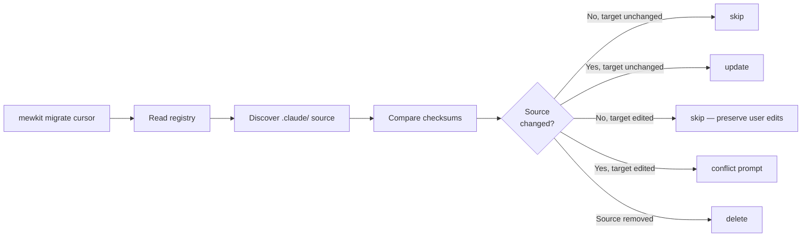

# Migration Guide

The `mewkit migrate` command exports your `.claude/` kit to 15 external coding-agent tools. This page covers when to use it, what each tool accepts, and how to recover when conflicts surface.

## When to migrate

| Scenario | Command |
|----------|---------|
| Just ran `mewkit init`, want Cursor to see the kit too | `mewkit migrate cursor` |
| Set up a fresh project for both Cursor and Codex in one shot | `mewkit init --migrate-to cursor,codex` |
| Have multiple coding agents installed and want them all in sync | `mewkit migrate --all` |
| Just ran `mewkit upgrade`, need to propagate changes to external tools | `mewkit migrate TOOL` (re-runs are idempotent) |
| Want to check what would happen before writing | `mewkit migrate TOOL --dry-run` |

## Capability matrix

What each tool can receive from your `.claude/` kit:

| Tool | Agents | Commands | Skills | Config | Rules | Hooks |
|------|:------:|:--------:|:------:|:------:|:-----:|:-----:|
| Claude Code (source) | ✓ | ✓ | ✓ | ✓ | ✓ | ✓ |
| Cursor | ✓ | — | ✓ | ✓ | ✓ | — |
| Codex | ✓ | ✓ | ✓ | ✓ | ✓ | ✓ |
| Droid | ✓ | ✓ | ✓ | ✓ | ✓ | ✓ |
| OpenCode | ✓ | ✓ | ✓ | ✓ | ✓ | — |
| Goose | ✓ | — | ✓ | ✓ | ✓ | — |
| Gemini CLI | ✓ | ✓ | ✓ | ✓ | ✓ | ✓ |
| Antigravity | — | ✓ | ✓ | ✓ | ✓ | — |
| GitHub Copilot | ✓ | — | ✓ | ✓ | ✓ | — |
| Amp | ✓ | — | ✓ | ✓ | ✓ | — |
| Kilo Code [unverified] | ✓ | — | ✓ | ✓ | ✓ | — |
| Kiro IDE | ✓ | — | ✓ | ✓ | ✓ | — |
| Roo Code | ✓ | — | ✓ | ✓ | ✓ | — |
| Windsurf | ✓ | ✓ | ✓ | ✓ | ✓ | — |
| Cline | ✓ | — | ✓ | ✓ | ✓ | — |
| OpenHands | ✓ | — | ✓ | ✓ | ✓ | — |

✓ supported · — not supported by tool

**Special cases:**
- **Antigravity** treats agents as a special case of skills. Your Claude Code agents migrate into Antigravity's skills directory.
- **Hooks** only migrate to four tools (Claude Code, Codex, Droid, Gemini CLI). For other tools, mewkit skips hooks with a warning.
- **Shell hooks** (`.sh`, `.ps1`, `.bat`) never migrate — only node-runnable hooks (`.cjs`, `.mjs`, `.js`) cross over.
- **Kilo Code** entries are ported from upstream but unverified by mewkit. A runtime warning appears when you select it.

## Quick start

### One-shot scaffold + export

```bash
# Fresh project, scaffold and export to Cursor in one command
npx mewkit init --migrate-to cursor

# Multiple tools at once
npx mewkit init --migrate-to cursor,codex,droid

# All 15 tools (CI-friendly)
npx mewkit init --migrate-to all
```

### Standalone after init

```bash
# Already have a .claude/ — export to one tool
npx mewkit migrate cursor

# Export to all installed tools (auto-detected)
npx mewkit migrate --yes

# Interactive picker
npx mewkit migrate
```

## Idempotent re-runs

mewkit tracks every install in `~/.mewkit/portable-registry.json` with SHA-256 checksums for both source and target. Re-running migrate reconciles changes per file using an 8-case decision matrix:



**Practical impact:** running `mewkit upgrade` followed by `mewkit migrate cursor` automatically propagates new agents/skills to Cursor without overwriting your local edits.

## Resolving conflicts

When source AND target both changed since last install, mewkit prompts:

```
[!] Conflict: cursor/agent/scout
  mewkit updated source since last install
  Target file was also modified (user edits detected)

? How to resolve?
  > Overwrite with mewkit version (lose your edits)
    Keep your version (skip mewkit update)
    Show diff
```

Options:

| Choice | Behavior |
|--------|----------|
| **Overwrite** | Take mewkit's version. Your edits are lost. |
| **Keep** | Take your version. mewkit's update is deferred until next conflict. |
| **Show diff** | Display unified diff (then re-prompt). Limit: 5 views per item. |
| **Smart merge** | (merge-target files only) Update mewkit's sections, keep your additions outside the sentinels. |

**Bypass the prompt:**
- `--force` — overwrite all conflicts without asking
- `--yes` — non-interactive default is "keep your version"

## Scope flags

Restrict what gets migrated:

```bash
# Only skills
mewkit migrate cursor --only=skills

# Only skills and rules
mewkit migrate cursor --only=skills,rules

# Everything except hooks
mewkit migrate gemini-cli --skip-hooks

# Everything except config and rules
mewkit migrate codex --skip-config --skip-rules
```

## Project vs. global scope

By default, mewkit writes to **project-local** paths (`./.cursor/rules/`, `./.codex/agents/`, etc.). Pass `--global` to write to your home directory (`~/.cursor/rules/`, `~/.codex/agents/`).

```bash
# Project scope (default)
mewkit migrate cursor

# Global scope
mewkit migrate cursor --global

# Init + migrate to global
mewkit init --migrate-to cursor --migrate-global
```

**Rule of thumb:** project scope keeps the kit confined to one repo. Global scope is for users who want every project on their machine to share the same Cursor/Codex config.

## Path collisions

Some tools share install paths. mewkit detects this and emits a banner during the preflight:

```
[i] Shared target: .agents/skills/ (skills) used by codex + amp + windsurf — each provider writes the same content here
```

Currently shared paths:
- `.agents/skills/` — used by Codex, Cursor, Windsurf, Gemini CLI, Amp (5 tools)
- `~/.agents/skills/` — globally shared between several of the above

When you select multiple sharing providers, mewkit issues distinct install actions per provider, but each writes byte-identical content (same `direct-copy` format) so the final on-disk state is consistent.

## Uninstalling / starting over

The registry tracks every installation. To clean a partial state:

```bash
# Remove the registry — next migrate becomes a fresh install
rm ~/.mewkit/portable-registry.json

# Per-tool: delete the tool's directory then re-run
rm -rf .cursor
mewkit migrate cursor
```

## Concurrency

A PID-based file lock at `SCOPE/.mewkit/.lock` (`./.mewkit/.lock` for project, `~/.mewkit/.lock` for global) prevents two `mewkit migrate` runs from racing. Stale locks with dead PIDs auto-clear after 60 seconds.

If you see `Another mewkit migrate is in progress (PID X)`, check whether that PID is actually alive:

```bash
ps -p <PID>      # Unix
tasklist | grep <PID>   # Windows
```

If dead, delete the lock manually: `rm .mewkit/.lock`.

## Troubleshooting

### "Provider detection failed" in `--yes` mode

A `which` probe threw an unexpected error. mewkit refuses to default to "all 15 targets" silently. Pass `--all` or specify a tool explicitly:

```bash
mewkit migrate cursor --yes      # explicit single tool
mewkit migrate --all --yes       # explicit all 15
```

### Codex hooks require recent Codex version

Codex hooks require Codex >= 0.124.0-alpha.3 (the version mewkit's capability table targets). Older Codex versions silently drop hook events. Upgrade Codex or set `MEWKIT_CODEX_COMPAT=optimistic` to assume newest capabilities.

### "Kilo Code support is UNVERIFIED"

This warning is informational only — Kilo Code's registry entry is ported from upstream but no mewkit maintainer has tested it on a live install. If migration fails, please [open an issue](https://github.com/ngocsangyem/MeowKit/issues) with the error.

## Upgrading mewkit itself

Independent of `mewkit migrate`, the CLI tool itself updates via:

```bash
npx mewkit upgrade           # latest stable
npx mewkit upgrade --beta    # latest beta
npx mewkit upgrade --check   # show available without installing
```

After upgrading mewkit, your `.claude/` kit content does NOT change. Run `mewkit init` (in a fresh dir) or `mewkit upgrade` (to refresh the kit) — both flows can chain `--migrate-to TOOL` to update external tools.

## See also

- [CLI Commands Reference](/cli/commands#migrate) — every flag with examples
- [TDD Optional Migration](/migration/tdd-optional) — older migration guide for the v2.x TDD-optional change
