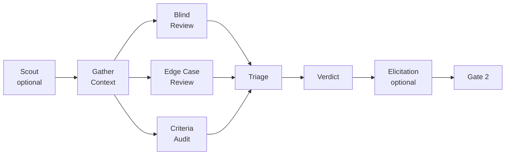

# reviewer

5-dimension structural code review agent that enforces Gate 2 with written verdicts.

## Overview

The reviewer performs deep structural reviews across five dimensions: architecture fit, type safety, test coverage, security, and performance. It produces a written verdict file at `tasks/reviews/YYMMDD-name-verdict.md` with PASS, FAIL, or PASS WITH NOTES. A FAIL verdict blocks shipping (Gate 2). Every finding must be actionable — no vague feedback.

The reviewer can also invoke the `mk:review` skill for extended capabilities: scope drift detection, adversarial red-teaming, and auto-fix.

## Quick Reference

### Quality & Review

| Dimension | What it checks |
|-----------|---------------|
| **Architecture fit** | Matches existing patterns? Respects ADRs? Accidental complexity? |
| **Type safety** | No `any` types? No unsafe casts? Generics used appropriately? |
| **Test coverage** | Adequate tests? Edge cases? Testing behavior not implementation? |
| **Security** | Runs `.claude/rules/security-rules.md` checklist. Delegates to security agent if deep audit needed. |
| **Performance** | No N+1 queries? No blocking in async? No unnecessary re-renders? No unbounded fetches? |

### Verdicts

| Verdict | Meaning | What happens next |
|---------|---------|------------------|
| **PASS** | No blocking issues | → Shipper (Phase 5) |
| **PASS WITH NOTES** | Non-blocking suggestions | → Shipper (suggestions noted for future) |
| **FAIL** | Critical findings | → Back to developer (must fix before re-review) |

## Skill Loading

The reviewer loads these skills depending on the review scope:

| Skill | Purpose | When loaded |
|-------|---------|------------|
| `mk:review` | Multi-pass adversarial review with parallel reviewers | Phase 4, explicit invocation |
| `mk:elicit` | Structured second-pass reasoning (8 methods) — post-verdict deeper analysis | Optional, after verdict |
| `mk:scout` | Pre-review edge case detection and context gathering | Optional, before review |
| `mk:cso` | Scope drift detection against original plan | During review |
| `mk:vulnerability-scanner` | Deep security audit beyond the 5-dimension checklist | When security dimension flags concern |

### Review Pipeline

The full reviewer pipeline with all optional steps:



**Scout (optional):** Runs before context gathering to detect edge cases and unusual patterns the main reviewers might miss. Feeds findings into the review context.

**Parallel Review:** Three reviewers run simultaneously — Blind Hunter (zero context), Edge Case Hunter (boundary conditions), Criteria Auditor (acceptance criteria). Each is independent to prevent anchoring bias.

**Elicitation (optional):** Post-verdict step using `mk:elicit` to push deeper on any dimension that produced a WARN or borderline PASS. Invoked when the verdict warrants a second-pass challenge.

## How to Use

The reviewer runs automatically in Phase 4. You can also invoke `mk:review` directly for the extended multi-pass review with adversarial analysis.

```bash
# Automatic (Phase 4 of pipeline)
# Triggered after developer + tester green phase

# Explicit review with extended capabilities
/mk:review              # branch diff
/mk:review #42          # specific PR
/mk:review --pending    # uncommitted changes
```

## Under the Hood

### Handoff Example

```
Reviewer verdict file: tasks/reviews/260327-auth-verdict.md

Verdict: PASS WITH NOTES
Architecture Fit: PASS — follows existing middleware pattern
Type Safety: PASS — no any types, proper generics
Test Coverage: PASS — 87% coverage, edge cases for auth
Security: PASS — no hardcoded secrets, proper input validation
Performance: PASS WITH NOTE — consider caching token validation

Suggestions:
1. Cache JWT validation result for 5min to reduce repeated crypto ops

→ Handoff to: shipper (PASS WITH NOTES allows shipping)
```

### Troubleshooting

| Issue | Cause | Fix |
|-------|-------|-----|
| Review stuck on one dimension | Missing context (e.g., no ADRs for architecture check) | Reviewer issues FAIL for unevaluated dimension — provide missing context |
| FAIL verdict on implementation that matches plan | Plan may have architectural issues | Check if plan itself needs revision via planner |
| Security dimension triggers concern | Sensitive code detected | Reviewer delegates to security agent for deep audit |
| Can't proceed to ship | Gate 2 — FAIL verdict active | Fix the critical findings, then re-review |
