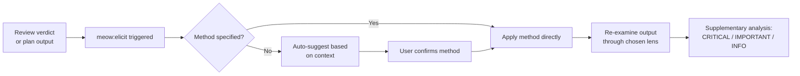

# meow:elicit

Structured second-pass reasoning that re-examines an existing output — review verdict, plan, or analysis — through a specific named reasoning lens. Surfaces insights that generic "make it better" requests miss.

## What This Skill Does

`meow:elicit` offers 8 named reasoning methods to apply after any analysis output. It loads the target output (verdict file, plan, or in-session context), presents the method menu, applies the chosen lens, and produces a structured findings report. The result appends to the original output as a supplementary section — it deepens analysis without changing verdicts or gate decisions.

- **8 named methods** — pre-mortem, inversion, red team, Socratic, first principles, constraint removal, stakeholder mapping, analogical
- **Auto-suggestion** — recommends a method based on context when none is specified
- **Structured output** — findings ranked by severity: CRITICAL / IMPORTANT / INFORMATIONAL
- **Non-destructive** — never changes verdicts, never generates code, always user-triggered
- **Review integration** — optionally offered by `meow:review` after step-04 verdict

## Reasoning Methods

| Method | Lens | Best For |
|--------|------|----------|
| **Pre-mortem** | "Assume this shipped and failed. Why?" | Risk discovery, failure mode analysis |
| **Inversion** | "What would make this maximally wrong?" | Assumption testing, edge cases |
| **Red Team** | "You are an attacker. How do you exploit this?" | Security analysis, adversarial thinking |
| **Socratic** | "What evidence supports each claim?" | Logic validation, gap detection |
| **First Principles** | "Strip assumptions. What's fundamentally true?" | Architecture decisions, design simplification |
| **Constraint Removal** | "What if [constraint X] didn't exist?" | Innovation, scope exploration |
| **Stakeholder Mapping** | "Who else is affected? What do they need?" | Impact analysis, requirements gaps |
| **Analogical** | "What similar system solved this differently?" | Alternative approaches, pattern matching |

## When to Use This

::: tip Use meow:elicit when...
- You have a review verdict and want deeper analysis before Gate 2
- A plan has assumptions you want stress-tested before Gate 1
- You ask "what am I missing?" or "challenge this"
- You want a specific angle of analysis, not a generic second opinion
:::

## Usage

```bash
# Run after /meow:review — pick a method interactively
/meow:elicit

# Specify a method directly
/meow:elicit red-team
/meow:elicit pre-mortem
/meow:elicit first-principles

# Target a specific plan file
/meow:elicit tasks/plans/240315-auth-refactor.md
```

## Auto-Suggestion Logic

When invoked without a method, `meow:elicit` suggests based on context:

| Context | Suggested Method |
|---------|----------------|
| Review found security issues | Red Team |
| Review found low test coverage | Pre-mortem |
| Plan has many assumptions | First Principles |
| Architecture decision | Inversion |
| Complex feature with many stakeholders | Stakeholder Mapping |
| Default / unclear | Socratic |

## How It Works



Output format:

```markdown
## Elicitation: [Method Name]

**Target:** [what was re-examined]
**Method:** [brief description of the lens applied]

### Findings

1. **[CRITICAL]** [finding] — [recommendation]
2. **[IMPORTANT]** [finding] — [recommendation]
3. **[INFORMATIONAL]** [finding] — [observation]

### Summary

[1-2 sentence synthesis of what this method revealed]

### Action Required

- [ ] [specific action items, if any]
```

::: info Skill Details
**Phase:** 4 (after verdict) or 1 (after plan creation)
**Used by:** reviewer agent, planner agent
**Plan-First Gate:** Always skips — operates on existing outputs, not new plans.
:::

## See Also

- [`meow:review`](/reference/skills/review) — multi-pass code review that produces the verdict this skill re-examines
- [`meow:validate-plan`](/reference/skills/validate-plan) — systematic 8-dimension plan quality check
- [`meow:plan-eng-review`](/reference/skills/plan-eng-review) — engineering plan review, another source of outputs to elicit from
