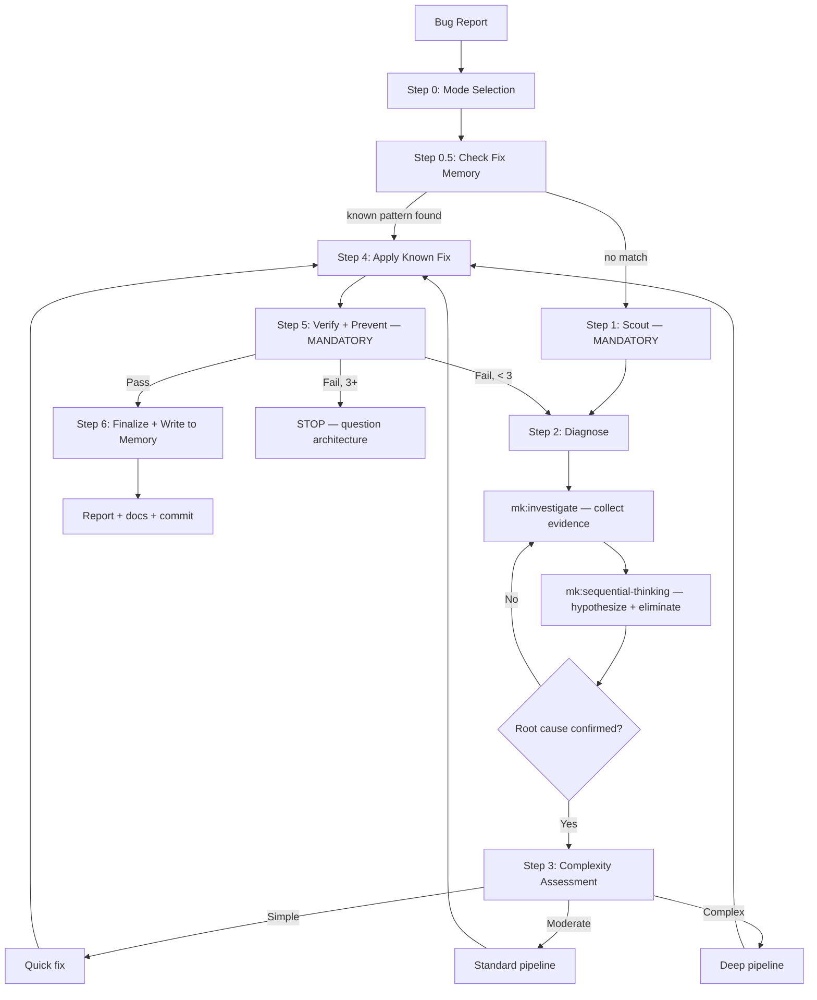

# mk:fix

Structured bug investigation and fix with auto-complexity detection, parallel exploration, and multiple workflow modes.

## What This Skill Does

`mk:fix` is MeowKit's debugging pipeline. Instead of immediately editing code when you report a bug, it forces a structured investigation: assess complexity, choose the right workflow, find the root cause, write a regression test, then apply the minimal fix. The skill adapts its approach based on how complex the bug is — a typo gets a quick fix, while a cross-module race condition gets the full investigation treatment.

## Core Capabilities

- **Auto-complexity assessment** — Classifies bugs as Quick (typo, config), Standard (logic, one module), or Deep (cross-cutting, architectural)
- **Four fix modes** — Autonomous (default), human-in-the-loop review, quick (for trivial issues), parallel (for multi-file problems)
- **Root cause methodology** — Uses `mk:investigate` for systematic 5-phase debugging
- **Parallel exploration** — Spawns multiple Explore subagents to verify hypotheses simultaneously
- **Regression test guarantee** — Every fix includes a test that fails without the fix and passes with it
- **Scope locking** — Uses `mk:freeze` to restrict edits to affected modules, preventing scope creep

## When to Use This

::: tip Use mk:fix when...
- You've found a bug and need it investigated properly
- Tests are failing and you need to understand why
- A CI/CD pipeline is broken
- You're seeing unexpected behavior in production
- Type errors, lint failures, or UI glitches need fixing
:::

::: warning Don't use mk:fix when...
- You're building a new feature → use [`mk:cook`](/reference/skills/cook)
- The issue is a design/architecture concern → use architect agent
:::

## Usage

```bash
# Default — autonomous mode, auto-detects complexity
/mk:fix login fails after 24 hours

# Review mode — pauses for approval at each step
/mk:fix payment processing timeout --review

# Quick mode — for trivial issues (typos, lint, config)
/mk:fix TypeScript error in auth.ts --quick

# Parallel mode — spawns agents per issue for multi-file problems
/mk:fix all failing tests in checkout module --parallel
```

## Example Prompts

| Prompt | Complexity | Mode |
|--------|-----------|------|
| `/mk:fix typo in README.md` | Quick | Quick — direct fix, no investigation |
| `/mk:fix session token not refreshed` | Standard | Autonomous — investigate → fix → test |
| `/mk:fix intermittent race condition in payment queue` | Deep | Full investigation with parallel exploration |
| `/mk:fix CI failing on main branch` | Standard | Autonomous — check CI logs, reproduce, fix |

## Fix Pipeline (7 steps)



| Step | What happens | Skills used |
|------|-------------|-------------|
| 0 | Mode selection | AskUserQuestion (Autonomous/HITL/Quick) |
| 0.5 | **Check fix memory** | Read `.claude/memory/fixes.md` + `fixes.json` for known fix patterns |
| 1 | **Scout (mandatory)** | mk:scout — map files, deps, tests |
| 2 | **Diagnose** | mk:investigate + mk:sequential-thinking |
| 3 | Complexity assessment | Route to Quick/Standard/Deep |
| 4 | Fix implementation | Address ROOT CAUSE, not symptoms |
| 5 | **Verify + prevent (mandatory)** | Regression test + defense-in-depth |
| 6 | **Finalize + learn** | Report, write fix pattern to `fixes.json`, docs, commit |

### Self-Improving Fix Loop

After every fix, Step 6 writes the fix pattern to `.claude/memory/fixes.json`. Next time a similar bug appears, Step 0.5 finds the pattern and fast-tracks diagnosis — turning repeated bugs into instant fixes.

```
Fix bug #1 → write pattern to fixes.json (frequency: 1)
Fix bug #2 (same class) → read fixes.json → skip full diagnosis → apply known fix
After 3+ fixes → pattern promoted to CLAUDE.md rule (via mk:memory)
```

::: info Skill Details
**Phase:** 1–5  
**Plan-First Gate:** Plans if fix affects > 2 files. Skips with `--quick` mode.
:::

## Gotchas

- **Fixing symptoms not root cause**: Quick patch makes the test pass but underlying issue remains → Always investigate before implementing; use mk:investigate first
- **Regression in adjacent code**: Fix in one module breaks an unstated dependency → Run full test suite, not just tests for the changed file
- **Test mocking hiding real failures**: Mocked tests pass but real integration fails → Prefer integration tests for bug fixes; mock only external services

## Related

- [`mk:investigate`](/reference/skills/investigate) — The debugging methodology used inside fix
- [`mk:cook`](/reference/skills/cook) — Full pipeline for new features
- [`mk:scout`](/reference/skills/scout) — Helps find relevant files during investigation
