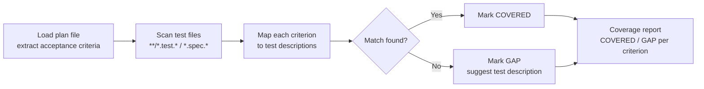

# meow:nyquist

Test-to-requirement coverage mapping that reads plan acceptance criteria and scans test files to identify which requirements have no corresponding test. Named after the Nyquist sampling theorem — sufficient test coverage prevents aliased (missed) requirements.

## What This Skill Does

`meow:nyquist` extracts acceptance criteria from a plan file, globs all test files in the project, maps each criterion to matching test descriptions via keyword and semantic matching, and produces a structured gap report. It is read-only — it never writes tests or modifies plan files.

- **Acceptance criteria extraction** — reads `tasks/plans/YYMMDD-name.md`, pulls all binary criteria
- **Test file scanning** — globs `**/*.test.*`, `**/*.spec.*`, `**/test_*.*`
- **Keyword + fuzzy matching** — matches criteria nouns/verbs to `describe`/`it`/`test` strings, with semantic equivalents (e.g. "login" ≈ "authenticate")
- **Gap report** — per-criterion COVERED / GAP status with suggested test descriptions for gaps
- **Manual override prompt** — when no match is found, asks user to confirm the gap is real (not a naming mismatch)

## When to Use This

::: tip Use meow:nyquist when...
- Phase 2 is complete and you want to verify all acceptance criteria have tests
- Phase 4 review is checking test coverage against the plan
- Before Gate 2, to confirm implementation matches plan requirements
- You want to ask "are all requirements actually tested?"
:::

## Usage

```bash
# Map criteria from active plan to test files
/meow:nyquist

# Target a specific plan file
/meow:nyquist tasks/plans/240315-auth-refactor.md
```

## How It Works



Output format:

```markdown
## Nyquist Coverage Report: [Plan Name]

### Requirement-to-Test Mapping

| # | Acceptance Criterion | Test File | Test Name | Status |
|---|---------------------|-----------|-----------|--------|
| 1 | [criterion text] | src/auth.test.ts | "should authenticate user" | COVERED |
| 2 | [criterion text] | — | — | GAP |
| 3 | [criterion text] | src/api.test.ts | "returns 404 for missing" | COVERED |

### Coverage Summary

- **Total criteria:** N
- **Covered:** N (N%)
- **Gaps:** N

### Gap Details

1. **[criterion text]** — No test found. Suggested test: [brief description]

### Recommendation

[PASS — all criteria covered | WARN — N gaps found, suggest adding tests]
```

## Matching Strategy

| Strategy | How it works |
|----------|-------------|
| **Keyword matching** | Extracts key nouns/verbs from criterion, searches `describe`/`it`/`test` strings |
| **File path matching** | If criterion mentions "auth", searches in `**/auth*test*` |
| **Fuzzy matching** | Checks semantic equivalents when exact match fails (login ≈ authenticate) |
| **Manual override** | No match found → asks user to confirm gap is real, not a naming mismatch |

::: info Skill Details
**Phase:** 2 (after tester writes tests) or 4 (during review)
**Used by:** tester agent, reviewer agent
**Plan-First Gate:** Always skips — reads the plan as input data, not for workflow gating.
:::

## See Also

- [`meow:validate-plan`](/reference/skills/validate-plan) — validates acceptance criteria are binary before tests are written
- [`meow:review`](/reference/skills/review) — uses nyquist output in the test coverage audit dimension
- [`meow:elicit`](/reference/skills/elicit) — deeper analysis of coverage gaps via pre-mortem or Socratic methods
