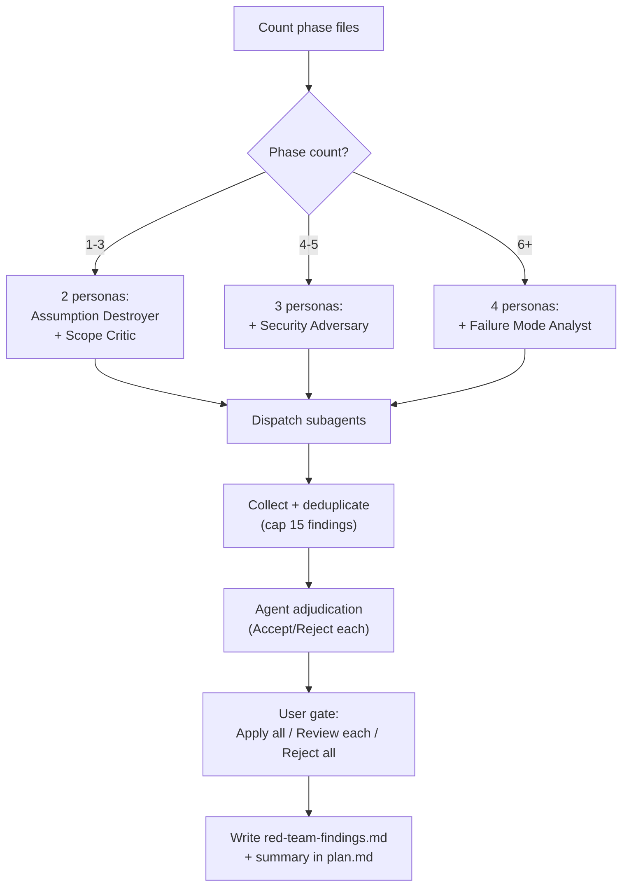

# meow:plan-creator
Creates structured multi-file plans before implementation. Scope-aware: trivial tasks exit early, simple tasks get fast plans, complex tasks get full research + phase files + validation. Enforces Gate 1.

## What This Skill Does
When `/meow:plan` or `/meow:cook` is invoked, this skill determines the workflow model (feature, bugfix, refactor, security), sizes scope, drafts the plan with phase files, validates it through red-team review and critical questions, and presents it for Gate 1 approval. Also handles ADRs, plan archival, and standalone red-team/validate operations on existing plans.

## Core Capabilities
- **Institutional memory retrieval** — Reads `review-patterns.md`/`review-patterns.json` and `architecture-decisions.md`/`architecture-decisions.json` at task start to prevent re-solving known problems
- **Step-file architecture** — 9 JIT-loaded steps (00-08) keep context lean; each step loads only when needed
- **Workflow model selection** — Routes to feature, bugfix, refactor, or security model
- **Scope challenge** — Trivial → exit, simple → fast, complex → hard; user scope input (EXPANSION/HOLD/REDUCTION)
- **4-persona red team** — Security Adversary, Failure Mode Analyst, Assumption Destroyer, Scope Complexity Critic; scales by phase count (1-3=2, 4-5=3, 6+=4)
- **Red-team findings file** — Separate `red-team-findings.md` with full detail (7-field findings), linked from plan.md summary table
- **Validation question framework** — Detection keywords trigger category-specific questions (Architecture, Assumptions, Scope, Risk, Tradeoffs); 2-4 options with section mapping for answer propagation
- **Gate 1 enforcement** — Plans must be approved via `AskUserQuestion` before implementation
- **Memory capture at Gate 1** — Planning decisions and red-team results persisted to `architecture-decisions.json` after approval
- **Solution design checklist** — 5-dimension trade-off analysis (YAGNI/KISS/DRY, security, performance, edge cases, architecture)
- **Context Reminder** — After Gate 1, prints mode-matched cook command with absolute path
- **ADR generation** — Creates Architecture Decision Records in `docs/architecture/`
- **Validation scripts** — `validate-plan.py` for plan completeness, `check-product-spec.sh` for product-level specs
- **Cold-start context briefs** — Each phase file is self-contained for fresh agent execution
- **Plan mutation protocol** — Formal rules for split/insert/skip/reorder/abandon
- **Cross-plan dependency** — Bidirectional `blockedBy`/`blocks` detection across plans

## Flag Modes

| Flag | Behavior |
|------|----------|
| *(none)* | Auto-detect from scope — trivial exits, simple → fast, complex → hard |
| `--fast` | Skip research + codebase analysis, plan.md only, semantic checks only |
| `--hard` | Full pipeline: research → analysis → plan + phases → red team → validation |
| `--deep` | Hard + per-phase scouting after drafting: file inventory + dependency maps per phase |
| `--parallel` | Hard + file ownership matrix + parallel group hydration |
| `--two` | 2 competing approaches + trade-off matrix; user selects before red-team |
| `--product-level` | Product-level spec (user stories, features, design language); hands off to harness |
| `--tdd` | **Composable** — combine with any mode. Injects 4 TDD sections per phase file: Tests Before, Refactor Opportunities, Tests After, Regression Gate |

## Subcommands

| Subcommand | Usage | What It Does |
|------------|-------|-------------|
| `archive` | `/meow:plan archive` | Scan completed/cancelled plans, optionally capture learnings, archive or delete |
| `red-team` | `/meow:plan red-team {path}` | Run adversarial 4-persona review on an existing plan; writes `red-team-findings.md` |
| `validate` | `/meow:plan validate {path}` | Run critical question interview on an existing plan; propagates answers to phase files |

Subcommands skip the planning pipeline — they operate directly on existing plan files.

## Gate 1 — AskUserQuestion

After drafting, the skill presents the plan via `AskUserQuestion` with three options:

- **Approve** — proceed, skill captures planning decisions to `architecture-decisions.json`, prints context reminder + stops
- **Modify** — user provides feedback, plan is revised and Gate 1 re-runs
- **Reject** — planning stops, restart from scope challenge

## Output — Print & Stop

After Gate 1 approval, the skill ends with a **Print & Stop**:
- Captures planning decisions to `.claude/memory/architecture-decisions.json`
- Prints a context reminder block with the mode-matched `/meow:cook [plan path]` command
- Stops — Claude will not proceed automatically
- You run the printed command when ready, or run a review skill first

## Red Team System

The red-team (step-05) uses 4 adversarial personas that scale by phase count:



Findings are written to a **separate `red-team-findings.md`** file with full 7-field detail (severity, location, flaw, failure scenario, evidence, suggested fix, category). Plan.md gets a summary table with a link to the full report.

## Usage
```bash
/meow:plan add pagination              # → auto-detects fast mode
/meow:plan build auth system --hard    # → full pipeline
/meow:plan redesign API --deep         # → hard + per-phase scouting
/meow:plan build auth --hard --tdd     # → hard + TDD sections in phases
/meow:plan red-team tasks/plans/260411-auth/  # → standalone red-team
/meow:plan validate tasks/plans/260411-auth/  # → standalone validation
/meow:plan archive                     # → archive completed plans
```
::: info Skill Details
**Phase:** 1  
**Used by:** planner agent  
**Plan-First Gate:** Creates plan if missing. Skips with plan path arg or `--fast` mode.
:::

## v2.3.1 Reference Additions

| Reference | Loaded When | Purpose |
|-----------|-------------|---------|
| `prompts/personas/plan-security-adversary.md` | Red team, 4+ phases | Auth bypass, injection, data exposure at plan level |
| `prompts/personas/plan-failure-mode-analyst.md` | Red team, 6+ phases | Race conditions, cascading failures, recovery gaps |
| `references/solution-design-checklist.md` | Step-03, hard/deep mode | 5-dimension trade-off analysis for Architecture/Risk sections |
| `references/archive-workflow.md` | `/meow:plan archive` | Full archive subcommand workflow |
| `references/red-team-standalone.md` | `/meow:plan red-team {path}` | Standalone red-team on existing plans |
| `references/validate-standalone.md` | `/meow:plan validate {path}` | Standalone validation on existing plans |
| `references/validation-questions.md` | Step-06 (enhanced) | Detection keywords, format rules, section mapping |

## Gotchas

- **Wrong model for task type**: feature-model on a bug fix skips investigation → always confirm type first
- **Goal describes activity, not outcome**: "Implement OAuth" vs "Users can log in with OAuth" → rewrite until Goal answers "what does done look like?"
- **Acceptance criteria can't be verified**: "code is clean" blocks Gate 2 → every criterion must reference a specific command or file check
- **Phase files not self-contained**: "See phase-02 for context" = failure. Each phase must state context directly.
- **Skipping scout on unfamiliar codebases**: → always run meow:scout if codebase is new
- **Security-sensitive plans need /meow:cso**: Red-team Security Adversary is plan-level; use /meow:cso for full security audit
- **Over-planning trivial tasks**: 2-file config change gets full research → step-00 scope gate exits early
- **Research disconnected from plan**: Findings archived but not cited → step-03 MUST integrate research into Key Insights

## Related
- [`meow:cook`](/reference/skills/cook) — Uses plan-creator as its first step
- [`meow:plan-ceo-review`](/reference/skills/plan-ceo-review) — Reviews plans created by plan-creator
- [`meow:plan-ceo-review`](/reference/skills/plan-ceo-review) — CEO-level plan review
- [`meow:validate-plan`](/reference/skills/validate-plan) — 8-dimension plan validation
- [`meow:decision-framework`](/reference/skills/decision-framework) — Guides approach selection during planning
- [`meow:verify`](/reference/skills/verify) — Verify step referenced in plan phase templates
