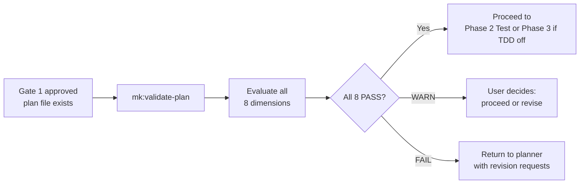

# mk:validate-plan

Validates an approved plan against 8 quality dimensions before implementation begins. Catches gaps that human approval at Gate 1 often misses — non-binary acceptance criteria, undeclared dependencies, missing test strategy, and unestimated effort.

## What This Skill Does

`mk:validate-plan` reads a plan file from `tasks/plans/`, evaluates it against 8 structured dimensions, and produces a pass/fail/warn report per dimension. It does not replace Gate 1 (human approval is still required) — it supplements it with systematic checks that are easy to overlook in a manual review.

- **8 validation dimensions** — scope, acceptance criteria, dependencies, risks, architecture, test strategy, security, effort
- **Structured report** — PASS / FAIL / WARN per dimension with specific findings
- **Routing logic** — all PASS proceeds to Phase 2; any FAIL returns to planner with revision requests
- **Auto-triggered for COMPLEX tasks** — `mk:cook` runs this automatically after Gate 1 for complex tasks
- **Read-only** — never modifies plan files, never blocks Gate 1

## 8 Validation Dimensions

| # | Dimension | Pass Criteria | Common Failure |
|---|-----------|--------------|----------------|
| 1 | **Scope Clarity** | In-scope and out-of-scope are explicit and non-overlapping | Vague scope: "improve the auth system" without boundaries |
| 2 | **Acceptance Criteria** | Every criterion is binary (pass/fail), not subjective | Subjective: "should feel fast" vs binary: "response < 200ms" |
| 3 | **Dependencies Resolved** | All external dependencies identified with status (available/blocked) | Missing: needs DB migration but not listed as dependency |
| 4 | **Risks Identified** | At least 1 risk flag with mitigation strategy | No risks listed (every plan has risks; zero = not evaluated) |
| 5 | **Architecture Documented** | Technical approach references existing patterns or includes ADR | "We'll figure out the architecture during implementation" |
| 6 | **Test Strategy** | Test approach covers acceptance criteria; edge cases identified | "We'll add tests after" (violates TDD) |
| 7 | **Security Considered** | Auth, data access, input validation addressed (or explicitly N/A) | No mention of security for a feature handling user data |
| 8 | **Effort Estimated** | Time/complexity estimate with confidence level | No estimate or "it depends" without qualification |

## When to Use This

::: tip Use mk:validate-plan when...
- Gate 1 is approved and you're about to start Phase 2 (Test)
- `mk:cook` detects a COMPLEX task and suggests validation
- You want to stress-test a plan before committing to implementation
- You're unsure if acceptance criteria are binary enough for TDD
:::

## Usage

```bash
# Validate the active plan (auto-detects from tasks/plans/)
/mk:validate-plan

# Validate a specific plan file
/mk:validate-plan tasks/plans/240315-auth-refactor.md
```

## How It Works



Output format:

```markdown
## Plan Validation: [Plan Name]

| #   | Dimension               | Status         | Finding            |
| --- | ----------------------- | -------------- | ------------------ |
| 1   | Scope Clarity           | PASS/FAIL/WARN | [specific finding] |
| 2   | Acceptance Criteria     | PASS/FAIL/WARN | [specific finding] |
| 3   | Dependencies Resolved   | PASS/FAIL/WARN | [specific finding] |
| 4   | Risks Identified        | PASS/FAIL/WARN | [specific finding] |
| 5   | Architecture Documented | PASS/FAIL/WARN | [specific finding] |
| 6   | Test Strategy           | PASS/FAIL/WARN | [specific finding] |
| 7   | Security Considered     | PASS/FAIL/WARN | [specific finding] |
| 8   | Effort Estimated        | PASS/FAIL/WARN | [specific finding] |

**Result:** [N]/8 passed | [Action: proceed / revise dimensions X,Y]
```

::: info Skill Details
**Phase:** Between Gate 1 and Phase 2
**Used by:** planner agent, cook pipeline
**Plan-First Gate:** Always skips — this skill IS the plan validation step.
**Auto-trigger:** COMPLEX tasks in `mk:cook`; optional for STANDARD; skipped for TRIVIAL.
:::

::: warning Not the same as validate-plan.py
The script at `mk:plan-creator/scripts/validate-plan.py` validates plan file **structure** (required sections exist). This skill validates plan **content quality** (are acceptance criteria binary? are risks identified?). Both can run — they check different things.
:::

## See Also

- [`mk:plan-creator`](/reference/skills/plan-creator) — creates the plan this skill validates
- [`mk:elicit`](/reference/skills/elicit) — deeper reasoning on plan assumptions after validation
- [`mk:nyquist`](/reference/skills/nyquist) — verifies test files cover the acceptance criteria that pass validation here
- [`mk:cook`](/reference/skills/cook) — auto-runs this skill for COMPLEX tasks
