# Spec → PR: Behind the Scenes

> A guided tour through the full developer loop. Each step shows the **prompt you type**, **which skills fire**, **which agent forks**, **what artifact gets written**, and **which gate decides whether you proceed**.

**Best for:** Developers who want to understand *why* the workflow is shaped this way — not just the commands.
**Time estimate:** First read 20 min · Real run 1-4 hours depending on ticket size
**Skills used:** [mk:confluence-spec-analyst](/reference/skills/confluence-spec-analyst), [mk:confluence-collaborate](/reference/skills/confluence-collaborate), [mk:jira-issue](/reference/skills/jira-issue), [mk:jira-agile](/reference/skills/jira-agile), [mk:jira-relationships](/reference/skills/jira-relationships), [mk:jira-evaluator](/reference/skills/jira-evaluator), [mk:jira-estimator](/reference/skills/jira-estimator), [mk:planning-engine](/reference/skills/planning-engine), [mk:agent-detector](/reference/skills/agent-detector), [mk:scale-routing](/reference/skills/scale-routing), [mk:plan-creator](/reference/skills/plan-creator), [mk:cook](/reference/skills/cook), [mk:review](/reference/skills/review), [mk:ship](/reference/skills/ship), [mk:jira-dev](/reference/skills/jira-dev), [mk:jira-lifecycle](/reference/skills/jira-lifecycle), [mk:memory](/reference/skills/memory)

## Prerequisites

<!--@include: ./_jira-setup.md-->

Confluence access uses the same `confluence-as` wrapper — already installed by `npx mewkit setup`. The Atlassian API token from the Jira setup works for Confluence too.

## The Principle

> **Every skill emits an artifact. Every gate is a human decision. No automation crosses the spec → ticket → code boundaries.**

This page exists because the seam between Confluence, Jira, and your codebase is where most workflows leak. MeowKit's design is to make every seam **observable** — you can see what each skill produced before deciding whether to advance.

## The Flow

```mermaid
flowchart LR
    A[Confluence spec] -->|mk:confluence-spec-analyst| B[Spec Research Report]
    B -->|human review| C{Gaps?}
    C -->|yes| D[mk:confluence-collaborate]
    D --> A
    C -->|no| E[mk:jira-issue create]
    E --> F[Tickets PROJ-1001..N]
    F -->|mk:jira-agile + mk:jira-relationships| G[Epic + ranking]
    G -->|mk:jira-evaluator + mk:jira-estimator| H[Refinement report]
    H -->|mk:planning-engine review| I[Tech Review Report]
    I -->|/mk:cook PROJ-1001| J[7-phase pipeline]
    J -->|mk:ship + mk:jira-dev| K[PR + ticket transitions]
    K -->|mk:memory| L[fixes.md / decisions.md]
```



Each arrow is a place where you read an artifact and decide.

---

## Step 1 — Pull the spec out of Confluence

### Prompt

```bash
/mk:confluence-spec-analyst analyze 12345 --include-children 1
```

Or, conversationally:

```
Analyze the spec at https://acme.atlassian.net/wiki/spaces/ENG/pages/12345
Pull child pages 1 level deep. I want requirements, acceptance criteria,
and any gaps or ambiguities flagged.
```

### What happens behind the scenes

| Layer | Action |
|---|---|
| Router | `mk:confluence` recognizes "spec analysis" intent → forwards to `confluence-spec-analyst` leaf |
| Skill frontmatter | `agent: confluence-spec-analyst` + `context: fork` — spawns the agent in a fresh context window |
| CLI wrapper | `confluence-as get-page 12345 --include-children 1` runs via the venv-installed binary |
| Multimodal sub-call | If the page embeds images/PDFs, `mk:multimodal` is invoked to describe each one and feed findings back into the report. Absent → `[NO_MULTIMODAL]` flag, analysis continues without it. |
| Children cap | Hard ceiling of 10 children. Default depth 1. Both require explicit raise. |
| Output | Spec Research Report written locally (NOT to Confluence) |

::: tip Why `context: fork`
The spec-analyst agent forks because spec analysis pollutes context with weasel-word inventory, gap-detection heuristics, and full page text. Fork isolates that bulk so your main session stays lean for planning + coding.
:::

### What the artifact looks like

```markdown
# Spec Research Report — Q3 Auth Refresh
> Source: https://acme.atlassian.net/wiki/spaces/ENG/pages/12345 (hash: a3f8...)
> Generated: 2026-05-11 01:08

## Requirements
- R1. Users can log in with Google OAuth
- R2. Sessions expire after 24h of inactivity
- R3. Existing email/password accounts continue to work [LINKED-AC: existing]

## Acceptance Criteria
- AC1. Clicking "Sign in with Google" redirects to Google consent
- AC2. After consent, user lands on /dashboard with a session cookie set
- AC3. After 24h idle, next request → 401 + redirect to /login
- AC4. Email/password login flow is unchanged

## Gaps / Ambiguities
- [MISSING] What scopes do we request from Google? (email only? + profile?)
- [VAGUE]   "Sessions expire after 24h" — sliding window or hard expiry?
- [AMBIGUOUS] R3 doesn't say whether OAuth-only users can later add a password

## Suggested User Stories
- Story A: "As a returning user I can sign in with my Google account"
  - Maps to: R1, R2, AC1, AC2
- Story B: "As an active user my session stays alive while I work"
  - Maps to: R2, AC3
- Story C: "Existing email/password users see no behavior change"
  - Maps to: R3, AC4

## Image / Diagram Findings
- Figure 1 (figma-frame "Sign-in v3"): button placement bottom-right, 16px gap
  from form fields, primary color #4285F4 (Google brand)
```

### Decision point

::: warning Human gate (no agent crosses this)
The report lists `[MISSING]`, `[VAGUE]`, `[AMBIGUOUS]` flags. **You** decide which need to be resolved before tickets exist. The agent will not guess on your behalf — this is enforced by `core-behaviors.md` Rule 2 (*Manage Confusion Actively*).
:::

---

## Step 2 — Send open questions back to the PM

### Prompt

```bash
/mk:confluence-collaborate add-comment 12345 \
  "Three open questions from spec analysis: (1) Google scopes? (2) Session expiry style — sliding or hard? (3) Can OAuth users add a password later?" \
  --footer
```

### What happens behind the scenes

| Layer | Action |
|---|---|
| Inline vs footer | Skill enforces `--footer` for open-question batches (inline comments are reserved for line-level feedback) |
| API call | `confluence-as add-comment --page 12345 --type footer --body "..."` |
| Notification | PM gets a Confluence notification email; their reply lands as a comment thread |
| Workflow | **You stop here.** Tickets do not yet exist. |

### Why the workflow pauses

Resolving ambiguity **before** ticket creation prevents two failure modes:

1. Tickets with vague ACs that estimator gives a falsely confident number on
2. Code that ships matching one valid interpretation of an ambiguous spec, requiring rework when the other interpretation surfaces

---

## Step 3 — Create the Jira tickets (your decision)

PM has replied. You now know: Google scopes = `email + profile`; expiry = sliding 24h; OAuth users can add a password later (separate ticket).

### Prompt

```bash
/mk:jira-issue create --project AUTH --type Story \
  --summary "Sign in with Google OAuth" \
  --description "Per spec page 12345 §R1. Scopes: email, profile.

  AC:
  - AC1. 'Sign in with Google' button redirects to Google consent
  - AC2. After consent, user lands on /dashboard with session cookie
  - AC3. Session uses sliding 24h expiry

  Spec: https://acme.atlassian.net/wiki/spaces/ENG/pages/12345"

/mk:jira-issue create --project AUTH --type Story \
  --summary "Sliding 24h session expiry"
  # ...

/mk:jira-issue create --project AUTH --type Task \
  --summary "Preserve email/password login flow (no-op test)"
  # ...
```

### What happens behind the scenes

| Layer | Action |
|---|---|
| Field resolution | `mk:jira-fields` is auto-invoked if the project has custom required fields. Skill prompts you to fill them. |
| Issue creation | `jira-as create` posts to `/rest/api/3/issue` |
| Audit | Each created issue prints its key + URL. No bulk creation — one verb, one issue. |
| Spec link | Description carries the Confluence URL verbatim. **This is the only sync mechanism** between Confluence and Jira. |

::: tip Why no bulk creation from the spec report
The Spec Research Report supports `--with-commands` to emit suggested `mk:jira-issue create` blocks. Even then, you copy them by hand. The friction is intentional — it forces a human read-through before each ticket lands in someone's backlog.
:::

### What you have now

```
AUTH-201  Story  "Sign in with Google OAuth"            (To Do)
AUTH-202  Story  "Sliding 24h session expiry"            (To Do)
AUTH-203  Task   "Preserve email/password login flow"    (To Do)
```

---

## Step 4 — Group into an epic and rank

### Prompt

```bash
/mk:jira-agile epic-add AUTH-200 AUTH-201 AUTH-202 AUTH-203
/mk:jira-agile rank AUTH-202 --before AUTH-201   # session expiry blocks the redirect
/mk:jira-relationships link AUTH-201 blocks AUTH-203
```

### What happens behind the scenes

| Skill | Verb | Effect |
|---|---|---|
| `mk:jira-agile` | `epic-add` | Sets the epic-link custom field on each child issue |
| `mk:jira-agile` | `rank` | Calls `/rest/agile/1.0/issue/rank` to reorder backlog |
| `mk:jira-relationships` | `link` | Creates a "blocks" issue link (visible on both tickets) |

### Decision point

::: warning Ranking is dev-declared, not inferred
The agent did not read "blocks" from the spec — you told it. The spec analyst can suggest dependencies in its report, but the actual ranking is always your call. The skill never reorders based on its own judgment.
:::

---

## Step 5 — Refine and estimate

### Prompt

```bash
/mk:jira-evaluator AUTH-201
/mk:jira-estimator AUTH-201
```

### What happens behind the scenes

`mk:jira-evaluator` (read-only):

| Check | Output |
|---|---|
| AC presence | `present` / `missing` / `vague` per AC |
| Complexity dimensions | Code volume, integration count, novelty, risk |
| Inconsistencies | Description ↔ AC contradictions, AC ↔ AC contradictions |
| Verdict | `simple` / `standard` / `complex` |

`mk:jira-estimator` (read-only, chains off evaluator):

| Input | Output |
|---|---|
| Evaluator complexity + inconsistencies | Suggested story points (1, 2, 3, 5, 8, 13) |
| Uncertainty annotation | If evaluator flagged inconsistencies, estimator says e.g. "**5 ± 3** — AC2 wording is ambiguous; estimate halves if redirect target is fixed" |

::: warning Estimates are signals, not commitments
Both skills emit suggestions only. The **team** still does planning poker. The AI provides numbers + reasoning; the humans negotiate.
:::

### Sample output

```
AUTH-201 evaluator
  ACs: 3 present, 0 missing, 1 vague (AC2 "lands on /dashboard" — which dashboard?)
  Complexity: standard
  Inconsistencies: none
  Verdict: simple

AUTH-201 estimator
  Suggested: 3 points
  Uncertainty: ±1 (AC2 wording)
  Drivers: 1 new OAuth provider, 1 callback route, session middleware untouched
```

---

## Step 6 — Tech review against your codebase

### Prompt

```bash
/mk:scout                                            # fast codebase fingerprint
/mk:planning-engine review AUTH-201 --scout
```

### What happens behind the scenes

| Step | Action |
|---|---|
| `mk:scout` | Builds an architecture sketch (top-level dirs, framework, primary languages, test runner). Cached. |
| `mk:planning-engine review` | Pulls ticket via `mk:jira-issue`, cross-references ACs against scout output, reports feasibility |
| Spec linkage | If you pass `--spec path/to/spec-research-report.md`, planning-engine also reads the original spec for context preservation |

### Sample output (Tech Review Report)

```markdown
# Tech Review: AUTH-201

## Affected files
- `src/auth/oauth-google.service.ts`   (new)
- `src/auth/oauth.controller.ts`        (modify — add /google route)
- `src/auth/session.middleware.ts`      (read-only — verify sliding logic exists)
- `src/auth/auth.module.ts`             (modify — register new provider)

## Feasibility: HIGH
The OAuth abstraction in src/auth/oauth.controller.ts already supports a
provider plugin pattern (see GitHubOAuthService). Adding Google is mostly
a config + token-exchange addition.

## Dependencies
- AUTH-202 (sliding session) must land first — current middleware uses fixed 24h
- AUTH-203 is independent — could parallelize

## Risks
- Google's PKCE requirement changed Q1 2026 — verify against current Google docs
- Token refresh logic is not in the current middleware (deferred from AUTH-87)

## Complexity signals
- 1 new file (~120 LOC est.)
- 2 modified files (<30 LOC each)
- 0 schema changes
- 0 cross-module touches outside src/auth/
```

::: tip Why scout runs first
Without scout, planning-engine guesses at file paths from the ticket text. Scout grounds the analysis in actual project structure — the difference between "should work" and "here are the exact files."
:::

---

## Step 7 — Implement with `/mk:cook`

You've chosen AUTH-201 for this sprint. Time to build.

### Prompt

```bash
/mk:cook implement AUTH-201
```

Optional flags: `--tdd` (failing test first), `--fast` (skip Phase 1 research). For this walkthrough we run the default pipeline.

### What happens behind the scenes — the 7 phases

This is where the most happens per command. Each phase is observable.

#### Phase 0 — Orient

```
mk:agent-detector reads:
  - AUTH-201 description + ACs (via mk:jira-issue)
  - The Tech Review Report from Step 6 (if present in tasks/reports/)
mk:scale-routing scans for vertical-domain CSV match
  → "OAuth" matches auth domain → level=high → tier override: COMPLEX
mk:risk-checklist flags:
  → AUTH (login/session keywords) → matched_flags: ["AUTH"]
```

::: danger AUTH flag is a hard escalator
Per `model-selection-rules.md` Rule 2, any `matched_flags` ∈ `{AUTH, AUTHZ, DATA_MODEL, AUDIT_SEC, EXT_SYSTEM}` forces COMPLEX tier — **regardless** of how simple the task looks. This is non-negotiable.
:::

Output:

```
Task complexity: COMPLEX → using Opus
matched_flags: ["AUTH"]
Routed to: planner → developer → security → reviewer → shipper
```

#### Phase 1 — Plan

```
mk:plan-creator runs in --hard mode (forced by AUTH flag)
Writes:
  tasks/plans/260511-auth-201-google-oauth/
  ├── plan.md                          (≤80 lines overview)
  ├── phase-01-service-skeleton.md     (new oauth-google.service.ts)
  ├── phase-02-controller-route.md     (add /google route + callback)
  └── phase-03-integration-tests.md
```

::: danger GATE 1 — Human approval required
The pipeline halts. You read `plan.md`, then either approve in chat or edit the plan files and re-prompt. `gate-enforcement.sh` blocks Phase 3 from starting if no approval line exists.
:::

#### Phase 2 — Test (only if `--tdd`)

In default mode, this phase is a no-op. With `--tdd`, the `tester` agent writes failing tests targeting each AC **before** any implementation runs. The `pre-implement.sh` hook then verifies the RED state.

#### Phase 3 — Build

```
developer agent reads phase-01-service-skeleton.md
Edits:
  - src/auth/oauth-google.service.ts (new, ~110 LOC)
  - src/auth/oauth.controller.ts     (+route, +10 LOC)
  - src/auth/auth.module.ts          (register service)
Commits incrementally with conventional-commit messages.
mk:verify runs after each commit:
  - npm run build  → 0 errors
  - npm run lint   → 0 warnings
  - npm test       → 18 passed
```

#### Phase 4 — Review

```
mk:review forks the reviewer agent in fresh context.
Reads:
  - the diff
  - tasks/plans/.../plan.md (to check scope discipline)
  - .claude/memory/review-patterns.md (past learnings)
Grades 5 dimensions:
  Functionality: PASS — all 3 ACs met
  Security:      PASS — uses httpOnly cookie, no token in localStorage
  Code quality:  PASS
  Tests:         WARN — no integration test for token refresh path
  Docs:          PASS — README updated
Writes: tasks/reviews/260511-auth-201-verdict.md
```

::: danger GATE 2 — Human approval required
Verdict has 1 WARN. You decide: ship with the WARN documented, or add the missing test first. **Any FAIL** blocks Phase 5 unconditionally.
:::

#### Phase 5 — Ship

```
mk:jira-dev branch-name AUTH-201
  → "feat/auth-201-google-oauth"
mk:jira-dev pr-description AUTH-201
  → PR body with "Closes AUTH-201", AC checklist, screenshot placeholder
git checkout -b feat/auth-201-google-oauth
git push -u origin HEAD
gh pr create --title "feat(auth): Sign in with Google" --body "..."
mk:jira-lifecycle transition AUTH-201 "In Review"
```

#### Phase 6 — Reflect

```
mk:memory appends to:
  - .claude/memory/architecture-decisions.md
      ##decision: OAuth provider plugins follow GitHubOAuthService pattern.
      Token refresh remains out of scope until AUTH-87 lands.
  - .claude/memory/review-patterns.md
      ##pattern: Reviewer caught missing token-refresh test on first OAuth provider.
      Add to OAuth provider checklist.
```

---

## Step 8 — After merge: close the loop

When the PR merges:

```bash
/mk:jira-lifecycle transition AUTH-201 "Done" --resolution Fixed
/mk:jira-collaborate add-comment AUTH-201 "Shipped in PR #142. Spec §R1, AC1-AC3 satisfied. AC2 dashboard target = /app/dashboard (confirmed with PM)."
/mk:confluence-collaborate add-comment 12345 --footer "AUTH-201 (Google OAuth) shipped in PR #142."
```

This is the only place the workflow writes **back** to Confluence — a footer comment on the source spec page so future readers know which ticket/PR realised which requirement.

---

## What flows between systems

```
┌──────────────────────┐                  ┌──────────────────────┐
│    Confluence        │                  │       Jira           │
│  ──────────────      │                  │  ──────────────      │
│  Spec page  ◄────────┼─────URL─only─────┼── ticket descriptions│
│                      │                  │                      │
│  Footer comment ◄────┼──ship summary────┼── PR #142            │
│  Open questions ◄────┼──ambiguities─────┼── spec analyst report│
└──────────────────────┘                  └──────────────────────┘
                                                   │
                                                   │ Jira keys + branch names
                                                   ▼
                                          ┌──────────────────────┐
                                          │   Codebase / Git     │
                                          │  ──────────────      │
                                          │  feat/auth-201-...   │
                                          │  PR #142 closes      │
                                          │  AUTH-201            │
                                          └──────────────────────┘
```

Three systems, three artifacts crossing each seam. No more, no less.

## Skill catalog used in this walkthrough

| Phase | Skill | Read/Write | Notes |
|---|---|---|---|
| Step 1 | `mk:confluence-spec-analyst` | read Confluence, write local report | Forks agent; multimodal optional |
| Step 1 | `mk:multimodal` *(opt)* | read media | Image/PDF findings in the report |
| Step 2 | `mk:confluence-collaborate` | write Confluence | Footer comments for open questions |
| Step 3 | `mk:jira-issue` | write Jira | One verb per ticket, no bulk |
| Step 3 | `mk:jira-fields` *(opt)* | read Jira | Resolves custom required fields |
| Step 4 | `mk:jira-agile` | write Jira | Epic-add + rank |
| Step 4 | `mk:jira-relationships` | write Jira | Blocks / depends-on links |
| Step 5 | `mk:jira-evaluator` | read Jira | Complexity + inconsistencies |
| Step 5 | `mk:jira-estimator` | read Jira | Story-point suggestion |
| Step 6 | `mk:scout` | read codebase | Fingerprint cache |
| Step 6 | `mk:planning-engine` | read all | Tech Review Report |
| Step 7 P0 | `mk:agent-detector` + `mk:scale-routing` | read | Tier + matched_flags |
| Step 7 P1 | `mk:plan-creator` | write plan files | Gate 1 enforced |
| Step 7 P2 | `mk:testing` *(`--tdd`)* | write tests | RED-phase gate |
| Step 7 P3 | `mk:cook` inner build | write code | Incremental commits |
| Step 7 P4 | `mk:review` | write verdict | Gate 2 enforced |
| Step 7 P5 | `mk:ship` + `mk:jira-dev` + `mk:jira-lifecycle` | write git + Jira | Branch, PR, transition |
| Step 7 P6 | `mk:memory` | write `.claude/memory/` | Cross-session continuity |
| Step 8 | `mk:jira-lifecycle` + `mk:jira-collaborate` + `mk:confluence-collaborate` | write Jira + Confluence | Close the loop |

## Human gates summary

Every gate where automation stops and a human decides.

| Gate | Where | Who decides |
|---|---|---|
| Resolve spec ambiguities | After Step 1 | Dev + PM |
| Which suggestions become tickets | Step 3 | Dev |
| Story-point estimate | After Step 5 | Team (planning poker) |
| Ticket ranking + dependencies | Step 4 | Dev / tech lead |
| **Gate 1** — plan approval | Phase 1 of `/mk:cook` | Dev (hook-enforced) |
| **Gate 2** — review verdict | Phase 4 of `/mk:cook` | Dev (hook-enforced) |
| Ship despite WARN dimensions | After Gate 2 | Dev |

## Common deviations

| Situation | Skip to |
|---|---|
| Spec is already a Jira ticket (no Confluence) | Step 5 — straight to evaluation |
| Tickets exist but no spec analysis was done | Step 5; consider asking the PO to back-fill ACs |
| Bug, not a feature | Use [Fixing a Bug](/workflows/fix-bug); spec-analyst doesn't apply |
| Hotfix (one-shot, zero blast radius) | `/mk:fix` bypasses Gate 1 per `scale-adaptive-rules.md` Rule 4 |
| Green-field product build | [Autonomous Build](/workflows/autonomous-build) (`/mk:harness`) — different pipeline |

## When things go sideways

| Situation | What to do |
|---|---|
| Spec changed mid-sprint | Re-run `/mk:confluence-spec-analyst` — the report includes a source-page hash so you can see what changed |
| Estimate was way off | Update points via `/mk:jira-agile set-story-points`; the team retro picks this up |
| Gate 1 plan rejected | Edit the phase files directly, re-prompt `/mk:cook` — it picks up where it left off |
| Gate 2 verdict FAIL | Fix the failing dimension, re-run `/mk:review`. No override. |
| Two tickets want the same file | `mk:planning-engine` flagged this in Step 6 — sequence them, don't parallelize |

## Related

- [Spec to Sprint Planning](/workflows/spec-to-sprint) — planner-focused upstream of this page
- [Ticket to Code](/workflows/ticket-to-code) — developer-focused; the per-ticket cycle this page nests inside
- [Agile / Scrum Workflow](/workflows/agile-scrum) — sprint-level rituals that bracket this loop
- [Autonomous Build](/workflows/autonomous-build) — `/mk:harness` for green-field builds
- [Code Review](/workflows/code-review) — deep-dive on Gate 2
- [Shipping Code](/workflows/ship-code) — deep-dive on Phase 5
